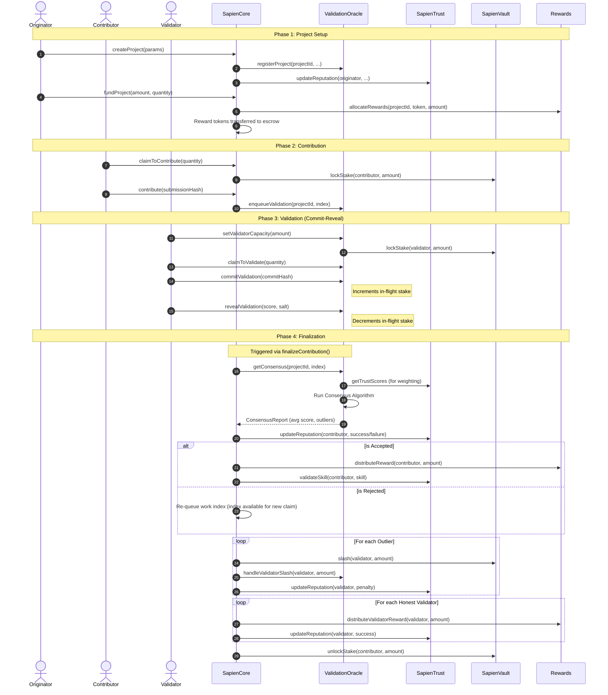

# Sapien PoQ Protocol - Complete Documentation

**Version:** v0.3  
**Last Updated:** January 22nd.

Welcome to the complete documentation for the **Sapien Proof-of-Quality (PoQ) Protocol**.

Sapien PoQ is an open protocol for verifiable, consensus-based quality signals in AI workflows. It adds a verifiable quality layer to AI datasets and agent behaviors through stake-weighted human verification.

---

## Table of Contents

1. [Introduction](#introduction)
2. [Architecture](#architecture)
   - [System Architecture Overview](#system-architecture-overview)
   - [Protocol Lifecycle](#protocol-lifecycle)
3. [Core Components](#core-components)
   - [Sapien Core](#sapien-core)
   - [Sapien Vault](#sapien-vault)
   - [Sapien Trust](#sapien-trust)
   - [Validation Oracle](#validation-oracle)
   - [Rewards Management](#rewards-management)
4. [Consensus Algorithms](#consensus-algorithms)
5. [User Guides](#user-guides)
   - [Guide for Originators](#guide-for-originators)
   - [Guide for Contributors](#guide-for-contributors)
   - [Guide for Validators](#guide-for-validators)
   - [Guide for Developers](#guide-for-developers)
6. [Security](#security)

---

## Introduction

### Key Value Propositions

- **Verifiable Quality**: Cryptographic proof of human judgment for AI systems.
- **Data Sovereignty**: Your data stays in your storage; only quality signals are on-chain.
- **Incentive Alignment**: Stake-weighted rewards and penalties ensure honest participation.
- **Composable**: Easily integrate with existing AI tools (CVAT, LangChain, etc.) via oracles.

---

## Architecture

### System Architecture Overview

Sapien PoQ is designed as a modular protocol that provides a "Quality Oracle" for AI systems. It allows human experts to verify AI-generated data or agent behaviors, producing a verifiable quality signal that can be consumed by on-chain and off-chain systems.

#### Participant Roles

The protocol defines four primary roles:

**1. Originators**
- Originators are the "buyers" of quality. They create projects, define quality criteria, and fund reward pools.
- **Goal**: Obtain high-quality verified data or agent behavior signals.
- **Requirement**: Must stake SAPIEN tokens to create projects.

**2. Contributors**
- Contributors are the workers who perform tasks (e.g., labeling an image, generating an AI response).
- **Goal**: Earn rewards by providing high-quality work.
- **Requirement**: Must stake SAPIEN tokens to claim work slots.

**3. Validators**
- Validators are the independent reviewers who assess the quality of contributions.
- **Goal**: Earn rewards by reaching consensus with other validators.
- **Requirement**: Must stake SAPIEN tokens to participate in committees.

**4. Oracles (Adapters)**
- Oracles are the technical interface between the Sapien protocol and external tools.
- **Contributor Oracles**: Connect tools like CVAT or custom AI pipelines to submit work.
- **Validator Oracles**: Provide interfaces for human reviewers to submit scores.

#### Verification Lifecycle

The PoQ process follows five distinct phases:

**Phase 1: Project Setup**
The Originator creates a project in `SapienCore`, defining parameters like the required skill, minimum quality score, and reward distribution. They fund the project with reward tokens (e.g., USDC).

**Phase 2: Work Submission**
Contributors claim slots and submit their work. The work itself stays in the Originator's storage (e.g., S3, IPFS); only a hash and reference are submitted to `SapienCore`.

**Phase 3: Validation (Commit-Reveal)**
To prevent collusion and herding, validators use a two-step process in the `ValidationOracle`:
1. **Capacity Setup**: Validators lock a fixed amount of stake to establish "Validation Capacity," allowing them to handle multiple tasks efficiently.
2. **Commit**: Validators submit a hash of their score and a secret salt, increasing their "In-Flight Stake."
3. **Reveal**: After the commit period, validators reveal their actual score and salt. This releases their "In-Flight Stake" back into their capacity pool.

**Phase 4: Consensus Calculation**
Once enough reveals are gathered (or the deadline passes), the `ValidationOracle` uses a pluggable consensus algorithm (e.g., Hybrid or Sqrt Stake) to calculate a weighted average score and identify outliers. `ConsensusLib` handles the statistical heavy lifting, including standard deviation and tiered slashing calculations.

**Phase 5: Finalization & Settlement**
`SapienCore` finalizes the contribution:
- If accepted: Rewards are distributed via the `Rewards` contract to the contributor and honest validators.
- If rejected: The work is released back into the project pool for another contributor to attempt.
- Outlier validators are slashed via the `SapienVault`, and their reputation in `SapienTrust` is penalized.

#### Technical Stack

The protocol is implemented as a suite of EVM smart contracts:
- **Core Logic**: `SapienCore`
- **Consensus Oracle**: `ValidationOracle`
- **Reputation & Identity**: `SapienTrust`
- **Staking & Slashing**: `SapienVault`
- **Incentives**: `Rewards`

All quality signals are recorded as verifiable attestations, making them auditable and composable with other protocols.

---

### Protocol Lifecycle

This section illustrates the end-to-end lifecycle of a Sapien PoQ project, from creation to finalization and reward distribution.

#### End-to-End Sequence Diagram



#### Breakdown of Phases

**1. Project Setup**
Originators define the project parameters, including reward tokens, minimum stakes, and required skills. Funding the project moves reward tokens into the `Rewards` contract escrow.

**2. Contribution**
Contributors claim slots, which locks their "skin in the game" stake in the `SapienVault`. They then submit their work (typically a hash/reference), which is enqueued for validation.

**3. Validation**
Validators set their validation capacity beforehand. They claim pending contributions, then follow a two-step commit-reveal process to ensure independence. Their "in-flight" stake is tracked against their locked capacity.

**4. Finalization**
Once consensus is reached, `SapienCore` executes the outcome. Success leads to rewards and reputation gains, while failure or outlier behavior results in slashing and reputation penalties.

---

## Core Components

### Sapien Core

`SapienCore` is the central coordinator of the Sapien PoQ protocol. It manages the lifecycle of projects, claims, and contributions, and triggers the finalization process that involves rewards and slashing.

#### Responsibilities

- **Project Management**: Creation and funding of projects.
- **Contribution Lifecycle**: Handling claims to contribute, work submission, and finalization.
- **Coordination**: Interfacing with `SapienVault`, `SapienTrust`, `ValidationOracle`, and `Rewards`.

#### Key Functions

**Project Functions**

- **`createProject`**: Allows an Originator to initialize a new project with specific parameters:
  - `projectId`: A unique `bytes32` identifier (usually a hash of the project metadata).
  - `rewardToken`: The ERC20 token used for payouts.
  - `minStakeToClaim`: Minimum stake required for a contributor to claim slots.
  - `minStakeToContribute`: Minimum stake required to contribute (optional/secondary check).
  - `minValidations`: Minimum number of validator reveals required to reach consensus (defaults to 3).
  - `validatorRewardBasisPoints`: The percentage of the reward pool reserved for validators (e.g., 1000 = 10%). Capped at 2500 (25%).
  - `requiredSkill`: Optional skill requirement for contributors.

- **`fundProject`**: Originators add reward tokens and increase the available quantity of contribution slots. A configurable protocol fee (default 1%) is automatically deducted and sent to the Sapien treasury. The remaining amount is allocated to the project's reward pool.

- **`reclaimExpiredIndices`**: Allows anyone to reclaim contribution slots that were reserved but not submitted within the deadline. This restores the `activeClaimedQuantity` and makes the slots available for other contributors.

**Contribution Functions**

- **`claimToContribute`**: Contributors claim a specific number of slots in a project. This:
  1. Verifies the contributor's stake in `SapienVault` meets `minStakeToClaim`.
  2. Locks the required stake in the vault.
  3. Reserves specific contribution indices for the contributor using an internal `IndexReservation` system.
  4. Returns a `claimId` used for subsequent submissions.

- **`contribute` / `batchContribute`**: Contributors submit a `submissionHash` (e.g., an IPFS CID) for specific indices within their claim.
  - Must be called before the claim or index reservation deadline.
  - Submissions are automatically enqueued in the `ValidationOracle` for review.

- **`releaseExpiredClaim`**: Marks a claim as expired if the contributor failed to submit work before the deadline.
  - Unlocks the contributor's stake but applies a slash penalty based on the `minStakeToClaim`.

- **`finalizeContribution`**: The final step in the lifecycle. It:
  1. Requests consensus from the `ValidationOracle` (checks if minimum reveals and deadlines are met).
  2. Updates the contributor's reputation in `SapienTrust` (Success increase or Rejection penalty).
  3. Distributes rewards via `Rewards` for accepted work.
  4. Executes slashing via `SapienVault` for outlier validators identified by consensus.
  5. Re-queues rejected work by releasing the index back to the pool of available slots.
  6. Unlocks the contributor's stake if the entire claim is processed.

#### Events

- `ProjectCreated`: Emitted when a new project is registered.
- `ProjectFunded`: Emitted when a project receives funding.
- `ProtocolFeeCollected`: Emitted when a protocol fee is collected during project funding.
- `ProtocolFeeUpdated`: Emitted when the protocol fee basis points are updated.
- `TreasuryUpdated`: Emitted when the treasury address is updated.
- `ContributionSubmitted`: Emitted when a contributor submits work.
- `ContributionFinalized`: Emitted when consensus is reached and rewards/slashing are processed.

#### Access Control

- **ORIGINATOR_ROLE**: Required to create projects.
- **CONTRIBUTOR_ROLE**: Required to claim slots and submit work.
- **DEFAULT_ADMIN_ROLE**: Global administration and configuration.

---

### Sapien Vault

The `SapienVault` is an upgradeable staking contract based on the **ERC-4626** standard. It handles the financial "skin in the game" for all protocol participants through token deposits, stake locking, and slashing.

#### Responsibilities

- **Staking**: Secure storage of SAPIEN tokens deposited by users.
- **Locking**: Temporarily restricting a user's ability to withdraw funds while they have active claims or commitments.
- **Slashing**: Permanently removing a portion of a user's stake as a penalty for poor quality work or dishonest validation.
- **Inflation Protection**: Uses a decimals offset (3) to protect against common ERC-4626 inflation attacks.

#### Key Functions

**Staking Functions**

Users interact with the vault using standard ERC-4626 functions (`deposit`, `withdraw`, `mint`, `redeem`). Deposits earn "shares" representing their portion of the vault's total assets.

**Locking Logic**

- **`lockStake`**: Called by `SapienCore` or `ValidationOracle` when a user claims a task or sets validation capacity. Locked stake cannot be withdrawn or transferred until it is explicitly unlocked. Every lock includes a `reason` string for transparent event tracking.

- **`unlockStake`**: Releases the lock on a user's assets, typically after a contribution is finalized, a claim expires, or a validator reduces their capacity.

**Slashing**

- **`slash`**: Removes a specified amount of assets from a user's position by burning their vault shares.
  - **Internal Mechanism**: The underlying assets remain in the vault.
  - **Effect**: Since shares are burned but assets remain, the "price per share" increases for all other stakers. This automatically redistributes the slashed value to the rest of the honest participants.

#### Security

- **Locker/Slasher Roles**: Only authorized contracts (like `SapienCore`) can lock or slash funds.
- **Pausability**: The vault can be paused by a `PAUSER_ROLE` in case of emergencies, disabling withdrawals while maintaining deposits and internal accounting.

#### View Functions

- `getStake`: Returns the total amount of tokens a user has in the vault.
- `getAvailableStake`: Returns the amount of tokens a user can withdraw (Total - Locked).
- `getLockedStake`: Returns the amount currently held for active tasks.

---

### Sapien Trust

`SapienTrust` is the identity and reputation layer of the Sapien protocol. It implements the **Proof of Quality (PoQ)** system, which tracks the historical performance of all participants (Originators, Contributors, and Validators).

#### Responsibilities

- **Reputation Tracking**: Managing scores for different roles based on success/failure and quality of work.
- **Skill Validation**: Tracking user expertise in specific domains (e.g., "Image Annotation", "NLP").
- **Role Verification**: Checking if a user meets the minimum stake and reputation requirements for a role.

#### Reputation System (PoQ)

Reputation scores range from **500 to 10000** (where 5000 is the neutral starting point).

**Role-Based Scores**

Users have separate reputation scores for each role:
- `ORIGINATOR_ROLE`
- `CONTRIBUTOR_ROLE`
- `VALIDATOR_ROLE`

**Update Logic**

Reputation is updated via the `updateReputation` function, which is called by `SapienCore` during finalization:
- **Success**: Increases the score by **+10 bps** (0.1%), with an additional quality bonus for high scores (>5000).
- **Rejection**: Decreases the score by **-50 bps** (0.5%).
- **Slash (Outlier)**: Decreases the score by **-100 bps** (1.0%).

**Lazy Decay**

Reputation naturally decays over time if a user is inactive, incentivizing consistent high-quality participation.
- **Mechanism**: The decay is applied "lazily" when a user's reputation is queried or updated.
- **Rate**: Configurable via `reputationDecayPerDay` (expressed in basis points).

#### Skills

The protocol supports domain-specific skills. When an Originator marks a project as requiring a specific skill (e.g., "Medical Labeling"):
1. Only users with that validated skill can participate.
2. Successful completion of contributions in that project can automatically validate the skill for the contributor and increment their `completionCount`.

#### Sybil Resistance

To prevent reputation farming via multiple accounts (Sybil attacks), `SapienTrust` implements several defenses:
1. **Entry Stake**: Users must have a minimum stake in `SapienVault` to be considered for any role.
2. **Skin in the Game**: High-value roles require higher minimum stakes (configurable via `roleMinStake`).
3. **Reputation Floor**: Scores cannot drop below 500, but low reputation restricts access to high-reward projects.

#### Key Functions

- `getTrustScore`: Query a user's reputation for a specific role.
- `hasValidRole`: Check if a user meets the stake and reputation requirements to act as a contributor or validator.
- `validateSkill`: Mark a specific skill as verified for a user.

---

### Validation Oracle

The `ValidationOracle` is a stateless consensus engine that manages the validation process for Sapien PoQ. It implements a commit-reveal scheme to ensure validator independence and uses pluggable algorithms to calculate consensus.

#### Responsibilities

- **Validation Management**: Handling claims to validate, commits, and reveals.
- **Consensus Calculation**: Delegating the mathematical calculation to external algorithm contracts.
- **Oracle Logic**: Recording the relationship between projects, contributions, and validators.

#### Key Functions

**Validator Workflow**

- **`setValidatorCapacity`**: Before participating, validators must set their "validation capacity" by locking SAPIEN tokens in the `SapienVault`.
  - This provides a pool of locked stake that covers multiple "in-flight" validations.
  - Eliminates the need to lock/unlock stake for every individual commit, significantly reducing gas costs for active validators.

- **`claimToValidate`**: Validators express interest in reviewing contributions for a specific project.
  - Requires `VALIDATOR_ROLE` and sufficient available capacity (Locked Stake - In-Flight Stake).
  - Reserves slots from the `pendingQueue` for a fixed `CLAIM_DURATION` (default 1 hour).

- **`commitValidation` / `batchCommitValidations`**: Validators submit a `commitHash` which is `keccak256(score, stakeAmount, salt)`.
  - This increases the validator's `inFlightStake`.
  - Sybil protection prevents Originators and the original Contributor from validating the work.

- **`revealValidation` / `batchRevealValidations`**: Validators reveal their `score` and `salt`.
  - The oracle verifies the reveal matches the commit.
  - The `inFlightStake` is decreased (capacity is freed up for new claims).

- **`cancelExpiredValidationClaim` / `cancelExpiredCommitment`**: Allows the system to penalize validators who block the pipeline:
  - `cancelExpiredValidationClaim`: Slashes validators who claim slots but never commit.
  - `cancelExpiredCommitment`: Slashes validators who commit but fail to reveal within the `revealDeadline`.

**Consensus Logic**

- **`getConsensus`**: Called by `SapienCore` to determine if a contribution is ready for finalization. It:
  1. Verifies that the minimum number of reveals has been reached.
  2. Checks if the reveal deadline has passed for any unrevealed commits.
  3. Fetches the project's assigned `ConsensusAlgorithm`.
  4. Returns the weighted average score, validator count, and a list of outliers to be slashed.

**Registry Functions**

- **`registerAlgorithm`**: (Admin only) Registers a new `IConsensusAlgorithm` implementation.

- **`setProjectAlgorithm`**: Allows an Originator to choose which consensus algorithm (e.g., "Hybrid", "SqrtStake") to use for their project.

#### Configurable Parameters

- **Reveal Deadline**: The time validators have to reveal their scores after committing (default is 3 days).
- **Claim Duration**: The time validators have to commit after claiming a slot (default is 1 hour).

#### Security Features

- **Sybil Protection**: The protocol prevents a project's Originator or the contribution's Contributor from validating their own work.
- **Commit-Reveal**: Prevents "herding" behavior where validators simply copy the scores of others.
- **Stake Locking**: Validator stake is locked from the moment of commitment until reveal or expiration.

---

### Rewards Management

The `Rewards` contract handles the allocation, distribution, and claiming of reward tokens for projects on the Sapien platform. It maintains separate accounting for contributors and validators to ensure fair and transparent payouts.

#### Responsibilities

- **Reward Escrow**: Holding funds deposited by Originators until they are earned by participants.
- **Allocation**: Mapping reward pools to specific project IDs.
- **Distribution**: Recording the earnings for contributors and validators after successful consensus.
- **Claiming**: Allowing users to withdraw their earned rewards to their personal wallets.

#### Key Functions

**Core Logic (OnlyCore)**

These functions can only be called by the `SapienCore` contract:
- `allocateRewards`: Moves project funds into the rewards escrow during the `fundProject` flow.
- `distributeReward`: Assigns a reward amount to a specific contributor for a project after work is accepted.
- `distributeValidatorReward`: Assigns a reward amount to a specific validator based on their stake and accuracy after consensus.

**User Functions**

- **`claimRewards` / `claimAllRewards`**: Allows a contributor to withdraw their earned rewards. `claimAllRewards` is a batch function that handles multiple projects in a single transaction, saving gas for active contributors.

- **`claimValidatorRewards` / `claimAllValidatorRewards`**: Allows a validator to withdraw their earnings. Similarly, `claimAllValidatorRewards` allows for batch claiming across multiple projects.

#### View Functions

- `getAvailableRewards`: Check how much a contributor can currently withdraw.
- `getTotalRewardsEarned`: View the historical total of rewards earned by a user.
- `getRemainingProjectRewards`: See the current balance of the reward pool for a project.

#### Access Control

- **OnlyCore**: Critical distribution functions are restricted to the `SapienCore` address to prevent unauthorized payouts.
- **DEFAULT_ADMIN_ROLE**: Configuration of the core contract address and emergency pausing.

---

## Consensus Algorithms

Sapien PoQ uses a pluggable consensus architecture. Originators can choose the algorithm that best fits their project's security and cost requirements.

### Available Algorithms

#### 1. Hybrid Consensus (`HybridConsensus.sol`)

The most sophisticated and recommended algorithm for Sapien.

- **Weighting**: `min(sqrt(stake) × reputation, 30% cap)`
- **Security Grade**: **A-**
- **Best For**: High-value projects where long-term quality and Sybil resistance are critical.
- **Pros**: Perfectly aligns incentives by considering both financial stake and historical quality (PoQ). Prevents "whale" dominance with a hard cap and sublinear (sqrt) scaling.

#### 2. Sqrt Stake Consensus (`SqrtStakeConsensus.sol`)

Uses a quadratic voting approach to balance power.

- **Weighting**: `sqrt(stake)`
- **Security Grade**: **A-**
- **Best For**: Projects seeking maximum validator diversity and fairness.
- **Pros**: Reduces the influence of large token holders, making it 22% more democratic than linear weighting.

#### 3. Capped Linear Consensus (`CappedLinearConsensus.sol`)

A middle ground between traditional staking and advanced consensus.

- **Weighting**: `min(stake, 30% of total committee stake)`
- **Security Grade**: **B+**
- **Best For**: General use cases requiring a simple but secure upgrade from linear weighting.
- **Pros**: Prevents any single validator from controlling the outcome (whale protection).

#### 4. Linear Stake Consensus (`LinearStakeConsensus.sol`)

The simplest form of consensus.

- **Weighting**: `stake`
- **Security Grade**: **C+**
- **Best For**: Low-risk projects or backward compatibility.
- **Cons**: Vulnerable to "whale" attacks where a single large holder can override the committee.

### Comparison Summary

| Metric | Linear | Capped | Sqrt | Hybrid |
|--------|--------|--------|------|--------|
| **Whale Resistance** | Low | High | Medium | High |
| **Sybil Resistance** | High | Medium | Medium | High |
| **Efficiency (Gas)** | Very High | High | Medium | Medium |
| **Incentive Alignment** | Low | Medium | High | Very High |

### How it Works

1. **Input**: Each algorithm receives an array of `ValidationInput` (Validator, Score, Stake, Reputation).
2. **Weighting**: The algorithm calculates the weight of each validator based on its specific logic.
3. **Consensus**: A weighted average score is calculated.
4. **Outlier Detection**: The system uses `ConsensusLib` to identify validators whose scores deviate significantly.
   - **Absolute Threshold**: Any score deviating by more than 1500 (15%) from the mean is considered an outlier.
   - **Relative Threshold**: Any score deviating by more than 2 standard deviations (2σ) is considered an outlier.
5. **Slashing Calculation**: `ConsensusLib` calculates a slash percentage based on the number of standard deviations from the mean:
   - **5σ+**: 100% slash (Extreme Outlier)
   - **4σ-5σ**: 75% slash
   - **3σ-4σ**: 50% slash
   - **2σ-3σ**: 25% slash
   - **1.5σ-2σ**: 10% slash
6. **Output**: Returns the final `weightedAverage` and a list of `validatorsToSlash` with their corresponding `slashAmounts`.

---

## User Guides

### Guide for Originators

As an Originator, you use the Sapien protocol to verify the quality of AI datasets or agent behaviors. This guide walks you through creating and funding your first project.

#### 1. Prerequisites

- **SAPIEN Tokens**: You must have SAPIEN tokens staked in the `SapienVault` to meet the minimum stake requirement for the `ORIGINATOR_ROLE`.
- **Reward Tokens**: You need the ERC20 tokens (e.g., USDC, USDT) that you plan to use for rewards.

#### 2. Create a Project

To create a project, call `SapienCore.createProject()` with the following parameters:

- `projectId`: A unique `bytes32` hash identifying the project.
- `rewardToken`: Address of your chosen reward token.
- `minStakeToClaim`: Minimum SAPIEN stake required for a contributor to claim a slot.
- `minStakeToContribute`: (Legacy) Minimum stake required to participate.
- `minValidations`: The minimum number of human reviewers needed per contribution.
- `validatorRewardBasisPoints`: Percentage of the total pool for validators (default 1000 = 10%). **Capped at 2500 (25%)**.
- `requiredSkill`: (Optional) A skill contributors must have or will earn upon successful completion.

#### 3. Fund Your Project

Once the project is created, you must add funds and define the quantity of work units:

Call `SapienCore.fundProject(projectId, rewardAmount, quantity)`:
- `rewardAmount`: Total amount of reward tokens to deposit.
- `quantity`: The total number of contributions you want verified.

**Protocol Fee**: A protocol fee (default 1% = 100 basis points) is automatically deducted from your funding amount and sent to the Sapien treasury. The remaining amount is allocated to your project's reward pool.

**Example**: If you fund with 1000 USDC:
- Protocol fee (1%): 10 USDC → Sent to Sapien treasury
- Project rewards: 990 USDC → Allocated to your project

*Note: The protocol will automatically calculate the per-task reward based on `totalRewards / quantity`, where `totalRewards` is the amount after the protocol fee deduction.*

#### 4. Choose a Consensus Algorithm

By default, projects use the protocol-wide default algorithm. You can choose a specific one for your project:

Call `ValidationOracle.setProjectAlgorithm(projectId, "Hybrid")`.
- Available options: `"Linear"`, `"Capped"`, `"Sqrt"`, `"Hybrid"`.

#### 5. Integrate Your Tools

To connect your existing AI pipeline to Sapien:
- **Submit Work**: Use a **Contributor Oracle** to call `SapienCore.contribute()` whenever new work is ready for validation.
- **Consume Signals**: Monitor the `ContributionFinalized` events or query `SapienCore.contributions()` to get the verified quality scores.

#### Best Practices

- **Clear TDS**: Ensure your Task Definition Spec (provided to contributors/validators via the oracle interface) is clear and objective.
- **Incentivize Validators**: Setting `validatorRewardBasisPoints` too low may lead to slow validation times.
- **Monitor Outliers**: If many validators are being slashed, your quality criteria might be too subjective or your instructions unclear.

---

### Guide for Contributors

Contributors perform AI-related tasks and earn rewards based on the quality of their output as determined by human validator consensus.

#### 1. Get Started

- **Stake SAPIEN**: You must have the minimum required stake in the `SapienVault` to claim tasks.
- **Build Reputation**: Your Proof of Quality (PoQ) score in `SapienTrust` determines your eligibility for high-value projects.

#### 2. Claim Work Slots

Before you can submit work, you must "claim" capacity in a project. This prevents others from taking the slots while you are working.

Call `SapienCore.claimToContribute(projectId, quantity)`:
- `quantity`: Number of work units you commit to finishing.
- **Deadline**: Each claim has a deadline (defined by the project). If you don't submit work by the deadline, your claim expires and your stake may be slashed.

#### 3. Submit Work

Perform the task using the tools provided by the Originator (e.g., CVAT for images). Once finished:

Call `SapienCore.contribute(projectId, claimId, contributionIndex, submissionHash)`:
- `submissionHash`: A unique hash or reference to your work (e.g., an IPFS CID).
- Use `batchContribute` to submit multiple items in a single transaction.

#### 4. Finalization and Rewards

After you submit work, it will be reviewed by validators. Once enough reviews are gathered, the contribution is finalized.

- **If Accepted**: You will receive your reward tokens in the `Rewards` contract. You can withdraw them using `Rewards.claimRewards()` or `Rewards.claimAllRewards()`.
- **If Rejected**: If your contribution is rejected by the validator committee, your work index is released back to the project for others to attempt. Your reputation will decrease, and you may be penalized if your quality is consistently low.

#### Improving Your Earnings

- **Focus on Quality**: Consistently high scores increase your `SapienTrust` reputation, giving you access to projects with higher rewards.
- **Validate Skills**: Successfully completing specialized tasks will validate those skills on your profile, making you eligible for niche projects.
- **Manage Deadlines**: Always release or finish claims before they expire to avoid unnecessary slashing.

---

### Guide for Validators

Validators provide the human intelligence layer of the protocol. By reaching consensus on the quality of work, validators secure the AI systems relying on Sapien.

#### 1. Prerequisites

- **Stake SAPIEN**: High-weight validation requires significant stake.
- **Maintain Reputation**: Honest participation builds your validator PoQ score.

#### 2. The Validation Process

Validation uses an efficient **Commit-Reveal** scheme. To maximize efficiency, validators manage their commitment using a "Capacity" system.

**Step 1: Set Your Capacity**

Call `ValidationOracle.setValidatorCapacity(amount)`.
- This locks a total amount of SAPIEN in the vault that acts as a pool for all your active validations.
- You only need to do this once (or when you want to change your commitment level).

**Step 2: Claim Task Slots**

Call `ValidationOracle.claimToValidate(projectId, quantity)`.
- This reserves a `quantity` of tasks from the project's pending queue.
- You have a limited time (default 1 hour) to submit your commits for these slots.

**Step 3: Commit Your Scores**

Review the work via the validator interface and decide on a score (0-10000).

Call `ValidationOracle.commitValidation(projectId, claimId, contributionIndex, commitHash)` (or use `batchCommitValidations` for efficiency):
- `commitHash` is `keccak256(score, stakeAmount, salt)`.
- The `stakeAmount` is deducted from your available capacity.

**Step 4: Reveal Your Scores**

After the project's reveal period begins:

Call `ValidationOracle.revealValidation(projectId, contributionIndex, score, salt)` (or use `batchRevealValidations`):
- If the reveal matches your commit, the `stakeAmount` is returned to your available capacity.

#### 3. Rewards and Penalties

- **Alignment Reward**: If your score is within the consensus range (typically within 2 standard deviations of the weighted average), you earn a share of the validator reward pool.
- **Outlier Slashing**: If your score is identified as an outlier, you will not receive rewards, your reputation will decrease, and a portion of your stake will be slashed.
- **Non-Reveal Penalty**: If you commit but fail to reveal your score before the deadline, your entire committed stake is slashed.

#### Pro-Tips for Validators

- **Be Objective**: Base your score strictly on the Task Definition Spec (TDS) provided by the Originator.
- **Keep Secrets**: Never share your salt or score before the reveal phase to avoid being targeted by colluders.
- **Automate**: For high-volume projects, use a Validator Oracle (adapter) to streamline the commit-reveal process.

---

### Guide for Developers

Developers can extend the Sapien PoQ ecosystem by building **Oracles (Adapters)** that connect external AI tools and workflows to the protocol.

#### Architecture of an Oracle

An Oracle typically consists of two parts:
1. **Off-chain Interface**: A bridge that monitors an external tool (e.g., CVAT for image labeling) and handles user authentication.
2. **On-chain Adapter**: A set of scripts or a contract that calls the `SapienCore` or `ValidationOracle` functions on behalf of the users.

#### Integration Points

**Contributor Oracle**

A Contributor Oracle streamlines the submission of work.

- **Workflow**:
  1. Detect when a user finishes a task in the external tool.
  2. Upload the work data to a storage bucket (S3, IPFS).
  3. Call `SapienCore.contribute()` with the data reference and hash.

- **Key Function**: `contribute(bytes32 projectId, uint256 claimId, uint256 contributionIndex, bytes32 submissionHash)`

**Validator Oracle**

A Validator Oracle provides a UI for human reviewers.

- **Workflow**:
  1. Fetch pending contributions from `ValidationOracle`.
  2. Present the work and the Task Definition Spec (TDS) to the validator.
  3. Manage the **Commit-Reveal** lifecycle (storing the salt locally until the reveal phase).

- **Key Functions**: `claimToValidate()`, `commitValidation()`, `revealValidation()`.

#### Building a Custom Consensus Algorithm

If the existing algorithms (Linear, Sqrt, Hybrid) don't meet your needs, you can implement your own.

1. **Implement `IConsensusAlgorithm`**: Create a contract that follows the interface.
2. **Calculate Consensus**: In the `calculateConsensus` function, implement your logic for weighting and outlier detection.
3. **Registration**: An admin must register your contract address in the `ValidationOracle`.

```solidity
interface IConsensusAlgorithm {
    function calculateConsensus(ValidationInput[] calldata validations)
        external view returns (ConsensusResult memory result);
    
    function getName() external pure returns (string memory);
}
```

#### Consuming Quality Signals

Applications can consume Sapien quality signals in several ways:
- **On-chain**: Query the `SapienCore.contributions` mapping to see the `status` and `averageScore`.
- **Off-chain**: Listen for `ContributionFinalized` events.
- **Attestations**: Read the attestations from the **Ethereum Attestation Service (EAS)** linked to each contribution.

#### Testing Your Integration

We recommend using **Foundry** for testing your adapters against the Sapien contracts.
1. Fork the Sapien deployment on Base Sepolia.
2. Deploy your adapter.
3. Simulate the full lifecycle: `createProject` -> `claim` -> `contribute` -> `validate` -> `finalize`.

---

## Security

The Sapien PoQ protocol is built on the principle of **Economic Security**. We use a combination of financial incentives (staking), penalties (slashing), and cryptographic proofs (commit-reveal, attestations) to ensure the integrity of human-powered AI verification.

### Core Security Pillars

#### 1. Staking (Skin in the Game)

All active participants must lock SAPIEN tokens in the `SapienVault`. This creates a tangible cost for malicious behavior and ensures that participants are economically aligned with the protocol's success.

#### 2. Proof of Quality (Reputation)

Reputation is not just a badge; it is a functional component of the consensus engine. In algorithms like **Hybrid Consensus**, your historical accuracy (PoQ score) directly increases your voting power, while a history of outlier behavior reduces it.

#### 3. Commit-Reveal

The `ValidationOracle` enforces a commit-reveal process for all human judgments. This prevents:
- **Herding**: Validators waiting to see others' scores before submitting their own.
- **Copy-Pasting**: Lazy validators mirroring the work of others without actually reviewing the task.

#### 4. Slashing Mechanisms

Slashing is used to penalize three specific types of bad behavior:
- **Poor Quality (Contributors)**: If work is rejected by consensus, the contributor loses stake proportional to the quality gap.
- **Outlier Judging (Validators)**: If a validator's score is a statistical outlier, they are slashed to discourage lazy or malicious voting.
- **Non-Performance**: Failure to fulfill a claim or reveal a commit leads to stake forfeiture.

### Whale and Sybil Resistance

#### Whale Protection

Large token holders are prevented from dominating consensus through:
- **Quadratic Weighting**: `sqrt(stake)` reduces the power of large amounts.
- **Hard Caps**: No single validator can account for more than 30% of a committee's total weight.

#### Sybil Resistance

Attacking the protocol with multiple small accounts is mitigated by:
- **Minimum Entry Stake**: A significant financial barrier to creating new accounts.
- **Reputation Maturity**: High-weight roles require a history of successful actions that cannot be easily faked or automated.

### Auditability

Every final quality signal produced by the protocol is recorded as an on-chain attestation. These attestations include:
- The consensus score.
- The number of validators involved.
- The algorithm used.
- References to the underlying work.

This creates an immutable audit trail for AI training data provenance and agent behavior compliance.

---

## Conclusion

The Sapien PoQ Protocol provides a comprehensive framework for verifiable quality assurance in AI systems. Through economic incentives, cryptographic proofs, and consensus mechanisms, it enables trustless verification of AI-generated content and behaviors.

For more information, visit [poq.sapien.io](https://poq.sapien.io).

---

*This document compiles all documentation from the `/docs` directory. For the most up-to-date information, please refer to the individual documentation files or the official Sapien PoQ website.*
