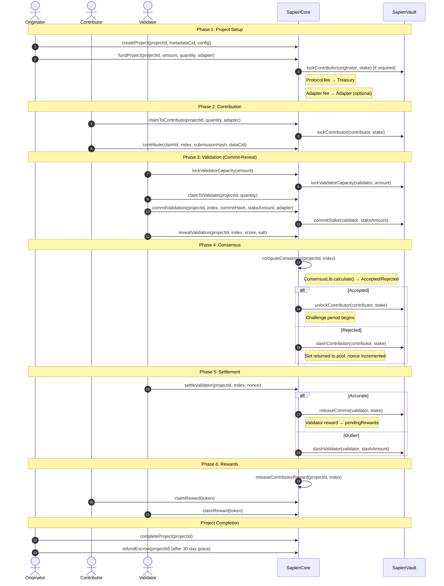

# Sapien PoQ Protocol — Complete Documentation

**Version:** v0.5
**Last Updated:** February 2026

Welcome to the complete documentation for the **Sapien Proof-of-Quality (PoQ) Protocol**.

Sapien PoQ is an open protocol for verifiable, consensus-based quality signals in AI workflows. It adds a verifiable quality layer to AI datasets and agent behaviors through stake-weighted human verification.

---

## Table of Contents

1. [Introduction](#introduction)
2. [Architecture](#architecture)
   - [System Architecture Overview](#system-architecture-overview)
   - [Protocol Lifecycle](#protocol-lifecycle)
3. [Core Components](#core-components)
   - [SapienCore](#sapiencore)
   - [SapienVault](#sapienvault)
   - [ReputationLib](#reputationlib)
   - [ValidationLib & ConsensusLib](#validationlib--consensuslib)
   - [FinalizationLib](#finalizationlib)
   - [DisputeLib](#disputelib)
4. [Consensus Algorithm](#consensus-algorithm)
5. [User Guides](#user-guides)
   - [Guide for Originators](#guide-for-originators)
   - [Guide for Contributors](#guide-for-contributors)
   - [Guide for Validators](#guide-for-validators)
   - [Guide for Developers](#guide-for-developers)
6. [Security](#security)

---

## Introduction

### Key Value Propositions

- **Verifiable Quality**: Cryptographic proof of human judgment for AI systems.
- **Data Sovereignty**: Your data stays in your storage; only quality signals are onchain.
- **Incentive Alignment**: Stake-weighted rewards and penalties ensure honest participation.
- **Composable**: Easily integrate with existing AI tools via adapter contracts.

---

## Architecture

### System Architecture Overview

Sapien PoQ v0.5 consists of **two deployable contracts** with **seven libraries**.

```
SapienCore (UUPS Proxy)
├── OriginationLib     — Project creation & funding
├── ContributionLib    — Claim & contribute
├── ValidationLib      — Commit-reveal & consensus orchestration
├── ConsensusLib       — Stake-weighted consensus algorithm
├── FinalizationLib    — Settlement, rewards, project completion
├── DisputeLib         — Disputes & originator reports
├── ReputationLib      — PoQ reputation with lazy decay
└─→ SapienVault (UUPS Proxy) — ERC-4626 staking
```

All libraries operate on SapienCore's **ERC-7201 namespaced storage** via `DELEGATECALL`. The only external contract call is SapienCore → SapienVault for stake operations. Shared types are centralized in `Types.sol` and protocol constants in `Constants.sol`.

#### Participant Roles

**1. Originators**
- Create projects, define quality criteria, and fund reward pools.
- **Goal**: Obtain high-quality verified data or agent behavior signals.
- **Skin in the game**: Optional per-slot stake requirement (configurable).

**2. Contributors**
- Perform tasks (e.g., labeling an image, generating an AI response).
- **Goal**: Earn rewards by providing high-quality work.
- **Skin in the game**: Must lock stake when claiming contribution slots.

**3. Validators**
- Independently review and score contributions using a commit-reveal scheme.
- **Goal**: Earn rewards by reaching consensus with other validators.
- **Skin in the game**: Must pre-lock validator capacity and commit per-validation stakes.

**4. Adapters**
- Technical interfaces between the Sapien protocol and external tools.
- Earn fees for origination, contribution, and validation services.
- Can be set per-project (origination), per-claim (contribution), or per-commit (validation).

#### Verification Lifecycle

The PoQ process follows six distinct phases:

**Phase 1: Project Setup**
The originator creates a project via `createProject`, defining parameters like reward token, consensus threshold, number of validations, and validator reward share. They fund the project via `fundProject`, which transfers tokens into escrow (after protocol and optional adapter fees), creates contribution slots, and optionally locks originator stake.

**Phase 2: Contribution**
Contributors claim slots via `claimToContribute` (locks contributor stake), then submit work via `contribute` or `batchContribute` with a submission hash and data CID. The claim has a configurable deadline (default 1 day). Unsubmitted slots can be expired via `expireClaim`.

**Phase 3: Validation (Commit-Reveal)**
1. **Capacity Setup**: Validators pre-lock tokens as capacity via `lockValidatorCapacity`.
2. **Claim**: Validators request a quantity via `claimToValidate(projectId, quantity)` and receive randomly assigned pending contributions (1-hour deadline to commit).
3. **Commit**: Validators submit `keccak256(abi.encodePacked(uint16(score), salt))` with a stake amount via `commitValidation`. Stake moves from capacity to in-flight.
4. **Reveal**: After committing, validators reveal `score` and `salt` via `revealValidation` within the reveal window.

**Phase 4: Consensus**
Once all required reveals are recorded, anyone can trigger `computeConsensus`. The `ConsensusLib` calculates a stake-weighted average, standard deviation, and classifies outliers using tiered thresholds. The contribution is marked `Accepted` (score ≥ threshold) or `Rejected` (score < threshold). The challenge period begins.

**Phase 5: Disputes**
During the challenge period, anyone can `openDispute` against a consensus outcome by posting a bond. Operators can `resolveDispute` (uphold/reject). If the resolution deadline (7 days) passes without action, anyone can `escalateDispute` to auto-uphold. Separate originator accountability via `reportOriginator`.

**Phase 6: Settlement & Rewards**
- `settleValidator`: Each validator settles — outliers are slashed (tiered 10%–100%), accurate validators receive rewards.
- `releaseContributorReward`: After the challenge period, contributor reward is released to pending balance.
- `claimReward`: Users withdraw accumulated rewards.
- `completeProject` + `refundEscrow`: Originator completes the project and claims remaining escrow after a 30-day grace period.

### Protocol Lifecycle

#### End-to-End Sequence Diagram



---

## Core Components

### SapienCore

`SapienCore` is the unified entry-point for the Sapien PoQ protocol. It coordinates the full lifecycle — project origination, contribution claiming, commit-reveal validation, stake-weighted consensus, dispute resolution, and reward distribution.

Deployed behind an **ERC-1967 UUPS proxy** with **ERC-7201 namespaced storage**. All business logic is delegated to purpose-built libraries.

#### Origination

- **`createProject(projectId, metadataCid, config)`** — Register a new project in `Created` status. Key config fields: `rewardToken`, `minStakeToClaim`, `minValidationStake`, `consensusThreshold` (BPS), `validatorRewardBps` (max 2500), `numberOfValidations` (1–10), `minValidatorReputation`, `requiredSkill`.
- **`fundProject(projectId, amount, quantity, adapter)`** — Fund with reward tokens, create slots. Protocol fee (10%) → treasury, optional origination adapter fee (4%) → adapter, optional originator stake lock.
- **`removeProject(projectId)`** — Operator-only. Slash originator stake, cancel project.

#### Contribution

- **`claimToContribute(projectId, quantity, adapter)`** — Claim 1–20 slots. Locks contributor stake. Uses range + return-stack hybrid for slot allocation. Returns `(claimId, indices[])`.
- **`contribute(claimId, index, submissionHash, dataCid)`** — Submit work. Reserved → Pending.
- **`batchContribute(...)`** — Batch submission.
- **`expireClaim(claimId, indices)`** — Permissionless after deadline. Slashes unsubmitted, unlocks submitted.

#### Validation

- **`lockValidatorCapacity(amount)` / `unlockValidatorCapacity(amount)`** — Pre-lock capacity.
- **`claimToValidate(projectId, quantity)`** — Request quantity of validations; receive randomly assigned pending contributions. 1-hour deadline.
- **`commitValidation(projectId, index, commitHash, stakeAmount, adapter)`** — Seal score. Capacity → in-flight.
- **`revealValidation(projectId, index, score, salt)`** — Reveal within window. Score 0–10,000.
- Batch versions: `batchCommitValidations`, `batchRevealValidations`.

#### Finalization

- **`computeConsensus(projectId, index)`** — Trigger consensus. Accepted/Rejected.
- **`settleValidator(projectId, index, nonce)`** — Settle after consensus.
- **`forceSettleValidator(projectId, index, nonce, validator)`** — Permissionless force-settle.
- **`releaseContributorReward(projectId, index)`** — Release reward after challenge period.
- **`claimReward(token)`** — Withdraw pending rewards.
- **`cancelExpiredCommitment(projectId, index, validator)`** — Slash non-revealers.

#### Disputes

- **`openDispute(projectId, index, evidenceHash, evidenceCid)`** — Bond-backed dispute.
- **`resolveDispute(projectId, index, upheld)`** — Operator resolution.
- **`escalateDispute(projectId, index)`** — Auto-uphold after 7 days.

#### Originator Accountability

- **`reportOriginator(projectId, evidenceHash)`** — Bond-backed report.
- **`resolveOriginatorReport(projectId, upheld)`** — Operator resolution.
- **`escalateOriginatorReport(projectId)`** — Auto-uphold after 7 days.

#### Project Completion

- **`completeProject(projectId)`** — Originator completes when pipeline is empty.
- **`refundEscrow(projectId)`** — Claim remaining escrow after 30-day grace.

#### Admin (DEFAULT_ADMIN_ROLE)

Fee configuration (`setProtocolFee`, `setOriginationFee`, `setContributionFee`, `setValidationFee`, `setDecayRate`), dispute config (`setDisputeBondBps`, `setOriginatorStakeRequirement`, `setOriginatorReportBondBps`, `setMinValidationStake`), treasury (`setTreasury`), claim protection (`setMinClaimAmount`, `setClaimCooldown`), deadlines (`setClaimDeadline`, `setChallengePeriod`, `setCommitDeadline`, `setRevealDeadline`, `setForceSettleDelay`), and `pause`/`unpause`.

---

### SapienVault

ERC-4626 vault for SAPIEN token staking with **typed lock categories**.

**Lock Categories:**
- `contributorLock` — Locked when claiming contribution slots or posting dispute/report bonds
- `validatorCapacity` — Pre-locked as validation capacity
- `inFlight` — Committed to active validations (drawn from capacity)

**Available balance** = `totalAssets - contributorLock - validatorCapacity - inFlight`

**Key Operations:**
- Contributor: `lockContributor`, `unlockContributor`, `slashContributor`, `slashAndUnlockContributor`
- Validator: `lockValidatorCapacity`, `unlockValidatorCapacity`, `commitStake`, `releaseCommit`, `slashValidator`
- All stake operations restricted to `ENGINE_ROLE` (granted to SapienCore)

**Minimum Deposit Age (Anti-Flash-Staking):**
- `lockValidatorCapacity` enforces a minimum deposit age before capacity can be locked.
- Admin-configurable via `setMinDepositAge`; default 0 (disabled).

**Security Features:**
- ERC-4626 inflation attack mitigation via 3-decimal offset
- Transfer guard: prevents transfers below locked amounts
- Pause protection: blocks all ERC-4626 operations when paused
- Slashing economics: burned shares increase price-per-share for remaining stakers

---

### ReputationLib

Implements the Proof of Quality (PoQ) reputation system with lazy decay and daily gain caps.

**Score Range:** 500 (minimum) – 10,000 (maximum), default 5,000.

**Role Keys:** `keccak256("ORIGINATOR")`, `keccak256("CONTRIBUTOR")`, `keccak256("VALIDATOR")`, or project-specific `requiredSkill` hash.

**Update Rules:**
- Success: +10 points + optional bonus, capped at 100/day
- Failure: -50 points
- Bounded: min 500, max 10,000

**Lazy Decay:** Applied on read/update. `decayAmount = score × decayRateBps × daysSinceUpdate / 10000`. Default rate: 0.1%/day.

---

### ValidationLib & ConsensusLib

**ValidationLib** manages the full validation lifecycle:
1. **Capacity**: Lock/unlock validator capacity in SapienVault
2. **Claims**: Request quantity; receive randomly assigned pending contributions (1-hour deadline, reputation check)
3. **Commit**: Seal `keccak256(uint16(score) || salt)` with stake. Must meet project + global minimum stake
4. **Reveal**: Verify hash, record score. Window: commit timestamp + commit deadline + reveal deadline
5. **Consensus**: Build `ValidationInput[]` from reveals, call `ConsensusLib.calculate()`

**ConsensusLib** implements the consensus algorithm:
- **Weight**: `sqrt(stake) × max(reputation, 100)`
- **Weighted average**: `Σ(score × weight) / Σ(weight)` with high-precision arithmetic
- **Standard deviation**: Weighted variance, square root
- **Outlier detection**: Tiered by σ (1.5σ → 10%, 2σ → 25%, 3σ → 50%, 5σ → 100%)

---

### FinalizationLib

Handles the post-consensus settlement flow:

1. **Validator settlement**: Outliers slashed (tiered), accurate validators receive stake back + reward share
2. **Contributor rewards**: Released after challenge period with no active dispute
3. **Adapter fees**: Deducted at distribution time (contribution fee from contributor share, validation fee from validator share)
4. **Reward claiming**: Subject to `minClaimAmount` and `claimCooldown`
5. **Expired commitments**: Non-revealers fully slashed
6. **Project completion**: Requires empty pipeline, unlocks originator stake
7. **Escrow refund**: After 30-day grace period post-completion

---

### DisputeLib

Manages two accountability mechanisms:

**Contribution Disputes:**
- Open during challenge period with bond (% of reward rate)
- Keyed by `(projectId, index, nonce)` to prevent cross-nonce poisoning
- Upheld: bond returned, challenger rewarded (20%), contributor penalized
- Rejected: bond slashed
- Escalation: auto-upheld after 7-day resolution deadline

**Originator Reports:**
- Report misconduct with bond (% of total rewards)
- Upheld: project cancelled, originator stake slashed, reporter rewarded
- Rejected: bond slashed
- Blocks new contribution claims while open

---

## Consensus Algorithm

The protocol uses a single, unified consensus algorithm in `ConsensusLib`.

### Weight Calculation

```
weight = sqrt(stake) × effectiveReputation
effectiveReputation = max(reputation, MIN_REPUTATION_FLOOR=100)
```

Using `sqrt(stake)` provides whale resistance (sublinear scaling), while incorporating reputation rewards consistent, high-quality participation.

### Outlier Detection

After computing the weighted average and standard deviation, validators are classified:

| Deviation from Mean | Classification | Slash Percentage |
|---------------------|---------------|-----------------|
| ≤ 1.5σ | Accurate | 0% (earns rewards) |
| > 1.5σ | Tier 1 Outlier | 10% of stake |
| > 2.0σ | Tier 2 Outlier | 25% of stake |
| > 3.0σ | Tier 3 Outlier | 50% of stake |
| > 5.0σ | Tier 4 Outlier | 100% of stake |

### Reward Distribution

Accurate validators share the validator reward pool proportionally to their weight:

```
validatorReward = (totalRewards × validatorRewardBps × weight) / (BPS × totalQuantity × totalAccurateWeight)
```

Contributors receive the remaining share:

```
contributorReward = rewardRate × (BPS - validatorRewardBps) / BPS
```

---

## User Guides

### Guide for Originators

#### 1. Prerequisites

- **SAPIEN Tokens**: You need tokens deposited in `SapienVault` if originator stake is required.
- **Reward Tokens**: ERC-20 tokens for the reward pool (e.g., USDC, USDT).

#### 2. Create a Project

Call `SapienCore.createProject(projectId, metadataCid, config)`:

- `projectId`: Unique `bytes32` identifier (chosen off-chain).
- `metadataCid`: IPFS CID pointing to project metadata.
- `config`: `Project` struct with:
  - `rewardToken`: ERC-20 address for payouts
  - `minStakeToClaim`: Minimum contributor stake per slot
  - `minValidationStake`: Project-level minimum validator stake
  - `consensusThreshold`: BPS threshold for acceptance (e.g., 7000 = 70%)
  - `validatorRewardBps`: Validator share of rewards (max 2500 = 25%)
  - `numberOfValidations`: Required reveals per contribution (1–10)
  - `minValidatorReputation`: Minimum validator reputation score
  - `requiredSkill`: Optional skill hash for validator eligibility

#### 3. Fund Your Project

Call `SapienCore.fundProject(projectId, amount, quantity, adapter)`:

- `amount`: Total reward tokens to deposit (fees deducted from this)
- `quantity`: Number of contribution slots to create
- `adapter`: Optional origination adapter address (address(0) for none)

**Fee breakdown** (example: funding 1000 USDC):
- Protocol fee (10%): 100 USDC → Treasury
- Origination adapter fee (4% of remaining, if adapter set): 36 USDC → Adapter
- Project escrow: 864 USDC → Available for rewards

Can be called multiple times to add more funding.

#### 4. Project Completion

When all contributions are processed:
1. Call `completeProject(projectId)` — requires no active pipeline
2. Wait 30 days (grace period for final disputes)
3. Call `refundEscrow(projectId)` — claim any remaining tokens

#### Best Practices

- **Clear metadata**: Ensure your Task Definition Spec is clear and objective.
- **Set appropriate thresholds**: Higher `consensusThreshold` means stricter quality.
- **Incentivize validators**: `validatorRewardBps` too low may lead to slow validation.
- **Monitor disputes**: Frequent disputes may indicate unclear quality criteria.

---

### Guide for Contributors

#### 1. Get Started

- **Deposit tokens**: Deposit SAPIEN tokens into `SapienVault` via `deposit()`.
- **Build reputation**: Your PoQ score determines eligibility for projects with reputation requirements.

#### 2. Claim Work Slots

Call `SapienCore.claimToContribute(projectId, quantity, adapter)`:
- `quantity`: Number of slots to claim (max 20 per call)
- `adapter`: Optional contribution adapter address
- Your stake is locked at `minStakeToClaim × quantity`
- Deadline: configurable (default 1 day)

#### 3. Submit Work

Call `SapienCore.contribute(claimId, index, submissionHash, dataCid)`:
- `submissionHash`: Hash of your work for integrity verification
- `dataCid`: IPFS CID pointing to the contribution data
- Use `batchContribute` for multiple items in one transaction

#### 4. After Submission

Your work enters the validation pipeline:

- **Accepted**: Consensus score ≥ threshold. Your stake is unlocked, reputation increases (with quality bonus). After the challenge period, call `releaseContributorReward` or wait for someone else to.
- **Rejected**: Consensus score < threshold. Your stake is slashed, reputation decreases, and the slot is returned to the pool.

#### 5. Claim Rewards

Call `SapienCore.claimReward(token)` to withdraw accumulated rewards.

#### Important Notes

- Submit before the claim deadline or your unsubmitted slots will be slashed via `expireClaim`
- Your contributor reputation affects your consensus quality bonus
- Adapter fees (if set) are deducted from your reward at distribution time

---

### Guide for Validators

#### 1. Prerequisites

- **Deposit tokens**: Deposit SAPIEN tokens into `SapienVault`.
- **Lock capacity**: Call `lockValidatorCapacity(amount)` to pre-lock your validation capacity.
- **Maintain reputation**: Projects may require minimum reputation scores.

#### 2. The Validation Process

**Step 1: Request Validation Assignments**

Call `SapienCore.claimToValidate(projectId, quantity)`:
- `quantity`: Number of validations to request
- You receive randomly assigned pending contributions
- 1-hour deadline to commit all assigned indices
- Cannot validate your own contributions

**Step 2: Commit Scores**

Review the work and decide on a score (0–10,000).

Call `SapienCore.commitValidation(projectId, index, commitHash, stakeAmount, adapter)`:
- `commitHash`: `keccak256(abi.encodePacked(uint16(score), salt))`
- `stakeAmount`: Must meet project + global minimum validation stake
- Stake moves from capacity → in-flight
- Use `batchCommitValidations` for multiple indices

**Step 3: Reveal Scores**

Call `SapienCore.revealValidation(projectId, index, score, salt)`:
- Must reveal within the reveal window (after commit, before commit + reveal deadline)
- Use `batchRevealValidations` for efficiency

**Step 4: Settle**

After consensus is computed, call `settleValidator(projectId, index, nonce)`:
- **Accurate**: Stake returned to capacity, earn reward share proportional to your weight
- **Outlier**: Stake slashed at tiered rates (10%–100%), reputation decreases

#### 3. Rewards and Penalties

- **Alignment reward**: Based on your weight / totalAccurateWeight
- **Tiered slashing**: 10% (>1.5σ), 25% (>2σ), 50% (>3σ), 100% (>5σ)
- **Non-reveal penalty**: Full stake slash via `cancelExpiredCommitment`
- **Non-commit penalty**: Reputation decrease via `cancelExpiredValidationClaim`

#### Pro-Tips

- **Pre-lock sufficient capacity** to avoid per-commit lock/unlock gas costs
- **Never share your salt** before the reveal phase
- **Settle promptly** — after `forceSettleDelay`, anyone can force-settle you
- **Higher stake = higher weight** (via sqrt), but also higher slash exposure

---

### Guide for Developers

#### Adapter Architecture

Adapters are the integration points between external tools and the Sapien protocol. They earn fees for their services.

**Three adapter types:**
1. **Origination adapter**: Set during `fundProject`. Earns origination fee.
2. **Contribution adapter**: Set during `claimToContribute`. Earns contribution fee on reward release.
3. **Validation adapter**: Set during `commitValidation`. Earns validation fee on settlement.

**Fee rates** are configured globally by the protocol admin:
- Origination: default 4%, max 5%
- Contribution: default 3%, max 5%
- Validation: default 3%, max 5%

#### Integration Points

**Contributor Adapter:**
1. Detect when a user finishes a task in the external tool
2. Upload work data to storage (S3, IPFS)
3. Call `claimToContribute` with `adapter = yourAddress`
4. Call `contribute` or `batchContribute` with the submission hash and data CID

**Validator Adapter:**
1. Monitor `ContributionSubmitted` events for new work
2. Present work and TDS to human reviewers
3. Manage the commit-reveal lifecycle (store salt locally until reveal)
4. Call `claimToValidate(projectId, quantity)`, `commitValidation`, `revealValidation`
5. Set `adapter = yourAddress` during `commitValidation` to earn fees

#### Consuming Quality Signals

- **On-chain**: Call `getContribution(projectId, index)` to read `status` and query `getConsensusReport`
- **Events**: Listen for `ConsensusReached`, `ContributorRewardReleased`, `ValidatorSettled`
- **Dispute monitoring**: Watch `DisputeOpened`, `DisputeResolved`, `DisputeEscalated`

#### Testing

Use **Foundry** for integration testing:
1. Fork the Sapien deployment
2. Deploy your adapter
3. Simulate the full lifecycle: `createProject` → `fundProject` → `claimToContribute` → `contribute` → `claimToValidate(projectId, quantity)` → `commitValidation` → `revealValidation` → `computeConsensus` → `settleValidator` → `releaseContributorReward` → `claimReward`

---

## Security

### Core Security Pillars

#### 1. Staking (Skin in the Game)

All active participants lock SAPIEN tokens in the `SapienVault` with typed lock categories (contributor locks, validator capacity, in-flight stakes). Locks cannot be bypassed — share transfers are restricted by the transfer guard.

#### 2. Proof of Quality (Reputation)

Reputation is a functional component of consensus weight. `weight = sqrt(stake) × reputation`. Historical accuracy directly increases voting power. Lazy decay penalizes inactivity. Asymmetric penalties (-50 for failure vs +10 for success) make Sybil attacks expensive.

#### 3. Commit-Reveal

Validators submit sealed score hashes before revealing, preventing:
- **Herding**: Validators waiting to see others' scores
- **Copy-pasting**: Lazy validators mirroring others without reviewing

#### 4. Tiered Slashing

Graduated penalties proportional to deviation from consensus:
- Mild disagreement (>1.5σ): 10% slash
- Significant disagreement (>2σ): 25% slash
- Extreme disagreement (>3σ): 50% slash
- Malicious outlier (>5σ): 100% slash

Slashed shares remain in the vault, increasing the price-per-share for honest stakers.

#### 5. Dispute System

Bond-backed disputes allow anyone to challenge consensus outcomes during the challenge period. Escalation mechanism auto-upholds disputes if operators fail to respond within 7 days. Originator accountability reports allow community members to flag bad-faith projects.

#### 6. Nonce-Based Re-Validation

Rejected contributions increment a submission nonce, enabling re-contribution and re-validation on the same slot index without historical state pollution. Disputes are keyed by `(projectId, index, nonce)` to prevent cross-nonce poisoning.

### Whale and Sybil Resistance

#### Whale Protection
- **Sublinear weighting**: `sqrt(stake)` reduces the power of large amounts
- **Reputation factor**: Weight also depends on historical accuracy, not just capital

#### Sybil Resistance
- **Stake requirements**: Financial barrier per claim/validation
- **Asymmetric penalties**: 5× more costly to fail than to succeed
- **Daily gain cap**: Maximum +100 reputation/day prevents rapid farming
- **Reputation maturity**: High-weight validation requires sustained honest participation

### Security Architecture Summary

| Mechanism | Threat Mitigated |
|-----------|-----------------|
| Contributor stake lock | Low-quality spam submissions |
| Validator capacity + commit | Validation griefing |
| Commit-reveal | Score herding and collusion |
| Tiered slashing | Lazy/malicious validation |
| Dispute bonds | Frivolous disputes |
| Originator reports | Bad-faith project operators |
| Daily gain cap | Reputation farming via Sybil |
| Force-settle | Validator liveness failures |
| Nonce keying | Cross-round state poisoning |
| ERC-7201 storage | Upgrade storage collisions |
| Transfer guard | Lock bypassing via share transfers |
| Pause | Emergency circuit breaker |

---

## Conclusion

The Sapien PoQ Protocol v0.5 provides a comprehensive framework for verifiable quality assurance in AI systems. Through economic incentives, cryptographic proofs, and consensus mechanisms, it enables trustless verification of AI-generated content and behaviors.

For more information, visit [poq.sapien.io](https://poq.sapien.io).

---

*This document compiles all documentation from the `/docs` directory for v0.5. For the most up-to-date information, refer to the individual documentation files or the source code.*
