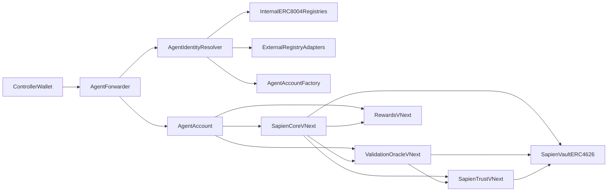
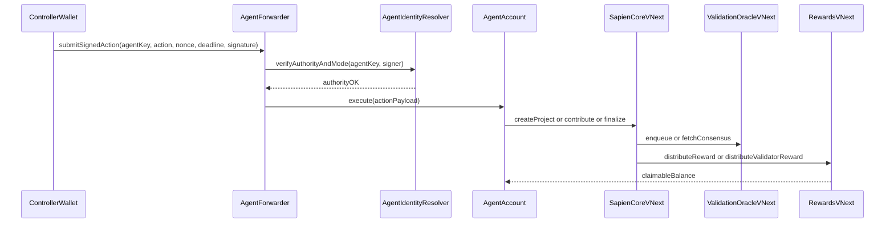

# ERC-8004 VNext Architecture (Hard Cutover)

## Status

- **Target:** next major protocol version (pre-mainnet)
- **Compatibility:** no backward compatibility required
- **Goal:** strict on-chain ERC-8004 compatibility with agent-native execution

## Executive Summary

Sapien VNext replaces address-first participant identity with ERC-8004 identity primitives.  
All originator, contributor, and validator actions are attributable to a canonical identity key derived from `(chainId, identityRegistry, agentId)`.  
Execution moves to deterministic `AgentAccount` contracts, while authorization uses EIP-712 delegated actions and ERC-1271 for contract signers.

This design supports:

- strict registry-level ERC-8004 integration
- internal and external registry modes
- wallet/controller rotation without losing in-flight state or rewards
- identity-keyed event indexing for protocol analytics and integrations

## Why This Change

Current contracts model participants by wallet address and `msg.sender`, which is not sufficient for strict ERC-8004 compliance. The new design needs identity-first attribution and portability across wallets/controllers while preserving all protocol state.

## Locked Decisions

- Hard cutover redesign (no legacy compatibility shims)
- Deterministic `AgentAccount` execution model
- Dual registry strategy:
  - internal protocol-managed registries
  - external canonical ERC-8004 registries via adapters
- Wallet rotation is a first-class requirement

## Design Goals

- Make identity (not wallet) the protocol source of truth.
- Preserve safety invariants for stake, rewards, and slashing under rotation.
- Keep ERC-4626 vault behavior intact while adding identity-aware locking/slashing paths.
- Ensure every critical state transition emits identity-indexed events.
- Keep integration simple for dapps: one identity, one account, one action path.

## Non-Goals

- Supporting legacy address-based APIs.
- Supporting mixed old/new participant state.
- Deferring identity migration to off-chain middleware.

## Identity Model

### Canonical Identity Key

Each participant identity is represented by:

- `chainId`
- `identityRegistry` (ERC-8004 identity registry address)
- `agentId` (ERC-721 token id in that registry)

Derived key:

- `agentKey = keccak256(abi.encode(chainId, identityRegistry, agentId))`

`agentKey` becomes the primary key for:

- project ownership attribution
- contribution claim ownership
- validator assignment/commit/reveal state
- reputation and skill state
- reward entitlement

### Execution Account

Each `agentKey` maps to a deterministic `AgentAccount` (CREATE2).  
Protocol-facing transactions execute from `AgentAccount`, not from transient controller wallets.

Benefits:

- stable on-chain address for protocol interactions
- clean wallet/controller rotation without state movement
- straightforward vault/reward transfer targets

## Authorization Model

### Delegated Action Path

All participant actions pass through `AgentForwarder` using typed EIP-712 messages:

- action selector + params hash
- `agentKey`
- nonce
- deadline

Signature verification:

- EOA: ECDSA recovery
- contract signer: ERC-1271 `isValidSignature`

Replay protection:

- nonce tracking per `agentKey`
- deadline enforcement

### Authority Resolution

`AgentIdentityResolver` validates that the signer/controller is authorized for the `agentKey` using:

- internal registry mode, or
- external registry adapter mode

## Registry Strategy (Both Modes)

### Internal Mode

Protocol deploys and manages ERC-8004-compatible identity/reputation/validation registry contracts.

### External Mode

Protocol integrates with canonical external registries through adapters that normalize calls and validation semantics.

### Mode Contract

Resolver enforces a single active authority source per identity context and prevents ambiguous ownership between modes.

## Protocol Architecture

## Contract-Level Changes

### New Components

- `src/accounts/AgentAccount.sol`
- `src/accounts/AgentAccountFactory.sol`
- `src/integration/AgentForwarder.sol`
- `src/integration/AgentIdentityResolver.sol`
- `src/interface/erc8004/IERC8004IdentityRegistry.sol`
- `src/interface/erc8004/IERC8004ReputationRegistry.sol`
- `src/interface/erc8004/IERC8004ValidationRegistry.sol`
- `src/registry/InternalIdentityRegistry.sol`
- `src/registry/InternalReputationRegistry.sol`
- `src/registry/InternalValidationRegistry.sol`
- `src/integration/ExternalIdentityRegistryAdapter.sol`
- `src/integration/ExternalReputationRegistryAdapter.sol`
- `src/integration/ExternalValidationRegistryAdapter.sol`

### Existing Components Refactored

- `src/interface/ISharedTypes.sol`
  - participant fields move from `address` to `agentKey` (or identity tuple where needed)
- `src/SapienCore.sol`
  - project/claim/contribution ownership keyed by identity
- `src/ValidationOracle.sol`
  - validator state, assignments, commits, reveals keyed by identity
- `src/Rewards.sol`
  - contributor/validator ledgers keyed by identity
- `src/SapienTrust.sol`
  - reputation/skills/cooldowns keyed by identity
- `src/SapienVault.sol`
  - remains ERC-4626 address-native, called through identity resolver to stable `AgentAccount`
- `src/interface/IConsensusAlgorithm.sol` and consensus implementations
  - validation participant fields updated to identity semantics

## Data Model Changes

### Before

- participant identity stored as wallet address
- ownership checks via `msg.sender`
- rewards/reputation keyed by wallet

### After

- participant identity stored as `agentKey`
- action authority verified by forwarder + resolver
- rewards/reputation/assignments keyed by `agentKey`
- transfer endpoints resolved to stable `AgentAccount` or configured payout endpoint

## Wallet Rotation Design

Rotation changes controller authority without changing `agentKey` or `AgentAccount`.

### Rotation Requirements

- current authority proof
- new authority acceptance proof
- fresh nonce and deadline

### Rotation Invariants

- no change in active claims
- no change in validator in-flight stake
- no change in accrued rewards
- no change in reputation/skill state
- no orphaned vault lock state

## Lifecycle Flows

## Event Model

All critical events include identity attribution:

- `agentKey`
- `identityRegistry`
- `agentId`
- execution account address (if relevant)
- correlation ids for validation request/response linkage

New identity events:

- account created for identity
- authority rotated
- registry mode binding updated

## Security Properties

Required invariants:

- identity reward conservation per project/token
- locked stake never exceeds identity stake
- delegated action attribution always matches signed `agentKey`
- nonce monotonicity per identity with no cross-rotation replay
- no orphaned identity state after mode changes
- anti-self-validation checks enforced by identity, not wallet

## Testing Strategy

### New Integration Suites

- agent originator lifecycle
- agent contributor lifecycle
- agent validator lifecycle
- EIP-712 delegated auth paths
- ERC-1271 signer paths
- wallet rotation during active lifecycle states
- internal mode and external mode parity

### Core Test Infrastructure Additions

- mock internal/external ERC-8004 registries
- ERC-1271 wallet mock
- identity and EIP-712 helper libraries
- identity-keyed invariants and fuzz handlers

## Delivery Plan

1. Freeze interfaces and identity key derivation.
2. Implement registries, adapters, and resolver.
3. Implement `AgentAccount` + factory + forwarder auth path.
4. Refactor core/oracle/rewards/trust to identity-keyed state.
5. Integrate vault lock/slash semantics through identity resolution.
6. Redesign event schema and validation correlation.
7. Rewrite integration/invariant tests and run full security pass.

## Definition of Done

- No participant-critical state is keyed by raw wallet address.
- All role actions execute through `AgentAccount` with EIP-712/1271 authorization.
- Wallet rotation preserves full lifecycle and economic state.
- Internal and external registry modes pass identical end-to-end test behavior.
- Identity-rich events are sufficient for deterministic indexing and auditability.
