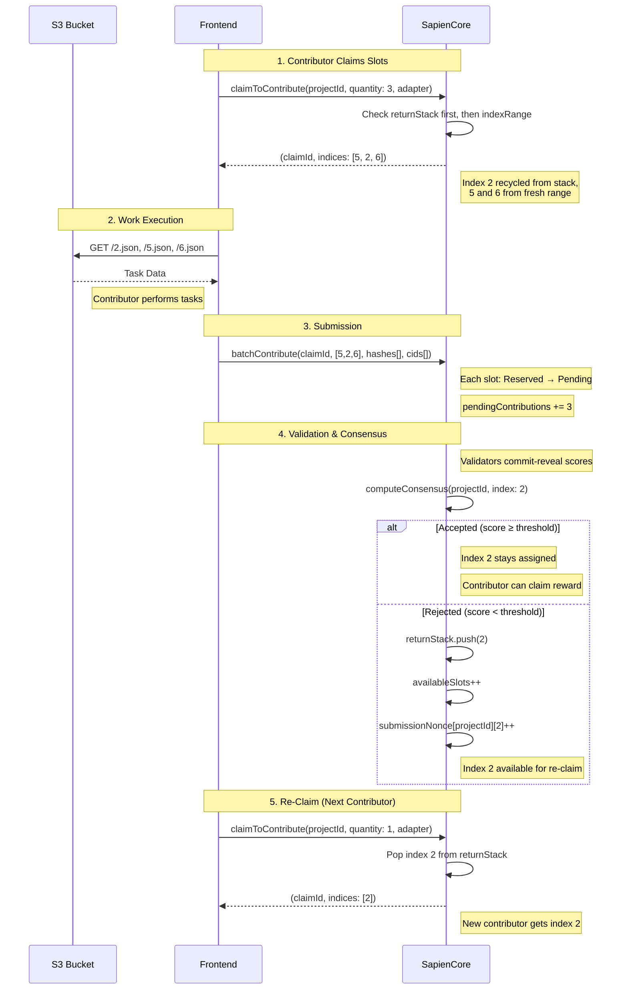

# Data Index Lifecycle

This document explains how the Sapien v0.5 protocol uses onchain indices to manage offchain data stored in external systems (e.g., S3 buckets, IPFS).

## Overview

The "index" is the unique identifier that bridges onchain logic with offchain storage. The contracts treat each index as a "logical unit of work" that requires one submission and multiple validations. The association between an index and specific data files is maintained by the frontend and offchain infrastructure.

## Slot Allocation: Range + Return-Stack Hybrid

v0.5 uses a hybrid allocator that combines contiguous range allocation with a LIFO return stack for recycled indices.

### Storage Layout

```solidity
mapping(bytes32 => IndexRange) indexRange;           // projectId → {start, count}
mapping(bytes32 => mapping(uint256 => uint256)) returnStack;  // projectId → stack
mapping(bytes32 => uint256) returnStackTop;           // projectId → stack height
```

### Allocation Flow

When `claimToContribute` assigns indices:

1. **Return stack first**: Recycle previously returned indices (from rejections/expirations)
2. **Range fallback**: Allocate fresh indices from the contiguous range

```
claimToContribute(projectId, quantity=3)
  │
  ├─ returnStackTop > 0?
  │   ├─ Yes: Pop from returnStack (LIFO)
  │   └─ Repeat until filled or stack empty
  │
  └─ remaining > 0?
      └─ Allocate from indexRange (decrement count)
```

### Return Flow

Indices are returned to the stack when:
- **Contribution rejected**: `computeConsensus` returns the slot when score < threshold
- **Claim expired**: `expireClaim` returns unsubmitted slots

```solidity
returnStack[projectId][returnStackTop[projectId]] = index;
returnStackTop[projectId]++;
project.availableSlots++;
```

## Sequence Diagram



## Nonce System

Each index tracks a `submissionNonce` that increments when a contribution is rejected. This enables:

- **Re-contribution**: A new contributor can submit to the same index
- **Isolation**: Validations, consensus reports, and disputes are keyed by `(projectId, index, nonce)` to prevent state cross-contamination between rounds

```
submissionNonce[projectId][index] = 0  (first submission)
  → Rejected by consensus
submissionNonce[projectId][index] = 1  (second submission)
  → Accepted by consensus
```

## Summary Mapping

| System Component | Role of the Index |
|:---|:---|
| **S3 / IPFS** | The filename or CID (e.g., `3.json`). |
| **SapienCore** | The unique "slot" for a piece of work, tracked in `contributions[projectId][index]`. |
| **Frontend** | The key used to construct the URL: `bucket.s3.com/${index}.json`. |
| **Return Stack** | Recycling bin for rejected/expired indices, ensuring no wasted slots. |
| **Nonce** | Version counter per index, isolating each submission round. |

**Key Takeaway:** The contracts manage the flow of "units of work" (indices) with automatic recycling. The association between an index and specific data is maintained by the frontend and offchain infrastructure.
