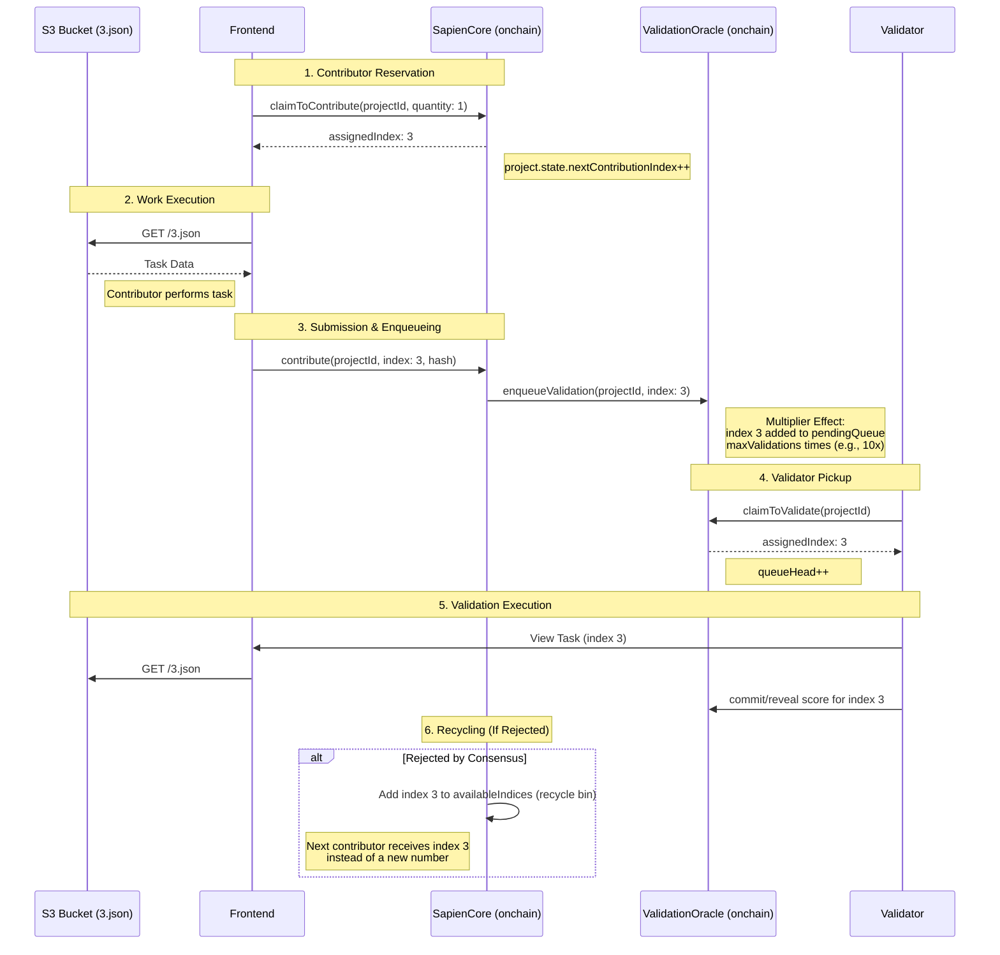

# Data Index Lifecycle (S3 Mapping)

This document explains how the Sapien V2 protocol uses onchain indices to manage offchain data stored in S3 (e.g., `0.json`, `1.json`, `3.json`).

## Overview

The "Index" is the unique identifier that bridges the onchain logic with offchain storage. The contract does not know about S3 or JSON; it treats each index as a "logical unit of work" that requires one submission and multiple validations.

## Sequence Diagram



## Step-by-Step Lifecycle

### 1. The Contributor "Reserves" the Number
When a contributor wants to work, they call `claimToContribute` in `SapienCore.sol`.

```solidity
// SapienCore.sol
assignedIndex = project.state.nextContributionIndex;
project.state.nextContributionIndex++;
```

If the project is new, the first contributor gets index `0`, then `1`, etc. If they claim a quantity of 3, they are assigned indices `0, 1, 2`. The frontend interprets this as: *"Go fetch `0.json`, `1.json`, and `2.json` from S3."*

### 2. The Submission
After finishing work for `3.json`, the contributor calls `contribute`. The contract records that index `3` has been submitted and notifies the Oracle.

```solidity
// SapienCore.sol
oracle.enqueueValidation(projectId, contributionIndex, block.timestamp);
```

### 3. The Validation Queue (The "Multiplier" Effect)
When index `3` is submitted, the `ValidationOracle` adds it to the queue multiple times based on the project's `maxValidations` setting.

```solidity
// ValidationOracle.sol
for (uint256 i = 0; i < max; i++) {
    pendingQueue[projectId][settings.queueTail] = contributionIndex;
    settings.queueTail++;
}
```

If `maxValidations` is 10, index `3` is added 10 times, ensuring 10 different people review the data.

### 4. Validator Pickup
When a validator calls `claimToValidate`, they "pop" the next number off the queue.

```solidity
// ValidationOracle.sol
uint256 index = pendingQueue[projectId][settings.queueHead];
settings.queueHead++;
```

If assigned index `3`, the frontend knows to display the data from `3.json` and the corresponding submission.

### 5. Index Re-queuing (The "Safety" Mechanism)
If `3.json` is rejected, `SapienCore` puts the index back in a "recycle bin" so another contributor can try again.

```solidity
// SapienCore.sol
stackTop[projectId]++;
availableIndices[projectId][stackTop[projectId]] = index;
```

The next contributor to call `claimToContribute` will receive `3` from the recycle bin before any new indices are generated.

## Summary Mapping

| System Component | Role of the Index |
| :--- | :--- |
| **S3 Bucket** | The filename (`3.json`). |
| **SapienCore** | The unique "slot" for a piece of work. |
| **ValidationOracle** | The "task" identifier in the FIFO queue. |
| **Frontend** | The key used to construct the URL: `bucket.s3.com/${index}.json`. |

**Key Takeaway:** The contracts manage the flow of "units of work" (indices). The association between an index and specific data (S3 files) is maintained by the frontend and offchain infrastructure.
