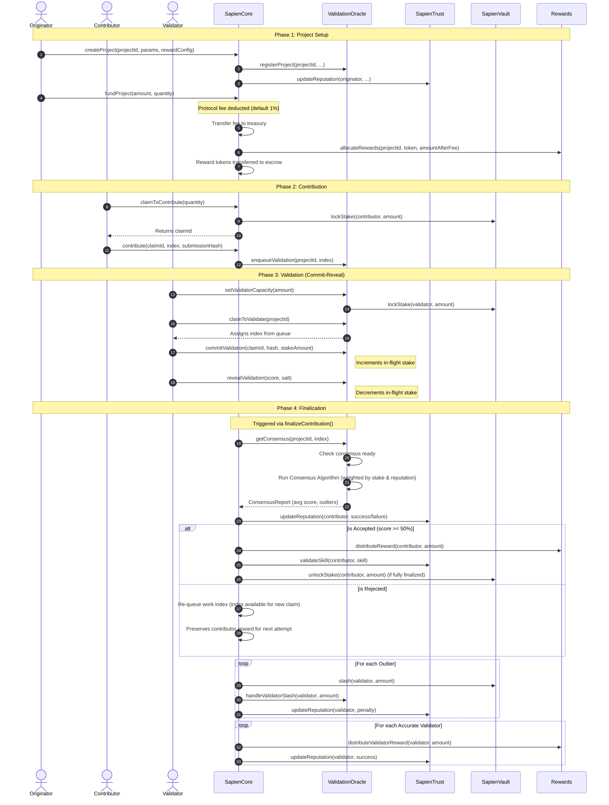
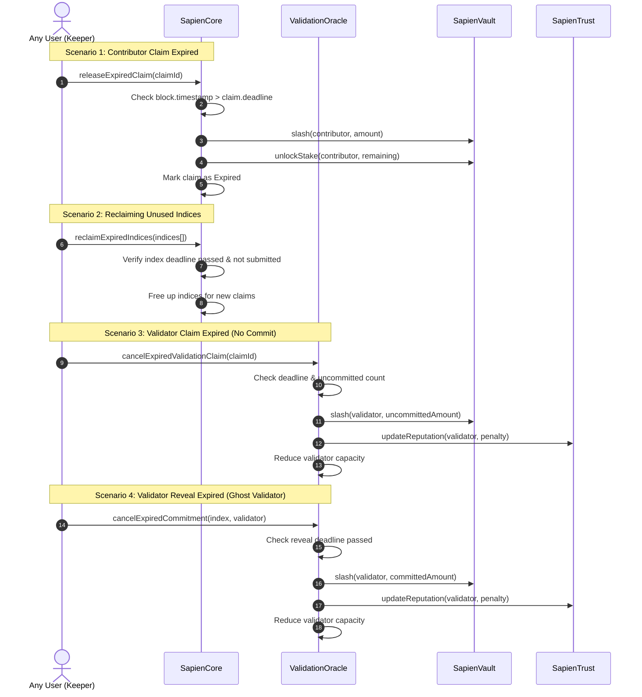

# Protocol Lifecycle

This diagram illustrates the end-to-end lifecycle of a Sapien PoQ project, from creation to finalization and reward distribution.

## 🔄 End-to-End Sequence Diagram

## 🪜 Breakdown of Phases

### 1. Project Setup
Originators define the project parameters, including reward tokens, minimum stakes (for claiming and contributing), validator reward splits, and required skills. When funding the project, a protocol fee (default 1%) is automatically deducted and sent to the Sapien treasury. The remaining amount is moved into the `Rewards` contract escrow for distribution to contributors and validators.

### 2. Contribution
Contributors claim slots (`claimToContribute`), which locks their "skin in the game" stake in the `SapienVault`. They receive a set of reserved indices. When they submit their work (`contribute`), the submission is tracked and immediately enqueued in the `ValidationOracle` for validation.

### 3. Validation
Validators must first set their validation capacity (`setValidatorCapacity`), locking SAPIEN tokens in the vault. They then claim validation tasks (`claimToValidate`) from the queue. The process follows a Commit-Reveal scheme:
1.  **Commit**: Validators submit a hash of their score and salt. They can optionally "confidence stake" a variable amount of their capacity to increase their weight in consensus.
2.  **Reveal**: After the commit window, they reveal their score. This mechanism prevents copying ("mirroring") other validators.

### 4. Finalization
Once enough validations are received and revealed, `finalizeContribution` is called. The `ValidationOracle` calculates consensus using the project's selected algorithm (e.g., `CappedLinearConsensus`).
-   **Contributors**: Receive rewards if the average score is ≥ 50%. If rejected, the index is re-queued for another contributor.
-   **Validators**: Accurate validators earn rewards proportional to their weighted stake. Outliers (those too far from consensus) are slashed and suffer reputation penalties.

## ⚠️ Edge Cases & Timeouts

The system includes several mechanisms to handle expiration and non-performance:

### 1. Contributor Claim Expiration
If a contributor reserves slots but fails to submit work before the deadline:
-   **Function**: `SapienCore.releaseExpiredClaim`
-   **Consequence**: The contributor is slashed (loss of stake) for the unfulfilled slots. Remaining stake is returned.

### 2. Index Reclamation
Indices reserved by expired claims are not automatically freed to save gas.
-   **Function**: `SapienCore.reclaimExpiredIndices`
-   **Consequence**: Makes the contribution indices available again for other contributors to claim.

### 3. Validator Claim Expiration (No Commit)
If a validator claims a task but fails to commit a score/hash:
-   **Function**: `ValidationOracle.cancelExpiredValidationClaim`
-   **Consequence**: The validator is slashed for the uncommitted validations.

### 4. Validator Reveal Expiration (Ghost Validator)
If a validator commits but fails to reveal their score (trying to hide a bad vote or save gas):
-   **Function**: `ValidationOracle.cancelExpiredCommitment`
-   **Consequence**: The validator is slashed for the full committed stake amount and suffers a reputation penalty.
