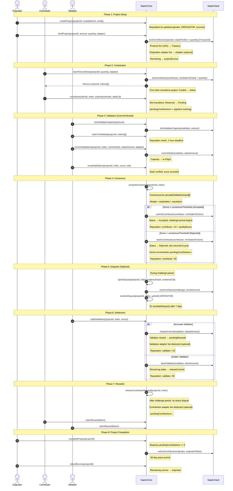
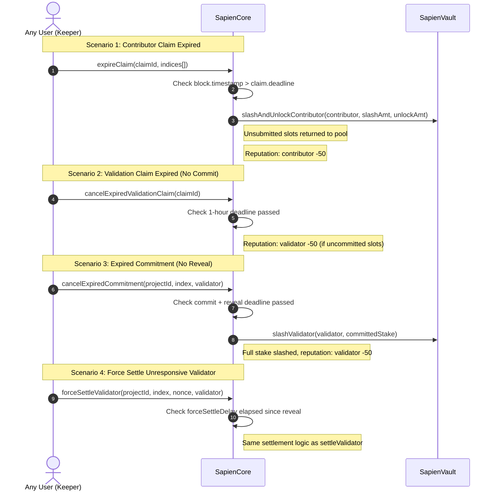

# Protocol Lifecycle

This diagram illustrates the end-to-end lifecycle of a Sapien PoQ project, from creation to finalization and reward distribution.

## End-to-End Sequence Diagram

## Breakdown of Phases

### 1. Project Setup
Originators register a project with `createProject`, defining the reward token, consensus threshold (BPS), number of validations, validator reward share, and optional skill requirements. Funding via `fundProject` transfers reward tokens into escrow after deducting the protocol fee (default 10%) and optional origination adapter fee (default 4% if an adapter is set). If `originatorStakeRequirement > 0`, the originator's stake is locked per slot.

### 2. Contribution
Contributors claim slots via `claimToContribute`, which locks their stake at `minStakeToClaim × quantity` and assigns slot indices using a range + return-stack hybrid allocator. The first claim on a `Funded` project transitions it to `Active`. Work is submitted via `contribute` with a submission hash and data CID.

### 3. Validation
Validators pre-lock capacity via `lockValidatorCapacity`, then claim specific indices via `claimToValidate` (1-hour deadline, reputation check). The commit-reveal scheme uses `keccak256(abi.encodePacked(uint16(score), salt))` as the commit hash. Stake moves from `validatorCapacity` to `inFlight` on commit.

### 4. Consensus
`computeConsensus` calls `ConsensusLib.calculate()` which computes a stake-weighted average (`sqrt(stake) × reputation`), standard deviation, and classifies outliers using tiered thresholds. The contribution is set to `Accepted` (score ≥ threshold) or `Rejected` (score < threshold). Accepted contributions start the challenge period; rejected contributions return the slot to the pool and increment the submission nonce.

### 5. Disputes
During the challenge period, bonded disputes can challenge consensus outcomes. Operators resolve disputes, or they auto-escalate after 7 days. Separate originator reports allow community accountability.

### 6. Settlement
Each validator calls `settleValidator`. Outliers are slashed at tiered rates (10%–100%). Accurate validators receive their stake back plus a share of the validator reward pool proportional to their consensus weight. Adapter fees are deducted if applicable.

### 7. Rewards
`releaseContributorReward` moves the contributor's share from project escrow to their pending balance (after adapter fee deduction). `claimReward` transfers pending rewards to the user's wallet (subject to `minClaimAmount` and `claimCooldown`).

### 8. Project Completion
The originator calls `completeProject` when no contributions are in-flight, which unlocks their stake and starts a 30-day grace period. After the grace period, `refundEscrow` returns any remaining tokens.

## Optimization and Improvement Recommendations

Based on expanded lifecycle and edge-path testing in `test/lifecycle/Lifecycle.t.sol`,
the following improvements are recommended to improve liveness, operator UX, and
integrator safety.

1. **Release validator slot reservations on validation-claim expiry**  
   On `cancelExpiredValidationClaim`, clear uncommitted reservation flags and
   decrement claim counters so new validators can claim and unblock consensus.

2. **Enforce claim-level commit cutoff**  
   In `commitValidation`, require the associated validation claim to still be
   `Active` and before claim deadline to preserve commit-reveal fairness.

3. **Add a terminal upheld-dispute transition**  
   For upheld disputes on accepted contributions, finalize contribution state in a
   way that decrements `pendingContributions` and preserves project completion paths.

4. **Define cancelled-project escrow settlement policy**  
   Add an explicit escrow disposition path for `Cancelled` projects (originator
   refund, treasury routing, or governance-defined split) to avoid stranded funds.

5. **Standardize commit-hash encoding across docs and contracts**  
   Keep interface docs, SDK helpers, and onchain verification logic in strict
   alignment (including score type/padding) to prevent reveal failures.

6. **Strengthen keeper recoverability patterns**  
   Continue exposing permissionless recovery operations (`cancelExpiredCommitment`,
   `forceSettleValidator`) and ensure every timeout path has a bounded, terminal
   cleanup route.

For currently confirmed lifecycle issues and reproductions, see
`docs/security/lifecycle-flow-issues.md`.

## Edge Cases & Timeouts

### 1. Contributor Claim Expiration
If a contributor fails to submit work before the claim deadline, anyone can call `expireClaim`. Unsubmitted slots are returned to the pool, the contributor is slashed for unsubmitted slots, stake is unlocked for submitted slots, and reputation decreases.

### 2. Validation Claim Expiration
If a validator fails to commit within the 1-hour validation claim deadline, anyone can call `cancelExpiredValidationClaim`. The validator's reputation is penalized for uncommitted slots.

### 3. Expired Commitment
If a validator commits but fails to reveal within the combined commit + reveal deadline, anyone can call `cancelExpiredCommitment`. The validator's full committed stake is slashed and their reputation decreases.

### 4. Force Settlement
If a validator reveals but fails to settle after the `forceSettleDelay` (default 3 days), anyone can call `forceSettleValidator` to settle on their behalf. This prevents validators from blocking reward distribution.
