# Sapien PoQ Protocol — Frontend Lifecycle Reference

> **Audience:** Frontend/dApp engineers implementing the Sapien Proof-of-Quality protocol.
> **Contract:** `SapienCore` (UUPS proxy, ERC-7201 storage)
> **External dependency:** `SapienVault` (stake operations; called only by `SapienCore`)

---

## 1. Entity State Machines

Understanding these enums is prerequisite for every UI state gate.

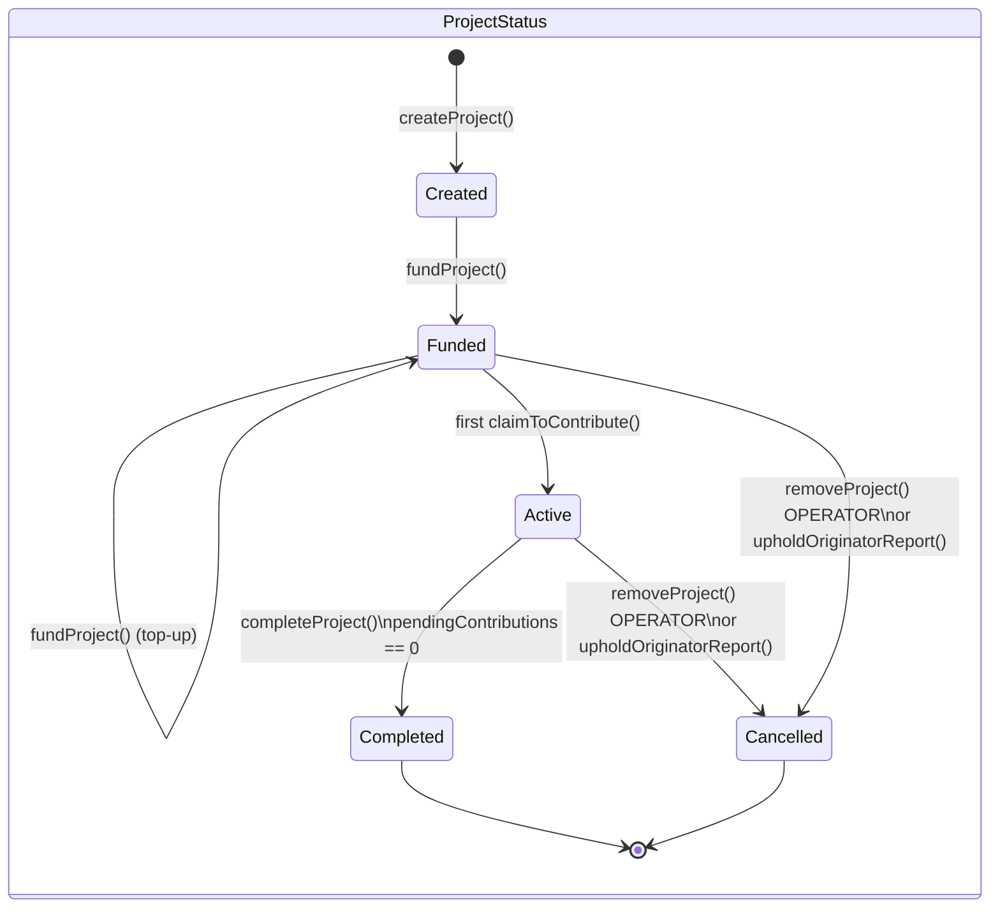

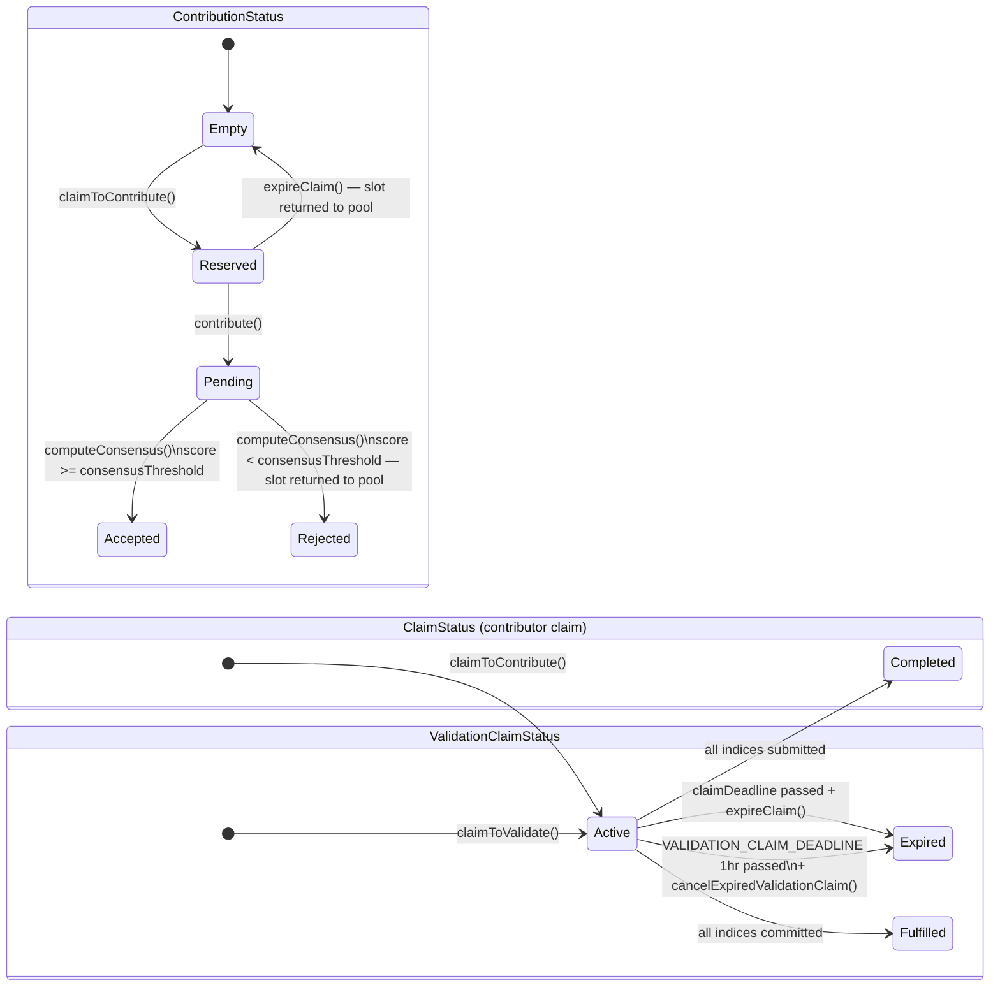

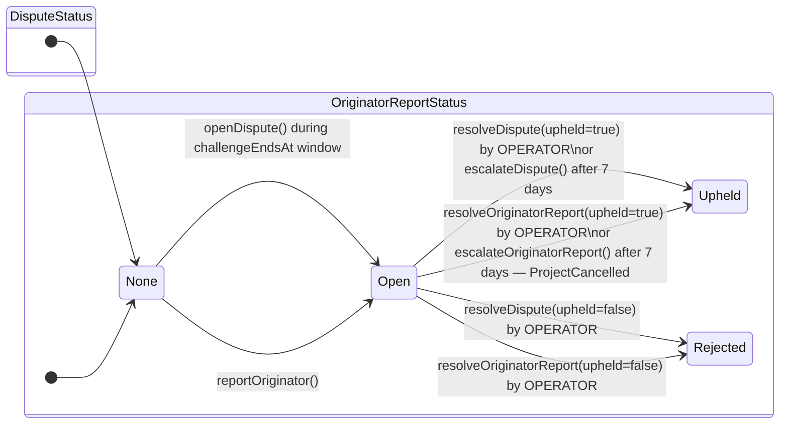

---

## 2. Timing Windows Reference

All durations are configurable by admin within bounds. These are the defaults.

| Window | Default | Max | Starts at | Notes |
|---|---|---|---|---|
| `claimDeadline` | 1 day | 30 days | `claimToContribute()` tx time | Contributor must call `contribute()` before this |
| `VALIDATION_CLAIM_DEADLINE` | 1 hour | fixed | `claimToValidate()` tx time | Validator must call `commitValidation()` before this |
| `commitDeadline` | 1 day | 30 days | `commitValidation()` tx time | Validator must call `revealValidation()` before `commitTimestamp + commitDeadline + revealDeadline` |
| `revealDeadline` | 1 day | 30 days | `commitValidation()` tx time | Combined window with `commitDeadline` above |
| `challengePeriod` | 1 day | 30 days | `computeConsensus()` tx time | `releaseContributorReward()` blocked during this |
| `forceSettleDelay` | 3 days | 90 days | `revealValidation()` tx time | Anyone can call `forceSettleValidator()` after this |
| `DISPUTE_RESOLUTION_DEADLINE` | 7 days | fixed | `openDispute()` tx time | Anyone can call `escalateDispute()` after this |
| `PROJECT_COMPLETION_DELAY` | 30 days | fixed | `completeProject()` tx time | `refundEscrow()` blocked during this; Cancelled projects skip the delay |

---

## 3. Happy Path — Full Lifecycle Swimlane

```mermaid
sequenceDiagram
    autonumber
    participant OR as Originator
    participant SC as SapienCore
    participant SV as SapienVault
    participant CTR as Contributor
    participant VLD as Validator

    Note over OR,SC: Phase 1 — Project Origination
    OR->>SC: createProject(projectId, metadataCid, config)
    Note right of SC: ProjectStatus.Created<br/>reputation[originator][ORIGINATOR] up
    OR->>SC: fundProject(projectId, amount, quantity, adapter)
    SC->>SC: protocolFee to treasury
    SC->>SC: originationFee to pendingRewards[adapter]
    SC->>SC: remainder to projectEscrow[projectId]
    Note right of SC: ProjectStatus.Funded<br/>totalQuantity += quantity<br/>availableSlots += quantity

    Note over CTR,SC: Phase 2 — Contribution
    CTR->>SC: claimToContribute(projectId, quantity, adapter)
    SC->>SV: lockContributor(contributor, minStakeToClaim * quantity)
    SC-->>CTR: claimId + indices[]
    Note right of SC: ProjectStatus Funded to Active on first claim<br/>indices status to Reserved<br/>ClaimStatus.Active, deadline = now + claimDeadline
    CTR->>SC: contribute(claimId, index, submissionHash, dataCid)
    Note right of SC: ContributionStatus Reserved to Pending<br/>rewardRate = totalRewards / totalQuantity<br/>pendingContributions++
    Note over CTR: Use batchContribute() to submit all indices in one tx

    Note over VLD,SC: Phase 3 — Validation
    VLD->>SC: lockValidatorCapacity(amount)
    SC->>SV: lockValidatorCapacity(validator, amount)
    VLD->>SC: claimToValidate(projectId, indices[])
    SC-->>VLD: validationClaimId
    Note right of SC: ValidationClaimStatus.Active<br/>deadline = now + 1hr<br/>Reserves claimCount slots per index
    VLD->>SC: commitValidation(projectId, index, commitHash, stakeAmount, adapter)
    SC->>SV: commitStake(validator, stakeAmount)
    Note right of SC: commitHash = keccak256(abi.encodePacked(score, salt))<br/>stakeAmount >= max(project.minValidationStake, global.minValidationStake)<br/>validationClaim.committedCount++ — Fulfilled when all committed
    Note over VLD: Store score + salt off-chain immediately
    VLD->>SC: revealValidation(projectId, index, score, salt)
    Note right of SC: Verifies keccak256(abi.encodePacked(score, salt)) == commitHash<br/>score must be 0 to 10000 basis points<br/>revealCount++ per index

    Note over SC: Phase 4 — Consensus
    SC->>SC: computeConsensus(projectId, index)
    Note right of SC: Callable by anyone once revealCount >= numberOfValidations<br/>Weighted average of scores by stake * reputation<br/>Std deviation used for outlier detection
    alt Accepted — weightedAverage >= consensusThreshold
        Note right of SC: ContributionStatus to Accepted<br/>challengeEndsAt = now + challengePeriod<br/>contributor reputation up<br/>minStakeToClaim unlocked for contributor
    else Rejected — weightedAverage < consensusThreshold
        Note right of SC: ContributionStatus to Rejected<br/>challengeEndsAt = now + challengePeriod<br/>contributor reputation down, stake slashed<br/>index slot returned to pool, submissionNonce++
    end

    Note over VLD,SC: Phase 5 — Validator Settlement
    VLD->>SC: settleValidator(projectId, index, nonce)
    Note right of SC: nonce = contributions[projectId][index].consensusNonce<br/>Must be called after computeConsensus()
    alt Accurate validator — not outlier
        SC->>SV: releaseCommit(validator, stakedAmount)
        Note right of SC: validatorShare = totalRewards * validatorRewardBps * weight<br/>             / (BPS * totalQuantity * totalAccurateWeight)<br/>validationFee to pendingRewards[adapter]<br/>net reward to pendingRewards[validator]<br/>validator reputation up
    else Outlier validator
        SC->>SV: slashValidator(validator, slashAmount)
        SC->>SV: releaseCommit(validator, remainder)
        Note right of SC: validator reputation down
    end

    Note over CTR,SC: Phase 6 — Reward Release and Claim
    SC->>SC: releaseContributorReward(projectId, index)
    Note right of SC: Callable by anyone<br/>Requires Accepted + challengeEndsAt elapsed + no open or upheld dispute<br/>contributorShare = rewardRate * (BPS - validatorRewardBps) / BPS<br/>contributionFee to pendingRewards[adapter]<br/>net reward to pendingRewards[contributor]<br/>pendingContributions--
    CTR->>SC: claimReward(token)
    SC-->>CTR: ERC-20 transfer
    Note right of SC: Respects minClaimAmount and claimCooldown
    VLD->>SC: claimReward(token)
    SC-->>VLD: ERC-20 transfer

    Note over OR,SC: Phase 7 — Project Completion
    OR->>SC: completeProject(projectId)
    Note right of SC: Requires originator caller + pendingContributions == 0<br/>Unlocks originatorLockedStake<br/>ProjectStatus to Completed
    Note over OR,SC: Wait 30 days PROJECT_COMPLETION_DELAY
    OR->>SC: refundEscrow(projectId)
    Note right of SC: Returns remaining projectEscrow to originator
    SC-->>OR: ERC-20 transfer of remaining escrow
```

---

## 4. Edge Case — Claim Expiry (Contributor Fails to Submit)

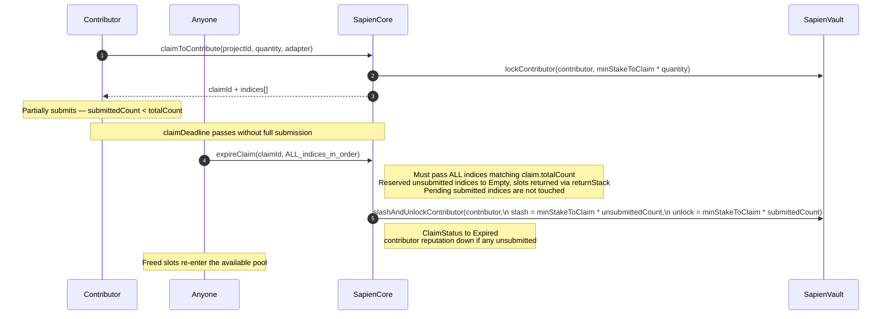

**Frontend gate:** Show "Expire Claim" when `block.timestamp > claim.deadline && claim.status == Active`.

---

## 5. Edge Case — Validation Claim Expiry (Validator Fails to Commit)

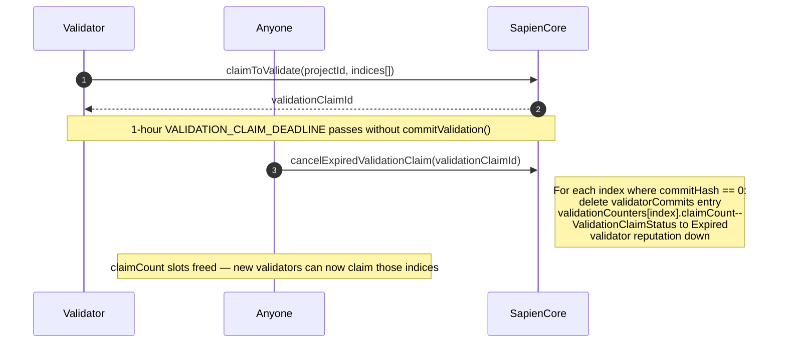

**Critical:** If this is never called, validation slots remain locked and `computeConsensus()` can never be triggered, permanently deadlocking the contribution pipeline. Surface expired validation claims as actionable items in the UI.

---

## 6. Edge Case — Expired Commit (Validator Commits but Fails to Reveal)

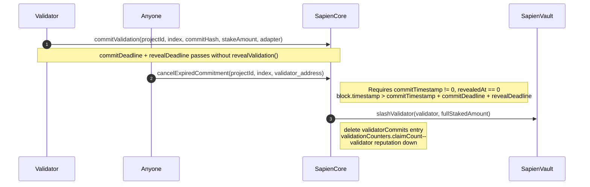

**Frontend:** Expose a keeper "Cancel Expired Commit" action. Watch `ValidationCommitted` events and flag validators at `commitTimestamp + commitDeadline + revealDeadline`.

---

## 7. Edge Case — Force Settle (Validator Fails to Self-Settle)

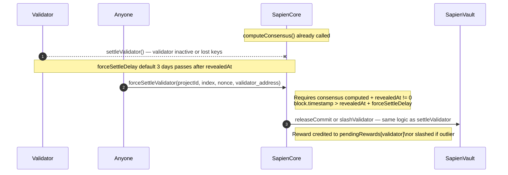

**Frontend:** After `revealedAt + forceSettleDelay`, check `isValidatorSettled(projectId, index, nonce, validator)` and surface the force settle action for unsettled validators.

---

## 8. Dispute Flow — Consensus Challenge

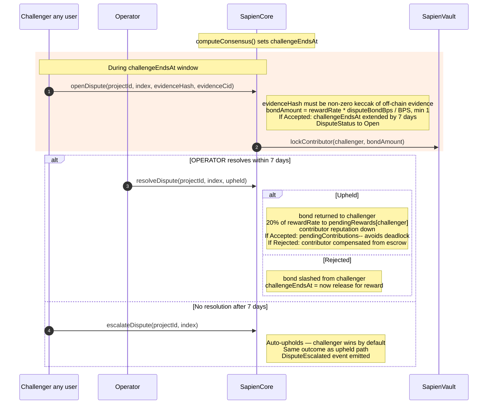

**Frontend gates:**
- Show "Open Dispute" only when `contribution.status ∈ {Accepted, Rejected}` AND `block.timestamp <= contribution.challengeEndsAt` AND `dispute.status == None`
- Show "Escalate Dispute" when `dispute.status == Open` AND `block.timestamp > dispute.openedAt + 7 days`
- `releaseContributorReward()` is blocked while `dispute.status ∈ {Open, Upheld}`

---

## 9. Originator Report Flow — Misconduct

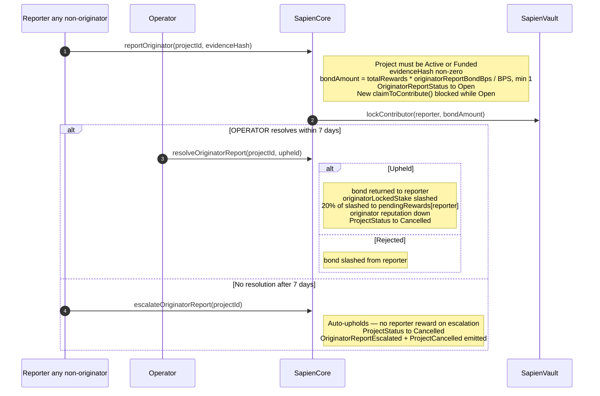

**After cancellation:** `refundEscrow()` is immediately callable — no 30-day delay for Cancelled projects.

---

## 10. Rejected Contribution — Dispute to Rehabilitate

When `computeConsensus()` produces `Rejected` and the contributor believes validators erred:

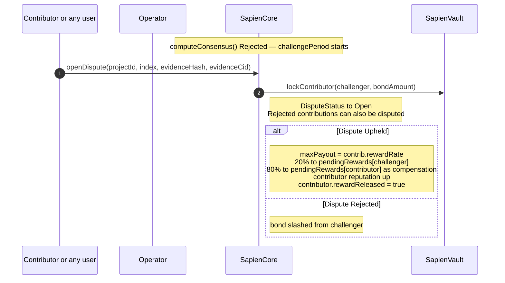

---

## 11. Project Completion — Full Teardown

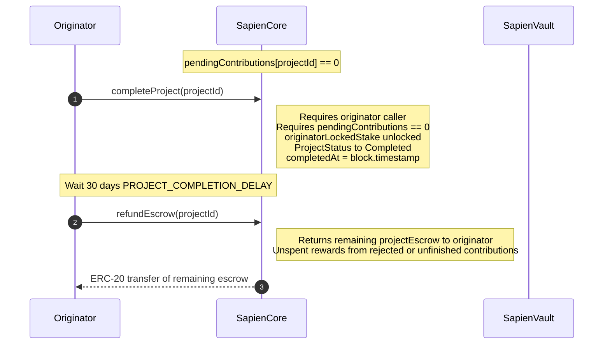

**Cancelled project path:** `refundEscrow()` is immediately callable with no 30-day wait.

---

## 12. Key Read Calls for UI State Gating

| Data needed | Call | Notes |
|---|---|---|
| Project state | `getProject(projectId)` | Full `Project` struct |
| Contribution state | `getContribution(projectId, index)` | `status`, `challengeEndsAt`, `rewardReleased` |
| Contributor claim | `getClaim(claimId)` | `deadline`, `status`, `submittedCount` |
| Validation claim | `getValidationClaim(validationClaimId)` | `deadline`, `status`, `committedCount` |
| Consensus report | `getConsensusReport(projectId, index)` | `computed`, `weightedAverage` |
| Current dispute | `getDispute(projectId, index)` | Keyed by current `consensusNonce` automatically |
| Originator report | `getOriginatorReport(projectId)` | `status`, `reportedAt` |
| Pending rewards | `getPendingRewards(user, token)` | Accrued but unclaimed balance |
| Validator settled | `isValidatorSettled(projectId, index, nonce, validator)` | `nonce = contribution.consensusNonce` |
| Validator outlier | `isValidatorOutlier(projectId, index, validator)` | After consensus computed |
| Available slots | `getProject(projectId).availableSlots` | How many more claims can be opened |
| Reveal count | `getRevealCount(projectId, index)` | Compare vs `project.numberOfValidations` |
| Challenge period | `challengePeriod()` | Seconds; add to `computeConsensus()` block time |
| Commit deadline | `commitDeadline()` | Seconds |
| Reveal deadline | `revealDeadline()` | Seconds |
| Force settle delay | `forceSettleDelay()` | Seconds |

---

## 13. Events to Index

| Event | When emitted | Key data |
|---|---|---|
| `ProjectCreated` | `createProject()` | `projectId`, `originator` |
| `ProjectFunded` | `fundProject()` | `projectId`, `amount`, `quantity` |
| `ProjectCompleted` | `completeProject()` | `projectId` |
| `ProjectCancelled` | `removeProject()`, upheld report or escalation | `projectId` |
| `ClaimCreated` | `claimToContribute()` | `claimId`, `projectId`, `claimant`, `indices` |
| `ClaimExpired` | `expireClaim()` | `claimId`, `unsubmittedCount` |
| `ContributionSubmitted` | `contribute()` | `projectId`, `index`, `contributor`, `submissionHash`, `dataCid` |
| `ValidationClaimCreated` | `claimToValidate()` | `validationClaimId`, `projectId`, `validator`, `indices` |
| `ValidationClaimExpired` | `cancelExpiredValidationClaim()` | `validationClaimId`, `releasedCount` |
| `ValidationCommitted` | `commitValidation()` | `projectId`, `index`, `validator` |
| `ValidationRevealed` | `revealValidation()` | `projectId`, `index`, `validator`, `score` |
| `ConsensusReached` | `computeConsensus()` | `projectId`, `index`, `weightedAverage`, `newStatus` |
| `ValidatorSettled` | `settleValidator()` / `forceSettleValidator()` | `projectId`, `index`, `validator`, `isOutlier` |
| `ContributorRewardReleased` | `releaseContributorReward()` | `projectId`, `index`, `contributor`, `reward` |
| `RewardClaimed` | `claimReward()` | `user`, `token`, `amount` |
| `DisputeOpened` | `openDispute()` | `projectId`, `index`, `challenger`, `bondAmount`, `evidenceCid` |
| `DisputeResolved` | `resolveDispute()`, `upholdDispute()`, `rejectDispute()` | `projectId`, `index`, `upheld` |
| `DisputeEscalated` | `escalateDispute()` | `projectId`, `index` |
| `OriginatorReported` | `reportOriginator()` | `projectId`, `reporter`, `bondAmount` |
| `OriginatorReportResolved` | `resolveOriginatorReport()`, `rejectOriginatorReport()` | `projectId`, `upheld` |
| `OriginatorReportEscalated` | `escalateOriginatorReport()` | `projectId` |
| `ValidatorCommitmentExpired` | `cancelExpiredCommitment()` | `projectId`, `index`, `validator` |
| `EscrowRefunded` | `refundEscrow()` | `projectId`, `amount` |

---

## 14. Commit Hash Encoding (Critical for Validators)

The commit hash **must** be computed as:

```solidity
bytes32 commitHash = keccak256(abi.encodePacked(uint256(score), bytes32(salt)));
```

In TypeScript with ethers v6:

```typescript
import { ethers } from "ethers";

const score: bigint = 8500n; // 85.00% — basis points, range 0–10000
const salt: string = ethers.hexlify(ethers.randomBytes(32));

const commitHash: string = ethers.solidityPackedKeccak256(
  ["uint256", "bytes32"],
  [score, salt]
);

// Store score + salt off-chain immediately (localStorage, encrypted DB, etc.)
// Pass commitHash to commitValidation()
// Pass score + salt to revealValidation() later
```

**Wrong patterns that will fail reveal:**

| Pattern | Problem |
|---|---|
| `keccak256(abi.encode(score, salt))` | ABI encoding pads to 32 bytes each — not packed |
| `keccak256(abi.encodePacked(uint16(score), salt))` | Wrong integer width |
| `ethers.keccak256(AbiCoder.defaultAbiCoder().encode(...))` | Padded, not packed |

---

## 15. Common Errors and Causes

| Error | Cause | Frontend fix |
|---|---|---|
| `ProjectNotActive` | Project in wrong status | Check `project.status` before calling |
| `NoSlotsAvailable` | `availableSlots == 0` | Wait for rejected contributions to return slots |
| `ClaimDeadlinePassed` | Submit after deadline or claim already expired | Gate on `claim.deadline` |
| `ClaimDeadlineNotPassed` | Attempting to expire before deadline | Check timestamp |
| `IndexNotReserved` | Contribute to index not in Reserved state | Track per-index `contribution.status` |
| `IndexNotSubmitted` | `claimToValidate` on index not in Pending state | Check `contribution.status == Pending` |
| `AlreadyCommitted` | Commit twice or `claimToValidate` twice on same index | Check `validatorCommits[...].commitHash != 0` |
| `ValidationNotClaimed` | `commitValidation` before `claimToValidate` | Always claim first |
| `NotCommitted` | `revealValidation` without a prior commit | Verify commit hash exists |
| `AlreadyRevealed` | Reveal twice | Check `revealedAt != 0` |
| `RevealWindowClosed` | `block.timestamp > commitTimestamp + commitDeadline + revealDeadline` | Reveal promptly |
| `InvalidReveal` | score or salt do not match commitHash | Verify encoding — see §14 |
| `InvalidScore` | `score > 10000` | Scores are basis points, max 10000 |
| `ConsensusNotReady` | `revealCount < numberOfValidations` | Wait for more reveals |
| `ConsensusAlreadyComputed` | `computeConsensus` called twice | Check `consensusReport.computed` |
| `AlreadySettled` | `settleValidator` called twice | Check `isValidatorSettled` |
| `ForceSettleTooEarly` | `block.timestamp <= revealedAt + forceSettleDelay` | Wait |
| `ChallengeNotElapsed` | `releaseContributorReward` before challenge period | Check `contribution.challengeEndsAt` |
| `DisputeInProgress` | `releaseContributorReward` with open or upheld dispute | Wait for dispute resolution |
| `DisputeWindowClosed` | `openDispute` after `challengeEndsAt` | Check timestamp |
| `DisputeAlreadyOpen` | Only one dispute per (projectId, index, nonce) | Check `dispute.status` |
| `DisputeAlreadyClosed` | Dispute already resolved | Final state, no action |
| `CannotDisputeOwnContribution` | Contributor disputes their own Accepted submission | Block in UI |
| `OriginatorCannotContribute` | Originator contributes to own project | Block in UI |
| `CannotValidateOwnContribution` | Validator validates index they contributed | Block in UI |
| `InsufficientReputation` | `rep < project.minValidatorReputation` | Show reputation requirement |
| `InsufficientStake` | Validation stake below minimum | Show `max(project.minValidationStake, global.minValidationStake)` |
| `ProjectHasActivePipeline` | `completeProject` with `pendingContributions > 0` | Wait for all contributions to clear |
| `ClaimCooldownActive` | `claimReward` called too soon | Show next eligible timestamp |
| `ClaimAmountTooSmall` | `pendingRewards < minClaimAmount` | Show threshold to user |
| `NoRewardToClaim` | `pendingRewards[user][token] == 0` | Nothing to claim |
| `InvalidEvidenceHash` | `evidenceHash == bytes32(0)` | Always provide a real keccak hash |
| `DisputeResolutionNotExpired` | Escalate before 7-day window | Check `dispute.openedAt + 7 days` |

---

## 16. Permissioned Action Summary

| Action | Who can call |
|---|---|
| `createProject` | Anyone |
| `fundProject` | Project originator only |
| `removeProject` | `OPERATOR_ROLE` only |
| `claimToContribute` | Anyone except project originator |
| `contribute` / `batchContribute` | Claim owner only |
| `expireClaim` | Anyone after deadline |
| `lockValidatorCapacity` / `unlockValidatorCapacity` | Anyone for themselves |
| `claimToValidate` | Anyone — not own contribution, reputation gated |
| `commitValidation` / `batchCommitValidations` | Validator who claimed the indices |
| `revealValidation` / `batchRevealValidations` | Validator who committed |
| `cancelExpiredValidationClaim` | Anyone — keeper action |
| `cancelExpiredCommitment` | Anyone — keeper action |
| `computeConsensus` | Anyone after enough reveals |
| `settleValidator` | Validator settling themselves |
| `forceSettleValidator` | Anyone after `forceSettleDelay` |
| `releaseContributorReward` | Anyone after `challengePeriod` |
| `claimReward` | Anyone for themselves |
| `openDispute` | Anyone except own Accepted contribution |
| `resolveDispute` | `OPERATOR_ROLE` only |
| `escalateDispute` | Anyone after 7 days |
| `reportOriginator` | Anyone except originator |
| `resolveOriginatorReport` | `OPERATOR_ROLE` only |
| `escalateOriginatorReport` | Anyone after 7 days |
| `completeProject` | Project originator only |
| `refundEscrow` | Project originator only |

---

## 17. Key Implementation Notes for Frontend Teams

**`pendingContributions` is the project completion gate.** Every rejected contribution (at `computeConsensus`), every reward-released accepted contribution (at `releaseContributorReward`), and every upheld dispute on an accepted contribution all decrement this counter. Only when it reaches 0 can the originator call `completeProject()`. Show this counter to originators.

**`nonce` in `settleValidator`.** Pass `contributions[projectId][index].consensusNonce`, not `submissionNonce`. They are the same in normal flow but diverge after a rejection (which increments `submissionNonce`). Use `getContribution(projectId, index).consensusNonce`.

**`releaseContributorReward` is permissionless.** Any address can call it for any contributor. Your UI can offer a "release all" keeper function without requiring the contributor to be online.

**Validation claim expiry is a keeper action.** If `cancelExpiredValidationClaim()` is never called on an expired claim, the slot reservations remain locked, blocking `computeConsensus()` permanently. Surface this as an actionable item with a countdown timer.

**Score storage.** Validators must durably store their `score` and `salt` off-chain between commit and reveal. If either is lost, the committed stake is forfeit when `cancelExpiredCommitment` is eventually called. Consider encrypted local storage with a recovery prompt.

**Batch operations.** Prefer `batchContribute` and `batchCommitValidations` / `batchRevealValidations` over single-index calls wherever possible to minimize gas and transaction count for users working with multiple indices.
