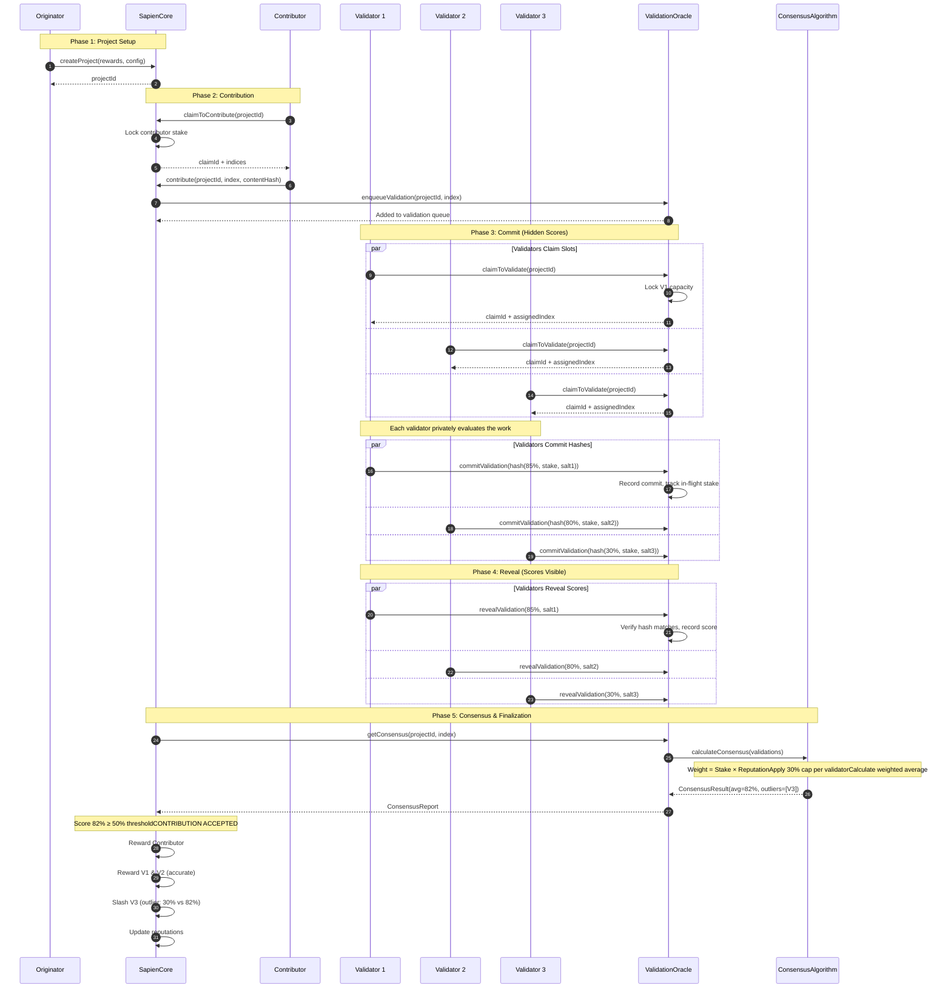

# Validator Consensus

A guide to how the Sapien Protocol validates contributions and reaches consensus.

> **Interactive Animation**: [View the animated explainer](./animations/consensus-explainer/) to see the consensus flow in action.

## Overview

The Sapien Protocol uses a **Proof of Quality (PoQ)** consensus mechanism where human validators assess the quality of contributions. Unlike traditional blockchain consensus that validates transactions, PoQ validates the *quality* of work submitted by contributors.

Think of it like peer review, but with economic incentives:
- **Validators stake tokens** as a commitment to honest evaluation
- **Good validators earn rewards** proportional to their stake and reputation
- **Bad validators lose stake** when they deviate significantly from consensus

## The Three Roles

| Role | What They Do | Requirements |
|------|--------------|--------------|
| **Originator** | Creates projects and funds rewards | Stake tokens, reputation |
| **Contributor** | Submits work to be validated | Stake tokens, may need specific skills |
| **Validator** | Evaluates and scores contributions | Stake tokens, may need specific skills |

## How Consensus Works (Step by Step)

### 1. Project Creation
An originator creates a project with:
- Reward pool for contributors
- Required skill (optional)
- Minimum stake requirements
- Validator reward percentage (up to 25%)

### 2. Contribution Submission
A contributor:
1. Claims a slot in the project
2. Submits their work (stored as a hash)
3. Their stake gets locked until validation completes

### 3. Validation Process (Commit-Reveal)

Validators use a **two-phase commit-reveal scheme** to prevent gaming:

#### Phase 1: Commit
- Validator claims a validation slot
- Validator privately scores the contribution (0-100%)
- Validator creates a **commit hash** = `hash(score + stake + secret)`
- Validator submits the hash on-chain
- This hides the actual score until everyone has committed

#### Phase 2: Reveal
- After enough validators have committed, reveal phase begins
- Each validator reveals their actual score with the secret
- Contract verifies the reveal matches the original commit
- Scores are recorded for consensus calculation

> **Why Commit-Reveal?** Without it, later validators could see early scores and copy them to avoid being outliers, undermining the system's integrity.

### 4. Consensus Calculation

Once enough validators have revealed, consensus is calculated:

```
Consensus Score = Weighted Average of all validator scores
```

**The Weight Formula (SqrtStake - Default):**
```
Validator Weight = √(Stake)
```

This means:
- **Higher stake = More influence** (but sublinear - doubling stake only increases weight by ~41%)
- **Whale resistance** - Large stakers can't dominate proportionally
- **Based on quadratic voting research** - Proven to reduce plutocracy by ~22%

> Note: Other algorithms available include CappedLinear (stake × reputation with 30% cap) and Hybrid.

### 5. Outcome Determination

- **Score ≥ 50%**: Contribution is **ACCEPTED**
  - Contributor receives reward
  - Contributor gains reputation
  - Contributor earns the project's required skill (if any)

- **Score < 50%**: Contribution is **REJECTED**
  - Contributor stake is unlocked (not slashed)
  - Contribution slot becomes available again
  - Contributor loses some reputation

### 6. Validator Rewards & Slashing

**Accurate Validators (close to consensus):**
- Receive rewards proportional to their weighted stake
- Gain reputation

**Outlier Validators (far from consensus):**
- Get slashed based on how far they deviated:

| Deviation | Slash Amount |
|-----------|-------------|
| 1.5-2 standard deviations | 10% of stake |
| 2-3 standard deviations | 25% of stake |
| 3-4 standard deviations | 50% of stake |
| 4-5 standard deviations | 75% of stake |
| 5+ standard deviations | 100% of stake |

---

## Sequence Diagram

The following swimlane diagram shows the complete validation flow:



---

## Key Concepts Explained

### Square Root Stake Weighting (Default)

The protocol uses square root weighting to calculate validator influence:

```
Validator Weight = √(Stake)
```

**Example:**
- Validator A: √1,000 tokens = 31.6 weight
- Validator B: √500 tokens = 22.4 weight
- Validator C: √100 tokens = 10.0 weight

Notice that Validator A has 10× the stake of C, but only 3.16× the weight. This **sublinear scaling** prevents whales from dominating.

### Why Square Root? (Whale Resistance)

Square root weighting is based on **quadratic voting research** and provides:
- **22% reduction in whale power** compared to linear weighting
- **Natural Sybil resistance** - splitting stake across accounts doesn't increase total weight
- **Balanced influence** - smaller stakers have meaningful voice

```
Linear:     1000 tokens → 1000 weight (whale dominates)
Square Root: 1000 tokens → 31.6 weight (whale influence reduced)
             100 tokens  → 10.0 weight (small staker has 32% of whale's power)
```

### Alternative Algorithms

Other consensus algorithms can be configured per-project:

| Algorithm | Weight Formula | Use Case |
|-----------|---------------|----------|
| **SqrtStake** (default) | √(stake) | General purpose, whale-resistant |
| **CappedLinear** | min(stake × rep, 30%) | High Sybil resistance, reputation-weighted |
| **LinearStake** | stake | Simple, direct stake weighting |
| **Hybrid** | Configurable | Custom per-project needs |

### Outlier Detection

The algorithm identifies outliers using standard deviation:

1. Calculate the **weighted average** of all scores
2. Calculate the **standard deviation**
3. Any validator whose score deviates by more than:
   - 15 points absolute, OR
   - 2 standard deviations
   
   ...is flagged as an outlier and slashed.

### Reputation Floor

New validators start with a minimum reputation of 1,000 (10% of max) to ensure they have *some* influence, even when new. This prevents:
- Zero-weight validators
- Complete exclusion of newcomers

---

## Economics & Fees

This section explains the complete economic flow of the protocol, including staking, fees, and reward distribution.

### Economic Flow Diagram

```
┌─────────────────────────────────────────────────────────────────────────────────┐
│                           SAPIEN PROTOCOL ECONOMICS                              │
├─────────────────────────────────────────────────────────────────────────────────┤
│                                                                                 │
│  ORIGINATOR DEPOSITS                                                            │
│  ───────────────────                                                            │
│       100 tokens                                                                │
│           │                                                                     │
│           ▼                                                                     │
│  ┌─────────────────┐                                                            │
│  │  Protocol Fee   │───────────▶  Treasury (1 token)                            │
│  │     (1%)        │                                                            │
│  └────────┬────────┘                                                            │
│           │ 99 tokens                                                           │
│           ▼                                                                     │
│  ┌─────────────────────────────────────────────┐                                │
│  │            REWARD POOL (99 tokens)          │                                │
│  │                                             │                                │
│  │  ┌─────────────────┐  ┌─────────────────┐   │                                │
│  │  │ Contributor     │  │ Validator       │   │                                │
│  │  │ Rewards (90%)   │  │ Rewards (10%)   │   │                                │
│  │  │                 │  │                 │   │                                │
│  │  │ ~89.1 tokens    │  │ ~9.9 tokens     │   │                                │
│  │  └─────────────────┘  └─────────────────┘   │                                │
│  └─────────────────────────────────────────────┘                                │
│                                                                                 │
└─────────────────────────────────────────────────────────────────────────────────┘
```

### Fee Structure

| Fee Type | Default | Max | Description |
|----------|---------|-----|-------------|
| **Protocol Fee** | 1% | 100% | Taken from originator deposits, sent to treasury |
| **Validator Reward Split** | 10% | 25% | Percentage of reward pool allocated to validators |
| **Contributor Reward** | 90% | 75% | Remaining percentage after validator split |

**Example with 1,000 tokens deposited:**
```
Originator deposits:     1,000 tokens
─────────────────────────────────────
Protocol fee (1%):       -  10 tokens  → Treasury
Reward pool:              990 tokens
─────────────────────────────────────
Contributor (90%):        891 tokens  → Per accepted contribution
Validators (10%):          99 tokens  → Split among accurate validators
```

### Staking Requirements

All participants must stake tokens in the SapienVault to participate:

| Role | Staking Requirement | Purpose |
|------|---------------------|---------|
| **Originator** | `minStake` for ORIGINATOR_ROLE | Right to create projects |
| **Contributor** | `minStakeToClaim` per claim | Collateral during work period |
| **Contributor** | `minStakeToContribute` to submit | Additional collateral for submission |
| **Validator** | Capacity-based locking | Stake locked per validation slot |

**Stake Lifecycle:**

```
┌──────────────────────────────────────────────────────────────────┐
│                    CONTRIBUTOR STAKE LIFECYCLE                    │
├──────────────────────────────────────────────────────────────────┤
│                                                                  │
│   DEPOSIT        LOCK            WORK          UNLOCK            │
│   ───────       ──────          ──────        ────────           │
│                                                                  │
│   User          Claim slot      Submit        Contribution       │
│   deposits  ──▶ locks      ──▶  work     ──▶  finalized    ──▶   │
│   tokens        stake           (locked)      unlocks stake      │
│                                                                  │
│                                 If rejected: stake slashed       │
│                                 If accepted: stake returned      │
│                                                                  │
└──────────────────────────────────────────────────────────────────┘

┌──────────────────────────────────────────────────────────────────┐
│                    VALIDATOR STAKE LIFECYCLE                     │
├──────────────────────────────────────────────────────────────────┤
│                                                                  │
│   DEPOSIT     SET CAPACITY     VALIDATE       OUTCOME            │
│   ───────    ─────────────    ──────────    ─────────            │
│                                                                  │
│   User        Lock stake       Commit +      If accurate:        │
│   deposits ──▶ as capacity ──▶ Reveal    ──▶ Reward + unlock     │
│   tokens                       scores        stake released      │
│                                                                  │
│                                              If outlier:         │
│                                              SLASHED (10-100%)   │
│                                                                  │
└──────────────────────────────────────────────────────────────────┘
```

### Validator Reward Distribution

Rewards are distributed proportionally based on **Stake × Reputation** weight:

```
                     Validator's Weight
Validator Reward = ─────────────────────── × Total Validator Pool
                   Sum of All Weights
```

**Example with 3 validators sharing 99 tokens:**

| Validator | Stake | Reputation | Weight | Share | Reward |
|-----------|-------|------------|--------|-------|--------|
| V1 | 100 | 8,000 | 80,000 | 47% | 46.53 tokens |
| V2 | 100 | 6,000 | 60,000 | 35% | 34.65 tokens |
| V3 | 50 | 6,000 | 30,000 | 18% | 17.82 tokens |
| **Total** | | | **170,000** | **100%** | **99 tokens** |

> Note: The 30% cap applies to weight during consensus calculation, but reward distribution uses uncapped weights.

### Slashing Economics

When a validator is slashed, their tokens **remain in the vault**, increasing the share value for all other stakers:

```
┌─────────────────────────────────────────────────────────────────┐
│                     SLASHING REDISTRIBUTION                      │
├─────────────────────────────────────────────────────────────────┤
│                                                                 │
│   BEFORE SLASH                    AFTER SLASH                   │
│   ────────────                    ───────────                   │
│                                                                 │
│   Vault: 10,000 tokens            Vault: 10,000 tokens          │
│   Shares: 10,000                  Shares: 9,500 (500 burned)    │
│   Price: 1.0 token/share          Price: 1.053 token/share      │
│                                                                 │
│   Outlier had 500 shares          Outlier has 0 shares          │
│   Other stakers: 9,500 shares     Other stakers: 9,500 shares   │
│                                   Value: 10,000 tokens (+5.3%)  │
│                                                                 │
└─────────────────────────────────────────────────────────────────┘
```

**Slashing is NOT burned** — it redistributes value to honest stakers through share dilution.

### Complete Lifecycle Economics Example

**Scenario:** Project with 1,000 token reward pool, 10 contributions, 3 validators per contribution

```
PHASE 1: PROJECT CREATION
═════════════════════════
Originator deposits:                    1,000.00 tokens
Protocol fee (1%):                       - 10.00 tokens → Treasury
Available for rewards:                    990.00 tokens

Reward per contribution:                   99.00 tokens
  - Contributor reward (90%):              89.10 tokens
  - Validator pool (10%):                   9.90 tokens


PHASE 2: STAKING (per participant)
══════════════════════════════════
Contributor stakes:                       100.00 tokens (locked during work)
Validator sets capacity:                  500.00 tokens (locked for 5 validations)


PHASE 3: VALIDATION OUTCOME (1 contribution)
════════════════════════════════════════════
Consensus score: 82% (ACCEPTED)

Contributor receives:                      89.10 tokens ✓
Contributor stake unlocked:               100.00 tokens ✓

Accurate Validators (V1, V2):
  - V1 reward (weight 47%):                 4.65 tokens ✓
  - V2 reward (weight 35%):                 3.47 tokens ✓

Outlier Validator (V3):
  - Deviation: 52 points (30% vs 82%)
  - Slash percentage: 50% (3σ deviation)
  - Slashed:                               50.00 tokens ✗
  - Redistributed to stakers:              50.00 tokens


PHASE 4: FINAL ACCOUNTING
═════════════════════════
Treasury received:                         10.00 tokens
Contributor earned:                        89.10 tokens
Validators earned:                          8.12 tokens (V1 + V2)
Validator slashed:                         50.00 tokens → Redistributed
```

### Key Economic Incentives

| Behavior | Economic Outcome |
|----------|-----------------|
| **Honest validation** | Rewards proportional to stake × reputation |
| **High confidence (more stake)** | More reward if accurate, more risk if wrong |
| **Building reputation** | Higher weight over time, more influence |
| **Outlier scores** | Progressive slashing (10% → 100%) |
| **Not revealing commits** | 100% stake slashed |
| **Expired claims** | Stake slashed for uncommitted slots |

### Protocol Revenue Model

The protocol generates revenue through:

1. **Protocol Fee (1%)** - Taken from all originator deposits
2. **Slashed Stakes** - Redistributed to stakers (including protocol-owned stake if any)

There are **no gas subsidies** — all participants pay their own transaction costs.

---

## Security Properties

| Threat | Mitigation |
|--------|------------|
| **Validator copies others' scores** | Commit-reveal hides scores until all committed |
| **Whale controls consensus** | 30% weight cap limits any single validator |
| **Sybil attack (many fake accounts)** | Weight = stake × reputation (expensive to build) |
| **Lazy validation (random scores)** | Outliers get slashed proportionally |
| **Ghost validators (commit but don't reveal)** | Slashed for expired commitments |
| **Validator collusion** | Standard deviation penalizes coordinated outliers |

---

## Timeline Summary

```
┌─────────────────────────────────────────────────────────────────────┐
│                         VALIDATION LIFECYCLE                         │
├─────────────────────────────────────────────────────────────────────┤
│                                                                     │
│  ┌──────────┐   ┌──────────┐   ┌──────────┐   ┌──────────────────┐  │
│  │ CLAIM    │   │ COMMIT   │   │ REVEAL   │   │ FINALIZE         │  │
│  │          │   │          │   │          │   │                  │  │
│  │ 1 hour   │──▶│ Variable │──▶│ 24 hours │──▶│ After min        │  │
│  │ deadline │   │          │   │ deadline │   │ validations      │  │
│  │          │   │          │   │          │   │ revealed         │  │
│  └──────────┘   └──────────┘   └──────────┘   └──────────────────┘  │
│       │              │              │                │              │
│       ▼              ▼              ▼                ▼              │
│  ┌──────────┐   ┌──────────┐   ┌──────────┐   ┌──────────────────┐  │
│  │ If not   │   │ If not   │   │ If not   │   │ Consensus        │  │
│  │ committed│   │ revealed │   │ finalized│   │ calculated,      │  │
│  │ → Slashed│   │ → Slashed│   │ → Stuck  │   │ rewards/slashes  │  │
│  │          │   │          │   │          │   │ distributed      │  │
│  └──────────┘   └──────────┘   └──────────┘   └──────────────────┘  │
│                                                                     │
└─────────────────────────────────────────────────────────────────────┘
```

---

## Contract Architecture

```
┌────────────────────────────────────────────────────────────────────┐
│                          SAPIEN PROTOCOL                            │
├────────────────────────────────────────────────────────────────────┤
│                                                                    │
│  ┌─────────────┐    ┌─────────────────┐    ┌──────────────────┐   │
│  │ SapienCore  │◄──▶│ ValidationOracle│◄──▶│ConsensusAlgorithm│   │
│  │             │    │                 │    │                  │   │
│  │ - Projects  │    │ - Commits       │    │ - Weight calc    │   │
│  │ - Claims    │    │ - Reveals       │    │ - Outlier detect │   │
│  │ - Finalize  │    │ - Queue mgmt    │    │ - Weighted avg   │   │
│  └──────┬──────┘    └────────┬────────┘    └──────────────────┘   │
│         │                    │                                     │
│         ▼                    ▼                                     │
│  ┌─────────────┐    ┌─────────────────┐                           │
│  │ SapienVault │    │  SapienTrust    │                           │
│  │             │    │                 │                           │
│  │ - Stake     │◄──▶│ - Reputation    │                           │
│  │ - Lock/Unlock│    │ - Skills       │                           │
│  │ - Slash     │    │ - Role checks   │                           │
│  └─────────────┘    └─────────────────┘                           │
│                                                                    │
└────────────────────────────────────────────────────────────────────┘
```

---

## Further Reading

- [Algorithms](./consensus/algorithms.md) - Deep dive into consensus algorithm implementations
- [Validation Oracle](./components/validation-oracle.md) - Technical details of the oracle
- [Validators Guide](./guides/validators.md) - How to participate as a validator
- [Security Overview](./security/overview.md) - Security considerations and attack mitigations
