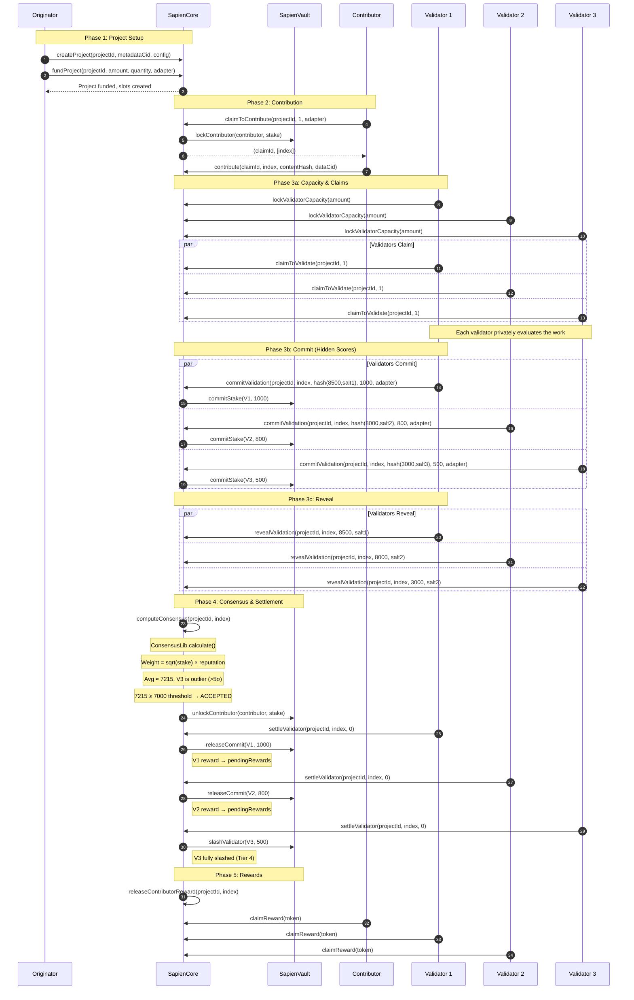

# Validator Consensus

A guide to how the Sapien Protocol validates contributions and reaches consensus.

> **Interactive Animation**: [View the animated explainer](./animations/consensus-explainer/) to see the consensus flow in action.

## Overview

The Sapien Protocol uses a **Proof of Quality (PoQ)** consensus mechanism where human validators assess the quality of contributions. Unlike traditional blockchain consensus that validates transactions, PoQ validates the *quality* of work submitted by contributors.

Think of it like peer review, but with economic incentives:
- **Validators stake tokens** as a commitment to honest evaluation
- **Good validators earn rewards** proportional to their stake and reputation
- **Bad validators lose stake** when they deviate significantly from consensus

## The Three Roles

| Role | What They Do | Requirements |
|------|--------------|--------------|
| **Originator** | Creates projects and funds rewards | Reward tokens, optional stake |
| **Contributor** | Submits work to be validated | Stake tokens (locked per slot) |
| **Validator** | Evaluates and scores contributions | Pre-locked validator capacity, reputation |

## How Consensus Works (Step by Step)

### 1. Project Creation
An originator creates a project with:
- Reward pool for contributors and validators
- Consensus threshold (BPS, e.g. 7000 = 70%)
- Number of validations required per contribution (1–10)
- Validator reward percentage (max 25%)
- Optional minimum validator reputation and required skill

### 2. Contribution Submission
A contributor:
1. Claims slots via `claimToContribute` (max 20 per call)
2. Submits work via `contribute` with a submission hash and data CID
3. Their stake gets locked until consensus is reached

### 3. Validation Process (Commit-Reveal)

Validators use a **two-phase commit-reveal scheme** to prevent gaming:

#### Step 0: Lock Capacity
- Validators pre-lock tokens as capacity via `lockValidatorCapacity`
- This capacity is drawn down when committing validations
- Deposit age check: if `minDepositAge` is set (admin-configurable, default 0 = disabled, max 7 days), deposits must have aged past it before locking — anti-flash-staking protection

#### Step 1: Claim Quantity (Random Assignment)
- Validator calls `claimToValidate(projectId, quantity)`
- Specifies how many contributions they want to validate; the protocol randomly assigns from pending contributions
- Anti-collusion measure: validators cannot choose which contributions to validate
- 1-hour deadline to commit
- Cannot validate your own contributions
- Must meet project's `minValidatorReputation`

#### Step 2: Commit
- Validator privately scores the contribution (0–10,000)
- Validator creates a **commit hash** = `keccak256(abi.encodePacked(uint16(score), salt))`
- Validator calls `commitValidation(projectId, index, commitHash, stakeAmount, adapter)`
- Stake moves from `validatorCapacity` → `inFlight`
- Must meet both project-level and global minimum validation stake

#### Step 3: Reveal
- **All validators must commit before any can reveal.** `revealValidation` reverts with `CommitPhaseIncomplete` until `commitCount >= numberOfValidations`.
- Validator calls `revealValidation(projectId, index, score, salt)`
- Contract verifies the reveal matches the original commit
- Must reveal within the reveal window (commit timestamp + commit deadline + reveal deadline)
- Score is recorded for consensus calculation
- Use `getCommitCount(projectId, index)` to check whether the commit phase is complete before attempting a reveal.

> **Why Commit-Reveal?** Without it, later validators could see early scores and copy them to avoid being outliers, undermining the system's integrity. The commit-phase gate ensures no validator can see any revealed scores before committing their own.

### 4. Consensus Calculation

Once all required validators have revealed, anyone can call `computeConsensus`:

**Weight Formula:**
```
weight = sqrt(stake) × max(reputation, 100)
```

This means:
- **Higher stake = More influence** (but sublinear — doubling stake only increases weight by ~41%)
- **Higher reputation = More influence** (linearly — consistent accuracy pays off)
- **Whale resistance** — large stakers can't dominate proportionally
- **Newcomer inclusion** — minimum reputation floor of 100

### 5. Outcome Determination

- **Score ≥ consensusThreshold**: Contribution is **ACCEPTED**
  - Contributor stake unlocked
  - Contributor gains reputation (+10 + quality bonus)
  - Challenge period begins

- **Score < consensusThreshold**: Contribution is **REJECTED**
  - Contributor stake slashed
  - Contributor loses reputation (-50)
  - Slot returned to pool for re-contribution
  - Submission nonce incremented

### 6. Challenge Period & Disputes

After consensus, a challenge period begins (default 1 day). During this period:
- Anyone can `openDispute` by posting a bond
- Disputes are resolved by operators or auto-escalated after 7 days
- If upheld: consensus is overturned, challenger rewarded (20% of saved/slashed amount)
- If rejected: challenger's bond is slashed

### 7. Validator Settlement & Rewards

After the challenge period (and no active dispute), each validator calls `settleValidator`:

**Accurate Validators (within 1.5σ):**
- Committed stake returned to capacity
- Earn rewards proportional to weight / totalAccurateWeight
- Gain reputation (+10)

**Outlier Validators (beyond 1.5σ):**
- Slashed based on deviation severity:

| Deviation | Slash Amount |
|-----------|-------------|
| > 1.5 standard deviations | 10% of stake |
| > 2.0 standard deviations | 25% of stake |
| > 3.0 standard deviations | 50% of stake |
| > 5.0 standard deviations | 100% of stake |

- Remaining stake returned to capacity
- Lose reputation (-50)

**Force Settlement:**
If a validator fails to settle, anyone can call `forceSettleValidator` after the `forceSettleDelay` (default 3 days) elapses past their reveal timestamp.

---

## Sequence Diagram



---

## Key Concepts Explained

### Square Root Stake Weighting

The protocol uses square root weighting for validator influence:

```
weight = sqrt(stake) × reputation
```

**Example:**
- Validator A: sqrt(10,000) × 7,000 = 100 × 7,000 = 700,000
- Validator B: sqrt(5,000) × 6,000 = 70.7 × 6,000 = 424,264
- Validator C: sqrt(2,000) × 5,000 = 44.7 × 5,000 = 223,607

Notice that Validator A has 5× the stake of C, but only ~3.1× the weight. The **sublinear scaling** prevents whales from dominating, while the **reputation factor** rewards consistent accuracy.

### Why sqrt(stake) × reputation?

- **sqrt(stake)**: Based on quadratic voting research — provides ~22% reduction in whale power compared to linear weighting. Splitting stake across accounts doesn't increase total weight.
- **reputation**: Linearly rewards historical accuracy. A validator with double the reputation has double the influence (all else equal).
- **MIN_REPUTATION_FLOOR = 100**: Ensures new validators always have some influence, preventing zero-weight exclusion.

### Tiered Slashing

Slashing is proportional to deviation severity:

```
                     Deviation from consensus
                          │
         ┌────────────────┼─────────────────────────────┐
         │                │                             │
    ≤ 1.5σ           1.5σ-2σ        2σ-3σ        3σ-5σ        > 5σ
  Accurate          Tier 1         Tier 2       Tier 3       Tier 4
   (0%)              (10%)         (25%)         (50%)       (100%)
```

This graduated approach means:
- **Minor disagreement**: Small penalty, encourages diverse but honest opinions
- **Major deviation**: Significant penalty, deters lazy validation
- **Extreme outlier**: Full slash, punishes malicious behavior

---

## Economics & Fees

### Fee Structure

| Fee Type | Default | Max | When Applied |
|----------|---------|-----|-------------|
| **Protocol fee** | 10% | 10% | Deducted from `fundProject` deposits |
| **Origination adapter fee** | 4% | 5% | Deducted from funding (after protocol fee) |
| **Contribution adapter fee** | 3% | 5% | Deducted from contributor reward at `releaseContributorReward` |
| **Validation adapter fee** | 3% | 5% | Deducted from validator reward at `settleValidator` |
| **Validator reward share** | per-project | 25% max | Set by originator as `validatorRewardBps` |

### Reward Distribution

```
Originator funds 1,000 tokens:
  Protocol fee (10%):     100 tokens → Treasury
  Adapter fee (4%):       36 tokens  → Origination adapter (optional)
  Project escrow:         864 tokens

Per contribution (10 slots):
  Reward rate:            86.4 tokens/slot
  Contributor share:      86.4 × (10000 - validatorRewardBps) / 10000
  Validator pool:         86.4 × validatorRewardBps / 10000
```

### Validator Reward Formula

```
validatorReward = (totalRewards × validatorRewardBps × weight) / (BPS × totalQuantity × totalAccurateWeight)
```

### Slashing Economics

When shares are burned via slashing, the underlying assets remain in the vault. Since fewer shares now represent the same pool of assets, the price-per-share increases for all remaining stakers — automatically redistributing slashed value.

### Claim Protection

- **minClaimAmount**: Minimum reward balance required to call `claimReward` (prevents dust claims)
- **claimCooldown**: Minimum time between successive `claimReward` calls per user

---

## Contract Architecture

```
┌──────────────────────────────────────────────────────────────┐
│                       SAPIEN PROTOCOL v0.5                     │
├──────────────────────────────────────────────────────────────┤
│                                                              │
│  SapienCore (UUPS Proxy)                                     │
│  ┌──────────────┐  ┌──────────────┐  ┌──────────────┐       │
│  │OriginationLib│  │ContributionLib│ │ ValidationLib │       │
│  │              │  │              │  │              │       │
│  │ - create     │  │ - claim      │  │ - capacity   │       │
│  │ - fund       │  │ - contribute │  │ - commit     │       │
│  │ - remove     │  │ - expire     │  │ - reveal     │       │
│  └──────────────┘  └──────────────┘  │ - consensus  │       │
│                                      └──────────────┘       │
│  ┌──────────────┐  ┌──────────────┐  ┌──────────────┐       │
│  │FinalizationLb│  │  DisputeLib  │  │ ReputationLib│       │
│  │              │  │              │  │              │       │
│  │ - settle     │  │ - dispute    │  │ - getScore   │       │
│  │ - release    │  │ - report     │  │ - update     │       │
│  │ - claim      │  │ - escalate   │  │ - decay      │       │
│  │ - complete   │  │              │  │              │       │
│  └──────────────┘  └──────────────┘  └──────────────┘       │
│         │                                                    │
│         ▼               ┌──────────────┐                    │
│  ┌─────────────┐        │ ConsensusLib │                    │
│  │ SapienVault │        │              │                    │
│  │ (UUPS Proxy)│        │ - calculate  │                    │
│  │             │        │ - outliers   │                    │
│  │ - locks     │        │ - tiered     │                    │
│  │ - slashing  │        │   slashing   │                    │
│  │ - ERC-4626  │        └──────────────┘                    │
│  └─────────────┘                                             │
│                                                              │
└──────────────────────────────────────────────────────────────┘
```

---

## Security Properties

| Threat | Mitigation |
|--------|------------|
| **Validator copies others' scores** | Commit-reveal hides scores until all committed |
| **Validator collusion** | Random assignment — validators specify quantity, protocol assigns from pending contributions; validators cannot choose which to validate |
| **Whale controls consensus** | `sqrt(stake)` sublinear scaling |
| **Sybil attack (many accounts)** | Weight = `sqrt(stake) × reputation` — expensive to build |
| **Lazy validation (random scores)** | Tiered slashing (10%–100%) proportional to deviation |
| **Ghost validators (commit, no reveal)** | Full stake slashed via `cancelExpiredCommitment` |
| **Validator liveness failure** | `forceSettleValidator` after delay |
| **Dispute gaming** | Bond-backed disputes with 20% challenger reward |
| **Originator misconduct** | `reportOriginator` with bond and escalation |

---

## Timeline Summary

```
┌───────────────────────────────────────────────────────────────────┐
│                     VALIDATION LIFECYCLE                           │
├───────────────────────────────────────────────────────────────────┤
│                                                                   │
│  CLAIM         COMMIT          REVEAL         CONSENSUS           │
│  ──────        ──────          ──────         ─────────           │
│  1 hour   →   1 day max   →  1 day max   →  Permissionless      │
│  deadline      deadline       deadline       trigger              │
│                                                                   │
│  CHALLENGE     SETTLE         REWARD                              │
│  ─────────     ──────         ──────                              │
│  1 day    →   Self-serve  →  claimReward                         │
│  period        or force-      (with cooldown)                    │
│  (disputes)    settle (3d)                                       │
│                                                                   │
│  All deadlines are configurable by admin                         │
│  (up to max limits defined in Constants.sol)                     │
│                                                                   │
└───────────────────────────────────────────────────────────────────┘
```

---

## Further Reading

- [Consensus Algorithm Details](./consensus/algorithms.md) — Deep dive into ConsensusLib
- [ValidationLib & ConsensusLib](./components/validation-oracle.md) — Technical component docs
- [Validators Guide](./guides/validators.md) — How to participate as a validator
- [Security Overview](./security/overview.md) — Security considerations and attack mitigations
- [Fee Structure](./guides/fees.md) — Complete fee documentation
