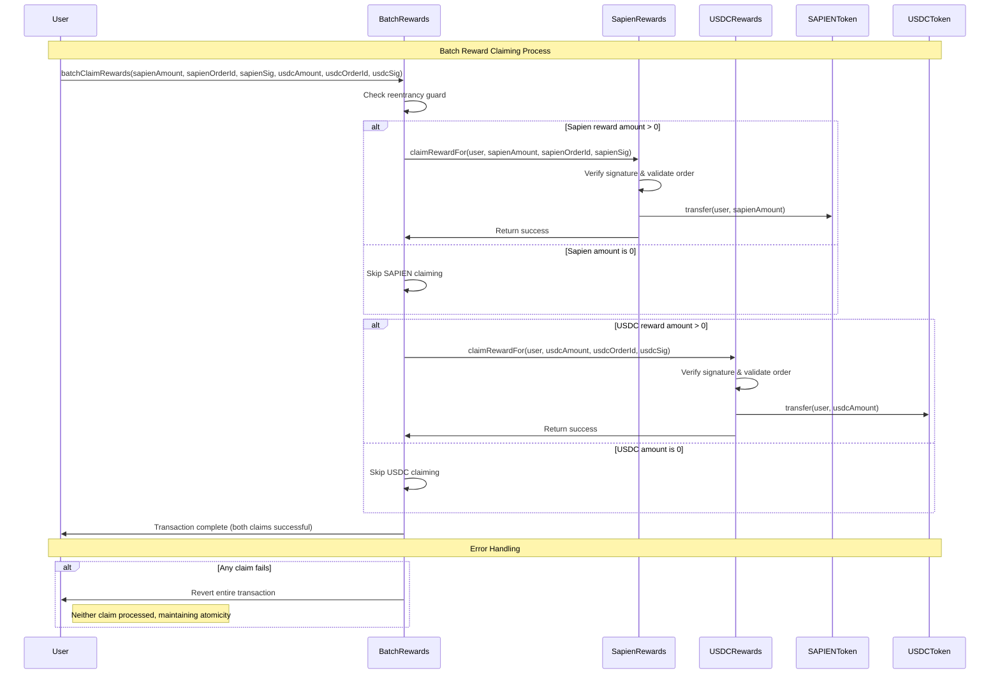

# BatchRewards Contract Documentation

## Overview

**Contract:** BatchRewards  
**Purpose:** Enables users to claim rewards from both Sapien and USDC reward contracts in a single atomic transaction, providing improved user experience and gas efficiency.

**Inheritance:**
- `ReentrancyGuard` (OpenZeppelin)

### Key Features

- **Atomic dual claiming**: Claims from both SAPIEN and USDC rewards contracts in one transaction
- **Gas optimization**: Reduces total gas costs compared to separate claiming transactions
- **Reentrancy protection**: Guards against potential reentrancy attacks during batch operations
- **Direct token delivery**: Tokens sent directly to the caller, not the batch contract
- **Immutable configuration**: Reward contract addresses set at deployment for security
- **Zero-value handling**: Gracefully skips claiming when amount is zero

---

## Developer Notes

### Architecture Decisions

1. **Immutable Contract Addresses**: SapienRewards and USDCRewards addresses set at deployment prevent configuration attacks
2. **Direct Token Transfer**: Tokens go directly to `msg.sender`, not through the batch contract
3. **Atomic Operations**: Single transaction either succeeds completely or reverts entirely
4. **Zero-Amount Optimization**: Skips unnecessary calls when reward amounts are zero
5. **Minimal State**: Stateless design reduces attack surface and gas costs

### Security Considerations

- **Reentrancy Protection**: ReentrancyGuard prevents recursive calls during batch operations
- **No Token Storage**: Contract never holds tokens, eliminating custody risks
- **Immutable References**: Reward contract addresses cannot be changed after deployment
- **Call Validation**: Underlying reward contracts handle all signature and authorization validation
- **Error Propagation**: Any failure in either claim will revert the entire transaction

### Integration Benefits

- **User Experience**: Single transaction for dual reward claiming reduces complexity
- **Gas Efficiency**: Batching reduces overall transaction costs and blockchain congestion
- **Atomic Guarantees**: Either both claims succeed or both fail, preventing partial state
- **Frontend Simplification**: Single function call replaces complex multi-transaction flows

---

## Workflow Diagram



---

## Constructor & Deployment

```solidity
constructor(ISapienRewards _sapienRewards, ISapienRewards _usdcRewards)
```

**Parameters:**
- `_sapienRewards`: Address of the SapienRewards contract for SAPIEN token claims
- `_usdcRewards`: Address of the SapienRewards contract configured for USDC token claims

**Validation:**
- Both addresses must be non-zero (`ZeroAddress()` error if validation fails)
- Addresses are immutable after deployment for security

**Developer Notes:**
- Uses immutable storage for gas optimization and security
- No initialization function needed due to simple constructor pattern
- Validates addresses at deployment time to prevent misconfiguration

---

## Core State Variables

```solidity
// Immutable reward contract references
ISapienRewards public immutable sapienRewards;    // SAPIEN token rewards contract
ISapienRewards public immutable usdcRewards;      // USDC token rewards contract
```

**Developer Notes:**
- `immutable` keyword provides gas optimization and security benefits
- Both contracts implement the same `ISapienRewards` interface
- Addresses cannot be changed after deployment, eliminating upgrade risks
- Public visibility allows external verification of contract configuration

---

## Main Functionality

### `batchClaimRewards(...)`
**Purpose:** Claims rewards from both SAPIEN and USDC contracts in a single atomic transaction

```solidity
function batchClaimRewards(
    uint256 sapienRewardAmount,
    bytes32 sapienOrderId,
    bytes memory sapienSignature,
    uint256 usdcRewardAmount,
    bytes32 usdcOrderId,
    bytes memory usdcSignature
) public nonReentrant
```

#### Parameters

| Parameter | Type | Description |
|-----------|------|-------------|
| `sapienRewardAmount` | `uint256` | Amount of SAPIEN tokens to claim (can be 0 to skip) |
| `sapienOrderId` | `bytes32` | Unique order ID for SAPIEN reward claim |
| `sapienSignature` | `bytes` | EIP-712 signature authorizing SAPIEN claim |
| `usdcRewardAmount` | `uint256` | Amount of USDC tokens to claim (can be 0 to skip) |
| `usdcOrderId` | `bytes32` | Unique order ID for USDC reward claim |
| `usdcSignature` | `bytes` | EIP-712 signature authorizing USDC claim |

#### Execution Flow

1. **Reentrancy Protection**: `nonReentrant` modifier prevents recursive calls
2. **SAPIEN Claim**: If `sapienRewardAmount > 0`, calls `sapienRewards.claimRewardFor()`
3. **USDC Claim**: If `usdcRewardAmount > 0`, calls `usdcRewards.claimRewardFor()`
4. **Direct Transfer**: Tokens transferred directly to `msg.sender` by reward contracts
5. **Atomic Completion**: Both claims must succeed or entire transaction reverts

#### Zero-Amount Handling

```solidity
// Conditional claiming based on amount
if (sapienRewardAmount > 0) {
    sapienRewards.claimRewardFor(msg.sender, sapienRewardAmount, sapienOrderId, sapienSignature);
}
if (usdcRewardAmount > 0) {
    usdcRewards.claimRewardFor(msg.sender, usdcRewardAmount, usdcOrderId, usdcSignature);
}
```

**Benefits:**
- Gas optimization by skipping unnecessary external calls
- Flexibility to claim only one type of reward if desired
- Maintains atomicity even with selective claiming

#### Security Features

- **Reentrancy Guard**: Prevents attack vectors during external contract calls
- **Direct Token Flow**: Tokens never touch the BatchRewards contract
- **Signature Validation**: Relies on underlying reward contracts for authorization
- **Atomic Operations**: Failure in either claim reverts entire transaction

---

## Integration Patterns

### Frontend Integration

#### Single Reward Type Claiming
```solidity
// Claim only SAPIEN tokens (skip USDC)
await batchRewards.batchClaimRewards(
    sapienAmount,     // SAPIEN amount
    sapienOrderId,    // SAPIEN order ID  
    sapienSignature,  // SAPIEN signature
    0,               // USDC amount (0 = skip)
    ethers.constants.HashZero, // USDC order ID (ignored)
    "0x"             // USDC signature (ignored)
);
```

#### Dual Reward Claiming
```solidity
// Claim both SAPIEN and USDC tokens
await batchRewards.batchClaimRewards(
    sapienAmount,     // SAPIEN amount
    sapienOrderId,    // SAPIEN order ID
    sapienSignature,  // SAPIEN signature
    usdcAmount,       // USDC amount
    usdcOrderId,      // USDC order ID
    usdcSignature     // USDC signature
);
```

### Backend Integration

#### Signature Generation
```typescript
// Generate signatures for both reward types
const sapienSig = await generateRewardSignature(
    userAddress,
    sapienAmount,
    sapienOrderId,
    sapienRewardsContract
);

const usdcSig = await generateRewardSignature(
    userAddress,
    usdcAmount,
    usdcOrderId,
    usdcRewardsContract
);

// Provide both signatures to frontend for batch claiming
```

### Smart Contract Integration

#### External Contract Usage
```solidity
// Example integration from another contract
contract MyContract {
    BatchRewards immutable batchRewards;
    
    function claimUserRewards(
        address user,
        uint256 sapienAmount,
        bytes32 sapienOrderId,
        bytes memory sapienSig,
        uint256 usdcAmount,
        bytes32 usdcOrderId,
        bytes memory usdcSig
    ) external {
        // Delegate to BatchRewards contract
        batchRewards.batchClaimRewards(
            sapienAmount, sapienOrderId, sapienSig,
            usdcAmount, usdcOrderId, usdcSig
        );
    }
}
```

---

## Gas Optimization Benefits

### Cost Comparison

| Scenario | Separate Transactions | Batch Transaction | Savings |
|----------|----------------------|------------------|---------|
| **Transaction Overhead** | 42,000 gas × 2 | 21,000 gas × 1 | ~21,000 gas |
| **External Calls** | High setup cost × 2 | Optimized batching | ~15,000 gas |
| **User Operations** | 2 wallet signatures | 1 wallet signature | UX improvement |
| **Network Congestion** | 2 transaction slots | 1 transaction slot | 50% reduction |

### Gas Optimization Techniques

1. **Immutable Storage**: Contract addresses stored as immutable for cheaper access
2. **Conditional Execution**: Zero-amount checks prevent unnecessary external calls
3. **Minimal State**: Stateless design eliminates storage operations
4. **Direct Delegation**: No intermediate token handling reduces gas consumption
5. **Single Transaction**: Eliminates duplicate transaction overhead

---

## Error Handling

### Constructor Errors
- `ZeroAddress()`: Thrown when either reward contract address is zero

### Runtime Errors
All runtime errors are propagated from the underlying reward contracts:

#### From SapienRewards/USDCRewards
- `InvalidAmount()`: Zero or invalid reward amount
- `OrderAlreadyUsed()`: Order ID already claimed
- `OrderExpired()`: Signature expired
- `UnauthorizedSigner()`: Invalid signature authorization
- `InsufficientAvailableRewards()`: Not enough rewards in contract

#### Reentrancy Protection
- Automatic revert if reentrancy detected during execution

### Error Propagation Strategy

```solidity
// Errors bubble up from reward contracts
try sapienRewards.claimRewardFor(...) {
    // Success - continue
} catch Error(string memory reason) {
    // Specific error - bubble up with context
    revert(reason);
} catch {
    // Unknown error - bubble up generic failure
    revert("SAPIEN claim failed");
}
```

---

## Security Analysis

### Attack Vector Analysis

#### Reentrancy Attacks
- **Protection**: `ReentrancyGuard` modifier on main function
- **Risk Level**: Low (additional protection beyond underlying contracts)
- **Mitigation**: Automatic revert on reentrancy detection

#### Signature Replay Attacks
- **Protection**: Delegated to underlying reward contracts
- **Risk Level**: None (no signature handling in BatchRewards)
- **Mitigation**: Order ID tracking in reward contracts

#### Economic Attacks
- **Protection**: No token custody or pricing logic
- **Risk Level**: None (pure delegation contract)
- **Mitigation**: All economic validation in reward contracts

#### Configuration Attacks
- **Protection**: Immutable contract addresses
- **Risk Level**: None after deployment
- **Mitigation**: No upgrade or configuration functions

### Security Best Practices

1. **Minimal Attack Surface**: Stateless design reduces potential vulnerabilities
2. **Delegation Pattern**: Security properties inherited from underlying contracts
3. **Immutable Configuration**: No admin functions or upgrade mechanisms
4. **Direct Token Flow**: No custody of user funds
5. **Error Transparency**: Clear error propagation for debugging

---

## Deployment Considerations

### Pre-Deployment Checklist

- [ ] Verify SapienRewards contract addresses for both SAPIEN and USDC
- [ ] Confirm both reward contracts implement `ISapienRewards` interface correctly
- [ ] Test batch claiming functionality on testnet
- [ ] Verify gas optimization benefits in realistic scenarios
- [ ] Ensure BATCH_CLAIMER_ROLE granted to BatchRewards in both reward contracts

### Post-Deployment Verification

```solidity
// Verify contract configuration
address sapienAddr = batchRewards.sapienRewards();
address usdcAddr = batchRewards.usdcRewards();

// Confirm non-zero addresses
require(sapienAddr != address(0), "Invalid SAPIEN rewards address");
require(usdcAddr != address(0), "Invalid USDC rewards address");

// Test batch claiming functionality
batchRewards.batchClaimRewards(testAmounts...);
```

### Role Configuration Requirements

The BatchRewards contract must be granted `BATCH_CLAIMER_ROLE` in both reward contracts:

```solidity
// Grant roles to BatchRewards contract
sapienRewardsContract.grantRole(BATCH_CLAIMER_ROLE, batchRewardsAddress);
usdcRewardsContract.grantRole(BATCH_CLAIMER_ROLE, batchRewardsAddress);
```

---

## Integration Testing

### Unit Tests

```solidity
function testBatchClaimBothRewards() public {
    // Setup valid signatures for both rewards
    // Call batchClaimRewards with both amounts > 0
    // Verify both tokens transferred to user
}

function testBatchClaimSingleReward() public {
    // Test claiming only SAPIEN (USDC amount = 0)
    // Test claiming only USDC (SAPIEN amount = 0)
}

function testReentrancyProtection() public {
    // Attempt reentrancy attack during batch claiming
    // Verify transaction reverts appropriately
}

function testErrorPropagation() public {
    // Use invalid signatures
    // Verify specific errors bubble up correctly
}
```

### Integration Tests

```solidity
function testEndToEndBatchClaiming() public {
    // Generate valid signatures for both reward types
    // Execute batch claim
    // Verify token balances increased correctly
    // Verify order IDs marked as used in reward contracts
}

function testAtomicBehavior() public {
    // Setup scenario where second claim fails
    // Verify first claim is also reverted
    // Confirm no tokens transferred
}
```

### Gas Benchmarking

```solidity
function benchmarkGasUsage() public {
    uint256 gasBefore = gasleft();
    batchRewards.batchClaimRewards(...);
    uint256 gasUsed = gasBefore - gasleft();
    
    // Compare against separate transaction costs
    // Document gas savings
}
```

---

## Maintenance and Monitoring

### Event Monitoring

The BatchRewards contract itself doesn't emit events, but monitors underlying contract events:

```solidity
// Monitor events from reward contracts
event RewardClaimed(address indexed user, uint256 amount, bytes32 indexed orderId);
```

### Health Checks

```solidity
// Regular health check functions
function verifyContractConfiguration() external view returns (bool) {
    return address(sapienRewards) != address(0) && 
           address(usdcRewards) != address(0);
}

function testBatchClaimingCapability() external view returns (bool) {
    // Verify BatchRewards has BATCH_CLAIMER_ROLE in both contracts
    return sapienRewards.hasRole(BATCH_CLAIMER_ROLE, address(this)) &&
           usdcRewards.hasRole(BATCH_CLAIMER_ROLE, address(this));
}
```

### Performance Monitoring

- **Gas Usage Trends**: Monitor gas consumption over time
- **Success Rates**: Track successful vs failed batch claims
- **Error Patterns**: Analyze common failure reasons
- **User Adoption**: Measure usage of batch claiming vs individual claims

---

## Upgrade and Migration Strategy

### Contract Immutability

The BatchRewards contract is designed to be immutable:
- No admin functions for changing reward contract addresses
- No upgrade mechanisms built in
- Immutable architecture provides security guarantees

### Migration Scenarios

If migration becomes necessary:

1. **Deploy New BatchRewards**: Create new contract with updated addresses
2. **Update Frontend**: Point UI to new contract address
3. **Role Management**: Grant BATCH_CLAIMER_ROLE to new contract
4. **Deprecation**: Revoke role from old contract if desired

### Backward Compatibility

- Users can always fall back to direct reward contract interaction
- Existing signatures remain valid for individual claiming
- No breaking changes to core reward claiming functionality

---

## Best Practices for Integrators

### Frontend Development

1. **Error Handling**: Implement comprehensive error handling for all possible failure scenarios
2. **Gas Estimation**: Provide accurate gas estimates for batch transactions
3. **Fallback Options**: Allow users to claim individually if batch claiming fails
4. **User Feedback**: Clear indication of which rewards are being claimed

### Backend Development

1. **Signature Coordination**: Ensure both signatures are generated with same expiration window
2. **Order ID Management**: Use distinct order IDs for SAPIEN vs USDC claims
3. **Rate Limiting**: Implement appropriate rate limiting for batch claim requests
4. **Monitoring**: Log batch claiming activity for analytics and debugging

### Smart Contract Integration

1. **Permission Verification**: Ensure contract has necessary roles before deployment
2. **Error Recovery**: Implement fallback mechanisms for batch claim failures
3. **Gas Budgeting**: Account for higher gas costs of batch operations
4. **Testing**: Comprehensive testing of all batch claiming scenarios

---

## Conclusion

The BatchRewards contract provides a simple yet powerful abstraction for dual reward claiming. Its minimalist design focuses on security, gas efficiency, and user experience while maintaining the security properties of the underlying reward contracts.

Key benefits:
- **Improved UX**: Single transaction for dual claims
- **Gas Efficiency**: Reduced total transaction costs  
- **Security**: Immutable, stateless design with reentrancy protection
- **Flexibility**: Support for claiming single or dual rewards
- **Maintainability**: Simple codebase with clear responsibilities

The contract serves as an excellent example of how thoughtful architectural decisions can significantly improve user experience while maintaining strong security guarantees. 