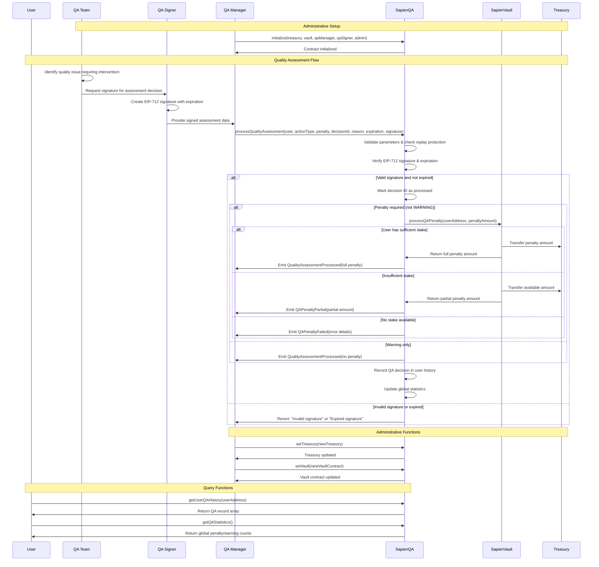

# SapienQA Contract Documentation

## Overview

**Contract:** SapienQA  
**Purpose:** Manages quality assurance decisions for the Sapien protocol through signature-based verification and penalty enforcement.

**Inheritance:**
- `ISapienQA`
- `AccessControlUpgradeable`
- `EIP712Upgradeable`

### Core Features

- EIP-712 signature verification for authorized QA decisions with expiration support
- Multiple QA action types with progressive penalty system
- Integration with SapienVault for automated penalty enforcement
- Comprehensive audit trail with detailed QA history per user
- Role-based access control separating QA managers and signers
- Protection against replay attacks through unique decision IDs
- Graceful handling of insufficient stakes during penalty application

---

## Workflow Diagram



---

## Workflow

1. **QA Assessment**: QA team identifies quality issue requiring intervention
2. **Signature Creation**: Authorized signer creates EIP-712 signature with expiration
3. **Decision Processing**: QA manager calls `processQualityAssessment()` with details and signature
4. **Verification**: Contract verifies signature authenticity, expiration, and replay protection
5. **Penalty Application**: If penalty required, deducts from user's staked tokens via SapienVault
6. **Record Keeping**: Records complete QA decision in user's history regardless of penalty success
7. **Statistics Update**: Updates global statistics and emits relevant events

---

## Initialization

```solidity
function initialize(
    address _treasury,
    address vaultContract,
    address qaManager,
    address qaSigner,
    address admin
) public initializer
```

Initializes the contract with:
- **_treasury**: Treasury address for penalty collection
- **vaultContract**: SapienVault contract address for penalty enforcement
- **qaManager**: Address with QA_MANAGER_ROLE
- **qaSigner**: Address with QA_SIGNER_ROLE  
- **admin**: Address with DEFAULT_ADMIN_ROLE

---

## Roles

| Role | Description |
|------|-------------|
| `DEFAULT_ADMIN_ROLE` | Contract configuration, treasury/vault updates |
| `QA_MANAGER_ROLE` | Executes signed QA decisions, processes assessments |
| `QA_SIGNER_ROLE` | Creates EIP-712 signatures authorizing QA decisions |

---

## QA Action Types

```solidity
enum QAActionType {
    WARNING,        // No penalty, just a warning
    MINOR_PENALTY,  // Small penalty (1-5% of stake)
    MAJOR_PENALTY,  // Medium penalty (5-15% of stake)
    SEVERE_PENALTY  // Large penalty (15-25% of stake)
}
```

---

## Main Function

### `processQualityAssessment(...)`

```solidity
function processQualityAssessment(
    address userAddress,
    QAActionType actionType,
    uint256 penaltyAmount,
    bytes32 decisionId,
    string calldata reason,
    uint256 expiration,
    bytes calldata signature
) public onlyQaManager
```

Primary function for processing QA decisions with comprehensive validation:

#### Parameters
- **userAddress**: Target user being assessed
- **actionType**: QAActionType enum (WARNING, MINOR_PENALTY, etc.)
- **penaltyAmount**: Token amount to penalize (0 for warnings)
- **decisionId**: Unique identifier preventing replay attacks
- **reason**: Human-readable explanation for the assessment
- **expiration**: Timestamp when signature expires
- **signature**: EIP-712 signature from authorized QA signer

#### Process Flow
1. **Input Validation**: Validates all parameters and checks for replay attacks
2. **Signature Verification**: Verifies EIP-712 signature and expiration
3. **Replay Protection**: Marks decision ID as processed
4. **Penalty Processing**: Attempts penalty application via SapienVault
5. **Record Creation**: Records decision in user's QA history
6. **Statistics Update**: Updates global warning/penalty counts
7. **Event Emission**: Emits comprehensive event for audit trail

---

## EIP-712 Signature System

### Domain and Type Definitions

**Domain Name**: `"SapienQA"`  
**Version**: Contract version from `Constants.QA_VERSION`

**QA Decision TypeHash**:
```solidity
keccak256("QADecision(address userAddress,uint8 actionType,uint256 penaltyAmount,bytes32 decisionId,string reason,uint256 expiration)")
```

### Signature Functions

#### `createQADecisionHash(...)`
```solidity
function createQADecisionHash(
    bytes32 decisionId,
    address user,
    uint8 actionType,
    uint256 penaltyAmount,
    string memory reason,
    uint256 expiration
) public pure returns (bytes32)
```

Creates the struct hash for EIP-712 signature generation.

#### `verifySignature(...)`
```solidity
function verifySignature(
    address userAddress,
    QAActionType actionType,
    uint256 penaltyAmount,
    bytes32 decisionId,
    string calldata reason,
    uint256 expiration,
    bytes calldata signature
) public view
```

Verifies EIP-712 signature validity and expiration. Ensures signer has QA_SIGNER_ROLE.

---

## QA Record Storage

### QARecord Structure
```solidity
struct QARecord {
    QAActionType actionType;    // Type of QA action taken
    uint256 penaltyAmount;      // Actual penalty applied
    bytes32 decisionId;         // Unique decision identifier
    string reason;              // Explanation for the action
    uint256 timestamp;          // When decision was processed
    address processor;          // QA manager who executed decision
}
```

**Storage**: `mapping(address => QARecord[]) private userQAHistory`

---

## View Functions

### User History Functions

#### `getUserQAHistory(address user)`
Returns complete array of QA records for specified user.

#### `getUserQARecordCount(address user)`
Returns total number of QA records for user.

### System State Functions

#### `isDecisionProcessed(bytes32 decisionId)`
Checks if decision ID has been used (prevents replay attacks).

#### `getQAStatistics()`
Returns global statistics:
- `penaltiesTotal`: Total penalty amount processed
- `warningsTotal`: Total number of warnings issued

#### `getDomainSeparator()`
Returns current EIP-712 domain separator for signature verification.

---

## Administrative Functions

### Treasury Management

#### `setTreasury(address newTreasury)`
Updates treasury address for penalty collection. Only callable by DEFAULT_ADMIN_ROLE.

### Vault Integration

#### `setVault(address newVaultContract)`
Updates SapienVault contract address. Only callable by DEFAULT_ADMIN_ROLE.

---

## Events

| Event | Description |
|-------|-------------|
| `QualityAssessmentProcessed` | Main event for successful QA decision processing |
| `QAPenaltyPartial` | Penalty partially applied due to insufficient stake |
| `QAPenaltyFailed` | Penalty processing failed (with error details) |
| `TreasuryUpdated` | Treasury address changed |
| `VaultContractUpdated` | Vault contract address updated |

### Primary Event Structure
```solidity
event QualityAssessmentProcessed(
    address indexed userAddress,
    QAActionType actionType,
    uint256 penaltyAmount,
    bytes32 decisionId,
    string reason,
    address processor
);
```

---

## Error Conditions

### Input Validation Errors
- `ZeroAddress()`: Invalid zero address provided
- `InvalidDecisionId()`: Empty or zero decision ID
- `EmptyReason()`: No reason provided for assessment
- `DecisionAlreadyProcessed()`: Decision ID already used (replay protection)

### QA Logic Errors
- `InvalidPenaltyForWarning()`: Non-zero penalty specified for warning
- `PenaltyAmountRequired()`: Zero penalty for penalty action types

### Signature Errors
- `UnauthorizedSigner(address)`: Signer lacks QA_SIGNER_ROLE
- `InvalidSignature()`: Malformed or invalid signature
- `ExpiredSignature(uint256)`: Signature past expiration timestamp
- `InvalidSignatureLength()`: Signature not 65 bytes
- `InvalidSignatureV()`: Invalid recovery parameter

---

## Security Considerations

### Signature Security
- **EIP-712 Standard**: Industry-standard signature format
- **Expiration Support**: Prevents stale signature usage
- **Role Separation**: Signers and managers are separate roles
- **Replay Protection**: Unique decision IDs prevent reuse

### Penalty Enforcement
- **Vault Integration**: Leverages SapienVault's security features
- **Partial Handling**: Graceful degradation for insufficient stakes
- **Audit Trail**: Complete record of all decisions regardless of outcome
- **Error Recovery**: Detailed error reporting for failed penalties

### Access Control
- **Role-Based Permissions**: OpenZeppelin AccessControl integration
- **Admin Separation**: Clear separation of administrative functions
- **Upgrade Protection**: Admin controls for critical contract updates

---

## Integration Notes

### SapienVault Integration
- Calls `processQAPenalty()` on vault contract
- Handles partial penalties gracefully
- Records actual penalty amount (may differ from requested)
- Maintains audit trail regardless of penalty success

### Constants Integration
- Uses `Constants.QA_VERSION` for contract versioning
- Integrates with `Constants.QA_DECISION_TYPEHASH`
- Utilizes `Constants.QA_SIGNATURE_VALIDITY_PERIOD`

### Gas Optimization
- Efficient storage layout for QA records
- Minimal external calls during processing
- Optimized signature verification process
- Batch-friendly design for multiple assessments

---

## Usage Examples

### Basic Warning
```solidity
processQualityAssessment(
    userAddress,
    QAActionType.WARNING,
    0,                          // No penalty for warnings
    keccak256("warning_001"),
    "Low quality submission",
    block.timestamp + 24 hours, // 24-hour expiration
    signature
);
```

### Penalty Assessment
```solidity
processQualityAssessment(
    userAddress,
    QAActionType.MINOR_PENALTY,
    1000 * 10**18,              // 1000 token penalty
    keccak256("penalty_001"),
    "Repeated quality issues",
    block.timestamp + 1 hours,  // 1-hour expiration
    signature
);
```

---
