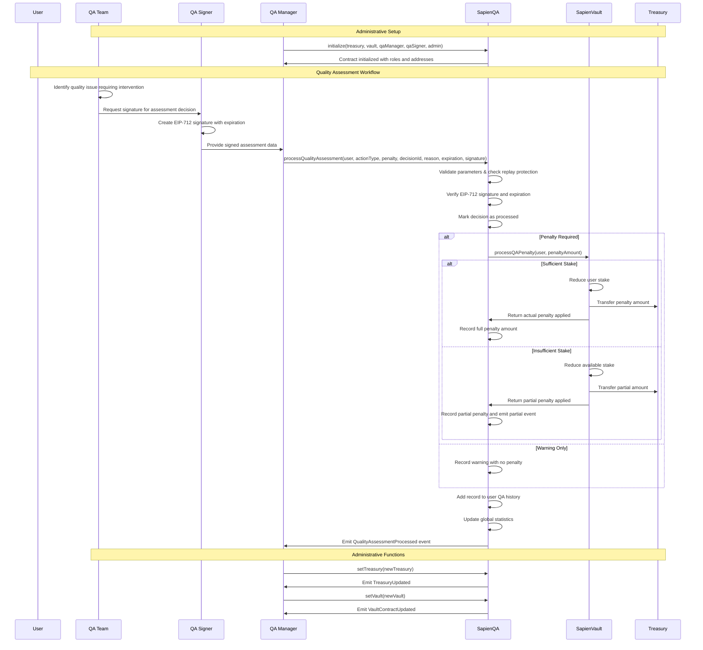

# SapienQA Contract Documentation

## Overview

**Contract:** SapienQA  
**Purpose:** Manages quality assurance decisions for the Sapien protocol through signature-based verification and penalty enforcement with comprehensive audit trails.

**Inheritance:**
- `ISapienQA`
- `AccessControlUpgradeable`
- `EIP712Upgradeable`

### Core Features

- **EIP-712 signature verification**: Authorized QA decisions with expiration support and replay protection
- **Progressive penalty system**: Multiple action types from warnings to severe penalties
- **SapienVault integration**: Automated penalty enforcement through stake reduction
- **Comprehensive audit trails**: Detailed QA history per user with complete decision records
- **Role-based access control**: Separation between QA managers (executors) and QA signers (authorizers)
- **Replay attack protection**: Unique decision IDs prevent duplicate processing
- **Graceful degradation**: Handles insufficient stakes with partial penalty application
- **Statistical tracking**: Global penalty and warning counters for ecosystem monitoring

---

## Developer Notes

### Architecture Decisions

1. **Decision ID Uniqueness**: Uses unique bytes32 identifiers to prevent replay attacks and ensure one-time processing
2. **Role Separation**: QA managers execute decisions while QA signers authorize them, providing checks and balances
3. **Signature Expiration**: Built-in expiration prevents stale decision execution and reduces attack windows
4. **Graceful Penalty Handling**: System continues operating even when penalties exceed available stake
5. **Audit Trail Design**: Complete history storage enables transparency and appeals processes

### Security Considerations

- **Signature Security**: EIP-712 typed data hashing prevents cross-contract and cross-chain replay attacks
- **Access Control**: Role-based permissions ensure only authorized parties can execute QA decisions
- **Replay Protection**: Decision ID tracking prevents duplicate processing of the same assessment
- **Economic Security**: Integration with vault ensures penalties are actually enforceable
- **Transparency**: Complete event logging provides full audit capabilities

---

## Workflow Diagram



---

## Initialization

```solidity
function initialize(
    address _treasury,
    address vaultContract,
    address qaManager,
    address qaSigner,
    address admin
) public initializer
```

**Parameters:**
- `_treasury`: Treasury address for penalty collection and contract administration
- `vaultContract`: SapienVault contract address for penalty enforcement
- `qaManager`: Address with QA_MANAGER_ROLE for executing QA decisions
- `qaSigner`: Address with QA_SIGNER_ROLE for authorizing QA decisions
- `admin`: Address with DEFAULT_ADMIN_ROLE for contract administration

**Developer Notes:**
- Uses OpenZeppelin's initializer pattern for upgradeable contracts
- Validates all addresses are non-zero to prevent configuration errors
- Sets up EIP-712 domain with contract name "SapienQA" and version
- Grants roles immediately during initialization for operational readiness

---

## Roles & Access Control

| Role | Identifier | Capabilities | Security Level |
|------|------------|--------------|----------------|
| `DEFAULT_ADMIN_ROLE` | 0x00 | Treasury/vault updates, role management | **Critical** |
| `QA_MANAGER_ROLE` | keccak256("QA_MANAGER_ROLE") | Execute QA decisions with valid signatures | **High** |
| `QA_SIGNER_ROLE` | keccak256("QA_SIGNER_ROLE") | Create EIP-712 signatures for QA decisions | **Critical** |

### Role Functions

```solidity
// Role identifier getters
function QA_MANAGER_ROLE() external pure returns (bytes32);
function QA_SIGNER_ROLE() external pure returns (bytes32);
```

### Role Security Model

- **QA_SIGNER_ROLE**: Authorization layer - creates cryptographic proof of decision validity
- **QA_MANAGER_ROLE**: Execution layer - processes signed decisions but cannot create signatures
- **DEFAULT_ADMIN_ROLE**: Configuration layer - manages contract parameters and role assignments

---

## Core State Variables

```solidity
// Core contract configuration
address public treasury;                      // Treasury for penalty collection
address public vault;                         // SapienVault contract for penalty enforcement

// Global statistics tracking
uint256 public totalPenalties;               // Total penalty amount processed
uint256 public totalWarnings;                // Total warnings issued

// Per-user audit trails
mapping(address => QARecord[]) private userQAHistory;    // Complete QA history per user

// Replay attack protection
mapping(bytes32 => bool) private processedDecisions;     // Decision ID tracking
```

**Developer Notes:**
- `userQAHistory` uses dynamic arrays for complete audit trail preservation
- `processedDecisions` provides O(1) replay protection with minimal storage overhead
- Global counters enable ecosystem-wide QA statistics and trend analysis
- Public addresses allow verification of contract configuration

---

## QA Action Types

```solidity
enum QAActionType {
    WARNING,        // 0: Formal warning with no penalty
    MINOR_PENALTY,  // 1: Small penalty for minor violations
    MAJOR_PENALTY,  // 2: Significant penalty for serious violations
    SEVERE_PENALTY  // 3: Maximum penalty for critical violations
}
```

### Action Type Guidelines

| Action Type | Use Case | Penalty Required | Severity |
|-------------|----------|------------------|----------|
| `WARNING` | First-time violations, minor issues | ❌ No | Low |
| `MINOR_PENALTY` | Repeated minor violations | ✅ Yes | Medium |
| `MAJOR_PENALTY` | Significant quality issues | ✅ Yes | High |
| `SEVERE_PENALTY` | Critical violations, malicious behavior | ✅ Yes | Critical |

---

## QA Processing System

### Main Processing Function

#### `processQualityAssessment(...)`
**Access:** QA_MANAGER_ROLE  
**Purpose:** Process a quality assessment decision with signature verification

```solidity
function processQualityAssessment(
    address userAddress,
    QAActionType actionType,
    uint256 penaltyAmount,
    bytes32 decisionId,
    string calldata reason,
    uint256 expiration,
    bytes calldata signature
) public onlyQaManager
```

**Processing Steps:**
1. **Input Validation**: Validates all parameters for consistency and security
2. **Signature Verification**: Verifies EIP-712 signature from authorized signer with expiration check
3. **Replay Protection**: Marks decision as processed to prevent duplicate execution
4. **Penalty Enforcement**: Processes penalty through SapienVault if required
5. **Record Keeping**: Adds complete record to user's QA history
6. **Statistics Update**: Updates global counters for warnings and penalties
7. **Event Emission**: Emits comprehensive event for off-chain monitoring

**Developer Implementation:**
- Uses internal helper functions for clean separation of concerns
- Handles vault integration failures gracefully with detailed error events
- Maintains complete audit trail regardless of penalty success/failure
- Provides detailed events for both successful and failed penalty applications

### Input Validation

#### `_validateQAInputs(...)`
**Purpose:** Comprehensive validation of all QA assessment parameters

**Validation Rules:**
- `userAddress != address(0)`: Valid user address required
- `decisionId != bytes32(0)`: Non-empty decision ID required
- `!processedDecisions[decisionId]`: Decision ID must not be already processed
- `bytes(reason).length > 0`: Non-empty reason required for transparency
- **For WARNING**: `penaltyAmount == 0` (warnings have no financial penalty)
- **For PENALTIES**: `penaltyAmount > 0` (penalties must have financial impact)

### Penalty Processing

#### `_processPenaltyIfRequired(...)`
**Purpose:** Handles penalty application with graceful error handling

```solidity
function _processPenaltyIfRequired(address userAddress, uint256 penaltyAmount) 
    private returns (uint256 actualPenaltyApplied)
```

**Processing Logic:**
1. **Skip if Warning**: Returns 0 immediately for WARNING action types
2. **Vault Integration**: Calls `SapienVault.processQAPenalty()` with try-catch handling
3. **Partial Penalty Handling**: Detects when penalty exceeds available stake
4. **Error Handling**: Catches and logs vault failures without stopping QA process
5. **Return Actual Amount**: Returns actual penalty applied for accurate record keeping

**Developer Notes:**
- Uses try-catch to handle vault failures gracefully
- Emits specific events for partial penalties and failures
- Continues QA process even if penalty fails (important for audit trail)
- Returns actual penalty amount for accurate statistics and record keeping

---

## Signature Security (EIP-712)

### Domain Configuration

```solidity
// EIP-712 domain configuration:
// name: "SapienQA"
// version: Contract version from Constants.QA_VERSION
// chainId: Current blockchain chain ID
// verifyingContract: This contract's address
```

### Typed Data Structure

```solidity
bytes32 internal constant QA_DECISION_TYPEHASH = keccak256(
    "QADecision(address userAddress,uint8 actionType,uint256 penaltyAmount,bytes32 decisionId,bytes32 reason,uint256 expiration)"
);
```

### Signature Verification

#### `verifySignature(...)`
**Purpose:** Comprehensive EIP-712 signature verification with expiration

```solidity
function verifySignature(
    address userAddress,
    QAActionType actionType,
    uint256 penaltyAmount,
    bytes32 decisionId,
    string calldata reason,
    uint256 expiration,
    bytes calldata signature
) public view
```

**Verification Process:**
1. **Expiration Check**: `block.timestamp <= expiration` prevents stale signatures
2. **Signature Format**: Must be exactly 65 bytes (r + s + v format)
3. **Hash Generation**: Creates EIP-712 typed data hash from parameters
4. **Signer Recovery**: Uses ECDSA to recover signer address from signature
5. **Authorization Check**: Verifies signer has `QA_SIGNER_ROLE`

**Developer Security Notes:**
- Reason parameter is hashed before inclusion in typed data for gas efficiency
- Expiration prevents indefinite signature validity
- Structured data prevents signature malleability attacks
- Role verification ensures only authorized signers can create valid signatures

### Hash Generation Helper

#### `createQADecisionHash(...)`
**Purpose:** Generates consistent hash for signature creation and verification

```solidity
function createQADecisionHash(
    bytes32 decisionId,
    address user,
    uint8 actionType,
    uint256 penaltyAmount,
    string memory reason,
    uint256 expiration
) public pure returns (bytes32)
```

**Usage:**
- Server-side signature generation
- Verification consistency
- Testing and debugging

---

## Data Structures

### QARecord Structure

```solidity
struct QARecord {
    QAActionType actionType;      // Type of QA action taken
    uint256 penaltyAmount;        // Actual penalty amount applied
    bytes32 decisionId;           // Unique decision identifier
    string reason;                // Human-readable reason for assessment
    uint256 timestamp;            // When the decision was processed
    address processor;            // QA manager who processed the decision
}
```

**Developer Notes:**
- `penaltyAmount` stores actual penalty applied (may be less than requested)
- `processor` provides accountability for QA decisions
- `timestamp` enables chronological analysis of QA actions
- `reason` provides transparency and supports appeals processes

---

## View Functions

### User History

#### `getUserQAHistory(address user)`
Returns complete QA history for specified user

```solidity
function getUserQAHistory(address user) 
    external view returns (QARecord[] memory qaHistory)
```

#### `getUserQARecordCount(address user)`
Returns count of QA records for gas-efficient iteration

### Decision Status

#### `isDecisionProcessed(bytes32 decisionId)`
Checks if decision ID has been processed (replay protection)

### Statistics

#### `getQAStatistics()`
Returns global QA statistics for ecosystem monitoring

```solidity
function getQAStatistics() external view returns (
    uint256 penaltiesTotal,
    uint256 warningsTotal
)
```

### EIP-712 Integration

#### `getDomainSeparator()`
Returns current EIP-712 domain separator for external signature generation

---

## Administrative Functions

### Treasury Management

#### `setTreasury(address newTreasury)`
**Access:** DEFAULT_ADMIN_ROLE  
**Purpose:** Updates treasury address for penalty collection

**Security:** Validates non-zero address and emits update event

### Vault Management

#### `setVault(address newVaultContract)`
**Access:** DEFAULT_ADMIN_ROLE  
**Purpose:** Updates SapienVault contract address for penalty enforcement

**Use Cases:**
- Vault contract upgrades
- Migration to new penalty enforcement system
- Emergency vault replacement

---

## Events

| Event | Purpose | Parameters |
|-------|---------|------------|
| `QualityAssessmentProcessed` | QA decision successfully processed | `user, actionType, penaltyApplied, decisionId, reason, processor` |
| `QAPenaltyPartial` | Penalty partially applied due to insufficient stake | `user, requestedAmount, actualAmount, reason` |
| `QAPenaltyFailed` | Penalty application failed completely | `user, amount, reason` |
| `TreasuryUpdated` | Treasury address changed | `oldTreasury, newTreasury` |
| `VaultContractUpdated` | Vault contract address changed | `oldVault, newVault` |

### Event Usage Patterns

```solidity
// Monitor for QA decisions
event QualityAssessmentProcessed(
    address indexed user,
    QAActionType indexed actionType,
    uint256 penaltyApplied,
    bytes32 indexed decisionId,
    string reason,
    address processor
);

// Track partial penalty situations
event QAPenaltyPartial(
    address indexed user,
    uint256 requestedAmount,
    uint256 actualAmount,
    string reason
);
```

---

## Error Conditions

### Validation Errors
- `ZeroAddress()`: Zero address provided for critical parameters
- `InvalidDecisionId()`: Empty or zero decision ID
- `EmptyReason()`: Empty reason string provided
- `DecisionAlreadyProcessed()`: Decision ID already used (replay protection)

### Action Type Validation
- `InvalidPenaltyForWarning()`: Non-zero penalty amount for WARNING action
- `PenaltyAmountRequired()`: Zero penalty amount for penalty actions

### Signature Errors
- `ExpiredSignature(uint256 expiration)`: Signature past expiration time
- `InvalidSignatureLength()`: Signature not exactly 65 bytes
- `UnauthorizedSigner(address signer)`: Signer lacks QA_SIGNER_ROLE

### Access Control Errors
- `AccessControlUnauthorizedAccount(address account, bytes32 role)`: Insufficient permissions

---

## Security Features

### Signature Security
- **EIP-712 Standard**: Industry-standard structured signature format prevents many attack vectors
- **Expiration Enforcement**: Time-limited signatures reduce window for potential abuse
- **Role-Based Signing**: Only authorized QA signers can create valid signatures
- **Replay Protection**: Decision IDs prevent duplicate processing of same assessment

### Access Control Security
- **Role Separation**: Managers execute but cannot authorize, signers authorize but don't execute
- **Critical Role Protection**: QA_SIGNER_ROLE is most critical and should be heavily secured
- **Administrative Oversight**: DEFAULT_ADMIN_ROLE can update configurations and manage roles

### Economic Security
- **Graceful Degradation**: System continues operating when penalties exceed available stakes
- **Accurate Accounting**: Tracks actual penalties applied vs requested for transparency
- **Audit Trail Preservation**: Complete history maintained regardless of penalty success/failure

### Operational Security
- **Input Validation**: Comprehensive validation prevents many edge cases and attacks
- **Error Handling**: Graceful handling of vault failures maintains system stability
- **Event Logging**: Complete audit trail enables monitoring and investigation

---

## Integration Guide

### For QA Management Systems

1. **Decision Creation:**
```solidity
// Step 1: Create unique decision ID
bytes32 decisionId = keccak256(abi.encodePacked(user, actionType, block.timestamp, nonce));

// Step 2: Generate EIP-712 signature
bytes32 hash = sapienQA.createQADecisionHash(decisionId, user, actionType, penalty, reason, expiration);
bytes memory signature = signTypedDataHash(hash, signerPrivateKey);

// Step 3: Execute decision
sapienQA.processQualityAssessment(user, actionType, penalty, decisionId, reason, expiration, signature);
```

2. **Historical Analysis:**
```solidity
// Get user's complete QA history
QARecord[] memory history = sapienQA.getUserQAHistory(user);

// Check specific decision status
bool processed = sapienQA.isDecisionProcessed(decisionId);

// Get ecosystem statistics
(uint256 totalPenalties, uint256 totalWarnings) = sapienQA.getQAStatistics();
```

### For Frontend Applications

1. **User QA Dashboard:**
```solidity
// Display user's QA history
uint256 recordCount = sapienQA.getUserQARecordCount(user);
QARecord[] memory history = sapienQA.getUserQAHistory(user);
```

2. **Administrative Interface:**
```solidity
// Monitor global QA statistics
(uint256 penalties, uint256 warnings) = sapienQA.getQAStatistics();

// Check contract configuration
address currentTreasury = sapienQA.treasury();
address currentVault = sapienQA.vault();
```

---

## Gas Optimization Notes

- **Event-Based Architecture**: Heavy reliance on events for off-chain data reduces on-chain storage costs
- **Efficient Mappings**: Simple boolean mapping for replay protection minimizes gas usage
- **Batch-Friendly Design**: Multiple QA decisions can be processed efficiently in sequence
- **Minimal Storage**: Only essential data stored on-chain, full details in events
- **Optimized Validation**: Early validation failures save gas on subsequent operations

---

## Testing Recommendations

### Unit Tests
- Signature generation and verification with various parameters
- Access control enforcement for all roles
- Input validation for edge cases and malicious inputs
- Error handling for vault integration failures

### Integration Tests
- End-to-end QA decision processing
- Vault penalty integration scenarios
- Role management and administrative functions
- Event emission verification

### Security Tests
- Signature replay attack prevention
- Access control bypass attempts
- Economic manipulation through penalty gaming
- Race condition testing for concurrent decisions

### Edge Case Tests
- Insufficient stake penalty scenarios
- Vault contract failure handling
- Expired signature rejection
- Invalid signature format handling

---

## Upgradeability Considerations

- **Proxy Pattern**: Uses OpenZeppelin's upgradeable proxy pattern for future improvements
- **State Preservation**: Historical QA records must be preserved across upgrades
- **Version Tracking**: EIP-712 domain includes version for signature compatibility
- **Role Continuity**: Role assignments should be preserved during upgrades
- **Statistical Continuity**: Global counters should maintain accuracy across upgrades

---

## Compliance and Audit Features

### Transparency
- **Complete Audit Trail**: Every QA decision permanently recorded with full details
- **Public History**: User QA history accessible for transparency and appeals
- **Immutable Records**: Historical records cannot be modified after creation
- **Detailed Events**: Comprehensive event emission for external monitoring

### Accountability
- **Processor Tracking**: Every decision records which QA manager processed it
- **Signature Attribution**: EIP-712 signatures provide cryptographic proof of authorization
- **Timestamp Accuracy**: Block timestamp provides verifiable timing information
- **Reason Documentation**: Human-readable reasons required for all decisions

### Auditability
- **Global Statistics**: Ecosystem-wide QA metrics for trend analysis
- **Role Tracking**: Complete record of who has what permissions
- **Configuration History**: Administrative changes logged through events
- **External Verification**: Public functions enable third-party verification of decisions
