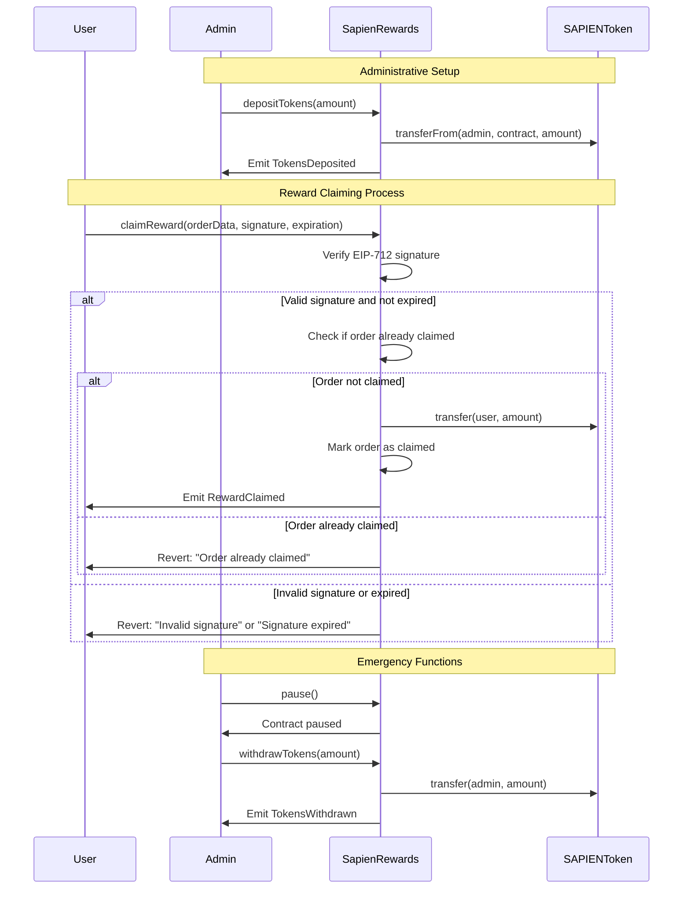

# SapienRewards Contract Documentation

## Overview

**Contract:** SapienRewards  
**Purpose:** Enables secure reward distribution to contributors in the Sapien AI ecosystem through EIP-712 signature-based claims with comprehensive token management.

**Inheritance:**
- `ISapienRewards`
- `EIP712Upgradeable`
- `AccessControlUpgradeable`
- `PausableUpgradeable`
- `ReentrancyGuardUpgradeable`

### Key Features

- EIP-712 signature-based reward claims for security and off-chain validation
- Order-based tracking system preventing double claims and replay attacks
- Role-based access control for administrators and reward managers
- Comprehensive deposit/withdrawal functionality for reward token management
- Emergency pause functionality for security incidents
- Detailed event logging for complete audit trails

---

## Workflow Diagram



---

## Workflow

1. **Token Deposit**: Reward administrators deposit reward tokens into contract
2. **Reward Calculation**: Off-chain systems calculate contributor rewards based on participation
3. **Signature Generation**: Authorized reward managers generate EIP-712 signatures for valid claims
4. **Reward Claiming**: Contributors use signatures to claim their earned rewards
5. **Token Transfer**: Contract validates signatures and transfers tokens to claimants
6. **Audit Trail**: All operations recorded with comprehensive event emission

---

## Initialization

```solidity
function initialize(
    address admin,
    address rewardAdmin,
    address rewardManager,
    address pauser,
    address newRewardToken
) public initializer
```

Initializes the contract with:
- **admin**: Address with DEFAULT_ADMIN_ROLE
- **rewardAdmin**: Address with REWARD_ADMIN_ROLE for token management
- **rewardManager**: Address with REWARD_MANAGER_ROLE for claim signing
- **pauser**: Address with PAUSER_ROLE for emergency controls
- **newRewardToken**: ERC20 token contract for rewards

---

## Roles

| Role | Description |
|------|-------------|
| `DEFAULT_ADMIN_ROLE` | Contract configuration, token updates, role management |
| `PAUSER_ROLE` | Emergency pause/unpause functionality |
| `REWARD_ADMIN_ROLE` | Token deposits, withdrawals, balance reconciliation |
| `REWARD_MANAGER_ROLE` | EIP-712 signature creation for reward claims |

---

## Core State Variables

- `IERC20 public rewardToken` – The reward token contract interface
- `uint256 private availableRewards` – Tracked balance for reward claims
- `mapping(address => mapping(bytes32 => bool)) private redeemedOrders` – Order tracking

---

## Administrative Functions

### Token Management

#### `setRewardToken(address newRewardToken)`
Updates the reward token contract. Resets available rewards to zero. Only callable by DEFAULT_ADMIN_ROLE.

#### `depositRewards(uint256 amount)`
Transfers tokens from REWARD_ADMIN to contract and updates available balance. Only callable by REWARD_ADMIN_ROLE.

#### `withdrawRewards(uint256 amount)`
Transfers tokens from contract to REWARD_ADMIN and updates available balance. Only callable by REWARD_ADMIN_ROLE.

### Balance Management

#### `reconcileBalance()`
Automatically adds any untracked tokens to available rewards balance. Only callable by REWARD_ADMIN_ROLE.

#### `recoverUnaccountedTokens(uint256 amount)`
Emergency function to recover tokens sent directly to contract without going through deposit. Only callable by REWARD_ADMIN_ROLE.

### Emergency Controls

#### `pause()` / `unpause()`
Emergency controls to halt/resume reward claiming operations. Only callable by PAUSER_ROLE.

---

## Reward Claiming System

### Primary Claim Function

#### `claimReward(uint256 rewardAmount, bytes32 orderId, bytes memory signature)`
Main function for claiming rewards using EIP-712 signatures.

**Parameters:**
- `rewardAmount`: Amount of tokens to claim
- `orderId`: Unique identifier for this reward order
- `signature`: EIP-712 signature from authorized REWARD_MANAGER

**Process:**
1. **Verification**: Validates order parameters and signature
2. **Replay Protection**: Marks order ID as redeemed
3. **Balance Update**: Deducts from available rewards
4. **Token Transfer**: Transfers tokens to claimant
5. **Event Emission**: Emits RewardClaimed event

**Returns:** `true` if successful

### Supporting Functions

#### `validateAndGetHashToSign(address userWallet, uint256 rewardAmount, bytes32 orderId)`
Server-side function for generating correct EIP-712 hash to sign.

**Validations:**
- Amount > 0 and ≤ maximum reward limit
- Order ID not empty and not already used
- Sufficient available rewards
- User is not a reward manager (prevents self-claiming)

**Returns:** EIP-712 hash for signature generation

#### `getOrderRedeemedStatus(address user, bytes32 orderId)`
Checks if specific order has been redeemed for given user.

---

## EIP-712 Implementation

### Domain Configuration
**Domain Name**: `"SapienRewards"`  
**Version**: Contract version from `Constants.REWARDS_VERSION`

### Type Definition
```solidity
REWARD_CLAIM_TYPEHASH = keccak256("RewardClaim(address userWallet,uint256 amount,bytes32 orderId)")
```

### Hash Generation
```solidity
struct RewardClaim {
    address userWallet;
    uint256 amount;
    bytes32 orderId;
}
```

---

## View Functions

### Balance Information

#### `getAvailableRewards()`
Returns currently available reward tokens for claims.

#### `getRewardTokenBalances()`
Returns both available rewards and total contract token balance.
- `availableBalance`: Tracked rewards available for claims
- `totalContractBalance`: Actual token balance (includes untracked tokens)

### Order Status

#### `getOrderRedeemedStatus(address user, bytes32 orderId)`
Returns boolean indicating if order has been redeemed.

---

## Events

| Event | Description |
|-------|-------------|
| `RewardClaimed` | User successfully claimed reward with amount and order ID |
| `RewardTokenSet` | Reward token contract address updated |
| `RewardsDeposited` | Tokens deposited with depositor, amount, and new balance |
| `RewardsWithdrawn` | Tokens withdrawn with withdrawer, amount, and new balance |
| `UnaccountedTokensRecovered` | Untracked tokens recovered with recipient and amount |
| `RewardsReconciled` | Balance reconciled with untracked amount and new balance |

### Key Event Structures

```solidity
event RewardClaimed(address indexed user, uint256 amount, bytes32 indexed orderId);

event RewardsDeposited(address indexed depositor, uint256 amount, uint256 newBalance);

event RewardsReconciled(uint256 untrackedAmount, uint256 newAvailableBalance);
```

---

## Error Conditions

### Input Validation
- `ZeroAddress()`: Invalid zero address provided
- `InvalidAmount()`: Zero or negative amount specified
- `InvalidOrderId(bytes32)`: Empty or zero order ID

### Operational Errors
- `InsufficientAvailableRewards()`: Not enough tracked rewards for claim
- `InsufficientUnaccountedTokens()`: Not enough untracked tokens for recovery
- `OrderAlreadyUsed()`: Order ID previously redeemed (replay protection)

### Authorization Errors
- `RewardsManagerCannotClaim()`: Reward managers cannot claim rewards for themselves
- `UnauthorizedSigner(address)`: Signature from address without REWARD_MANAGER_ROLE
- `RewardExceedsMaxAmount(uint256, uint256)`: Reward amount exceeds defined maximum

### Signature Errors
- `InvalidSignatureOrParameters(string, ECDSA.RecoverError)`: Malformed signature or recovery failure

---

## Security Features

### Signature Security
- **EIP-712 Standard**: Industry-standard structured signature format
- **Role-Based Signing**: Only authorized reward managers can create valid signatures
- **Replay Protection**: Order IDs prevent signature reuse
- **Self-Claim Prevention**: Reward managers cannot claim rewards for themselves

### Financial Security
- **Tracked Balances**: Separate tracking of available rewards vs total balance
- **Withdrawal Limits**: Cannot withdraw more than available tracked balance
- **Recovery Mechanisms**: Safe recovery of directly transferred tokens
- **Maximum Limits**: Per-claim maximum amounts prevent excessive distributions

### Access Control
- **Multi-Role System**: Clear separation of administrative and operational roles
- **Emergency Controls**: Pause functionality for security incidents
- **Reentrancy Protection**: All external functions protected against reentrancy
- **Input Validation**: Comprehensive validation of all user inputs

---

## Technical Implementation

### Storage Optimization
- **Nested Mappings**: Efficient order tracking per user
- **Private State**: Internal balance tracking for security
- **Event-Based Audit**: Comprehensive event emission for off-chain monitoring

### Gas Optimization
- **Minimal Storage Writes**: Efficient state updates
- **Batch-Friendly Design**: Suitable for bulk operations
- **Library Integration**: Uses OpenZeppelin for standard functionality

### Upgrade Support
- **Proxy Pattern**: Upgradeable implementation using OpenZeppelin patterns
- **Version Tracking**: Built-in version reporting for upgrade management
- **State Migration**: Designed for safe upgrade procedures

---

## Integration Notes

### Off-Chain Integration
- Server-side signature generation using `validateAndGetHashToSign()`
- Event monitoring for claim tracking and reconciliation
- Automated balance management through administrative functions

### Security Monitoring
- **Event Analysis**: Monitor for unusual claiming patterns
- **Balance Tracking**: Regular reconciliation of tracked vs actual balances
- **Role Monitoring**: Track administrative actions for audit compliance

### Error Handling
- **Graceful Degradation**: System continues operating during partial failures
- **Detailed Error Reporting**: Comprehensive error messages for debugging
- **Recovery Procedures**: Multiple mechanisms for handling edge cases

---

## Constants Integration

The contract integrates with `Constants.sol` for:
- **MAX_REWARD_AMOUNT**: Maximum allowable reward per claim
- **REWARDS_VERSION**: Contract version string
- **Role definitions**: PAUSER_ROLE, REWARD_ADMIN_ROLE, REWARD_MANAGER_ROLE
- **Type hashes**: REWARD_CLAIM_TYPEHASH for EIP-712

---

## Usage Examples

### Basic Reward Claim
```solidity
// Generate signature off-chain using validateAndGetHashToSign()
bytes32 hash = rewards.validateAndGetHashToSign(user, amount, orderId);
bytes memory signature = signHash(hash, managerPrivateKey);

// Claim reward
bool success = rewards.claimReward(amount, orderId, signature);
```

### Administrative Operations
```solidity
// Deposit rewards (as REWARD_ADMIN)
rewardToken.approve(address(rewards), amount);
rewards.depositRewards(amount);

// Reconcile balance if tokens sent directly
rewards.reconcileBalance();

// Recover unaccounted tokens
rewards.recoverUnaccountedTokens(amount);
```


---
