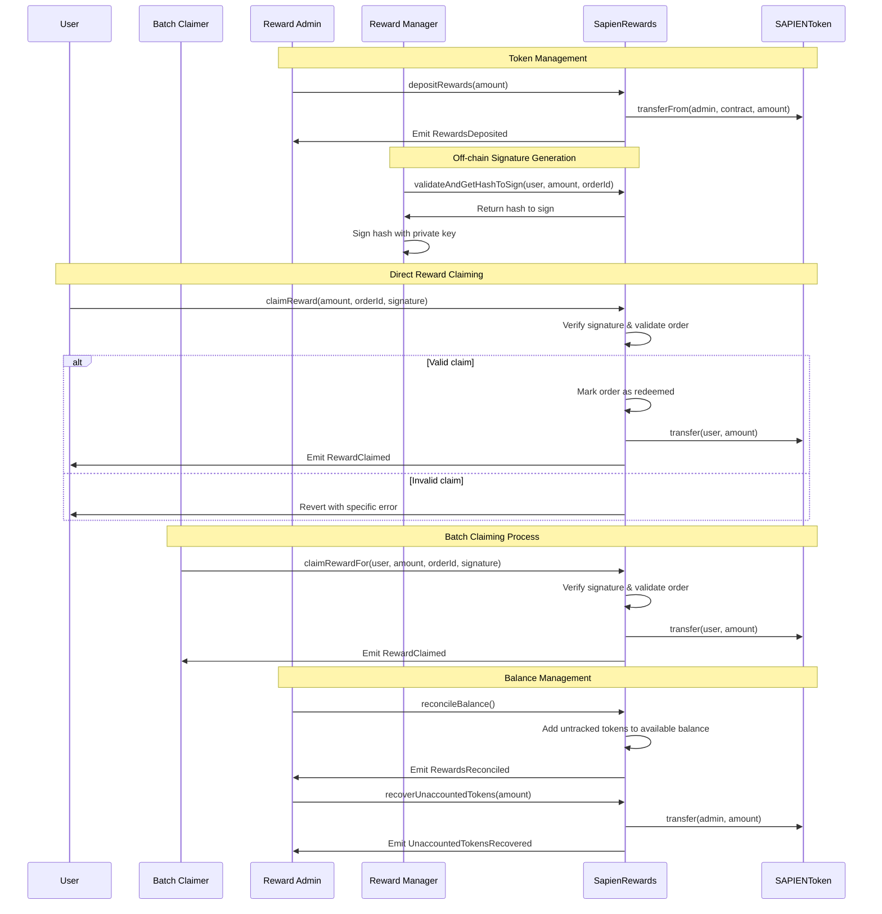

# SapienRewards Contract Documentation

## Overview

**Contract:** SapienRewards  
**Purpose:** Enables secure reward distribution to contributors in the Sapien AI ecosystem through EIP-712 signature-based claims with comprehensive token management and balance reconciliation.

**Inheritance:**
- `ISapienRewards`
- `EIP712Upgradeable`
- `AccessControlUpgradeable`
- `PausableUpgradeable`
- `ReentrancyGuardUpgradeable`

### Key Features

- **EIP-712 signature-based claims**: Secure off-chain validation with replay attack protection
- **Order-based tracking system**: Prevents double claims using unique order IDs with embedded expiration
- **Role-based access control**: Separation of reward admins, managers, and batch claimers
- **Comprehensive token management**: Deposit/withdrawal with balance reconciliation for direct transfers
- **Batch claiming support**: Allows authorized batch claimers to process rewards on behalf of users
- **Emergency controls**: Pause functionality and unaccounted token recovery
- **Detailed audit trails**: Complete event logging for transparency and compliance

---

## Developer Notes

### Architecture Decisions

1. **Order ID Format**: Uses 256-bit values with embedded 64-bit expiration timestamps for automatic signature expiry
2. **Balance Tracking**: Maintains separate `availableRewards` counter to handle direct token transfers
3. **Signature Security**: EIP-712 typed data hashing prevents signature replay across different chains/contracts
4. **Role Separation**: Distinct roles for funding (REWARD_ADMIN), signing (REWARD_MANAGER), and batch processing (BATCH_CLAIMER)

### Security Considerations

- **Reentrancy Protection**: All external functions protected against reentrancy attacks
- **Signature Validation**: Multi-layer validation including expiry, amount limits, and signer authorization
- **Order Tracking**: Per-user order redemption mapping prevents double claims
- **Balance Reconciliation**: Automatic detection and recovery of directly transferred tokens

---

## Workflow Diagram



---

## Initialization

```solidity
function initialize(
    address admin,
    address rewardAdmin,
    address rewardManager,
    address pauser,
    address newRewardToken
) public initializer
```

**Parameters:**
- `admin`: Address with DEFAULT_ADMIN_ROLE for contract administration
- `rewardAdmin`: Address with REWARD_ADMIN_ROLE for token management
- `rewardManager`: Address with REWARD_MANAGER_ROLE for signature generation
- `pauser`: Address with PAUSER_ROLE for emergency controls
- `newRewardToken`: ERC20 token contract address for rewards

**Developer Notes:**
- Uses OpenZeppelin's initializer pattern for upgradeable contracts
- Validates all addresses are non-zero to prevent configuration errors
- Sets up EIP-712 domain with contract name and version for signature security

---

## Roles & Access Control

| Role | Identifier | Capabilities | Security Level |
|------|------------|--------------|----------------|
| `DEFAULT_ADMIN_ROLE` | 0x00 | Full admin rights, role management, token changes | **Critical** |
| `REWARD_ADMIN_ROLE` | keccak256("REWARD_ADMIN_ROLE") | Token deposits/withdrawals, balance reconciliation | **High** |
| `REWARD_MANAGER_ROLE` | keccak256("REWARD_MANAGER_ROLE") | Signature generation for reward claims | **High** |
| `BATCH_CLAIMER_ROLE` | keccak256("BATCH_CLAIMER_ROLE") | Claim rewards on behalf of users | **Medium** |
| `PAUSER_ROLE` | keccak256("PAUSER_ROLE") | Emergency pause/unpause operations | **High** |

### Role Functions

```solidity
// Role identifier getters
function PAUSER_ROLE() external pure returns (bytes32);
function REWARD_ADMIN_ROLE() external pure returns (bytes32);
function REWARD_MANAGER_ROLE() external pure returns (bytes32);
function BATCH_CLAIMER_ROLE() external pure returns (bytes32);
```

---

## Core State Variables

```solidity
// Core token and balance tracking
IERC20 public rewardToken;                    // The reward token contract
uint256 private availableRewards;             // Tracked available balance for claims

// Claim tracking to prevent replay attacks
mapping(address => mapping(bytes32 => bool)) private redeemedOrders;
```

**Developer Notes:**
- `availableRewards` tracks contract-managed balance separately from actual token balance
- `redeemedOrders` uses nested mapping for gas-efficient per-user order tracking
- Private state variables with public getters for controlled access

---

## Token Management API

### Administrative Functions

#### `depositRewards(uint256 amount)`
**Access:** REWARD_ADMIN_ROLE  
**Purpose:** Deposits reward tokens for distribution  

```solidity
function depositRewards(uint256 amount) external onlyRewardAdmin
```

**Developer Implementation:**
- Transfers tokens from sender to contract using `safeTransferFrom`
- Increases `availableRewards` counter for balance tracking
- Emits `RewardsDeposited` event with sender, amount, and new total

#### `withdrawRewards(uint256 amount)`
**Access:** REWARD_ADMIN_ROLE  
**Purpose:** Withdraws unused reward tokens  

```solidity
function withdrawRewards(uint256 amount) external onlyRewardAdmin
```

**Validation:**
- Requires `amount > 0` 
- Requires `amount <= availableRewards`
- Decreases tracked balance before transfer to prevent reentrancy issues

#### `setRewardToken(address newRewardToken)`
**Access:** DEFAULT_ADMIN_ROLE  
**Purpose:** Changes the reward token contract (resets balance tracking)

**Security Warning:** Resets `availableRewards` to 0, requiring balance reconciliation

### Balance Reconciliation

#### `reconcileBalance()`
**Access:** REWARD_ADMIN_ROLE  
**Purpose:** Automatically reconciles tracked vs actual token balance

```solidity
function reconcileBalance() external onlyRewardAdmin
```

**Developer Logic:**
1. Compare `rewardToken.balanceOf(address(this))` with `availableRewards`
2. If actual balance > tracked balance, add difference to `availableRewards`
3. Emit `RewardsReconciled` event with untracked amount

#### `recoverUnaccountedTokens(uint256 amount)`
**Access:** REWARD_ADMIN_ROLE  
**Purpose:** Recovers tokens sent directly to contract without proper deposit

**Use Cases:**
- Recovery from accidental direct transfers
- Emergency token extraction
- Contract migration scenarios

---

## Reward Claiming System

### Signature Validation

#### `validateAndGetHashToSign(address userWallet, uint256 rewardAmount, bytes32 orderId)`
**Purpose:** Server-side signature generation with comprehensive validation

```solidity
function validateAndGetHashToSign(
    address userWallet,
    uint256 rewardAmount, 
    bytes32 orderId
) public view returns (bytes32 hashToSign)
```

**Validation Checks:**
1. **Amount validation**: `rewardAmount > 0` and `<= MAX_REWARD_AMOUNT`
2. **Order validation**: `orderId != bytes32(0)` and not already redeemed
3. **Expiry validation**: Extract 64-bit timestamp from orderId and validate range
4. **Balance validation**: `rewardAmount <= availableRewards`
5. **User validation**: User doesn't have REWARD_MANAGER_ROLE (prevents self-signing)

**Developer Notes:**
- OrderId format: `[192 bits: unique data][64 bits: expiration timestamp]`
- Expiry must be between `MIN_ORDER_EXPIRY_DURATION` (60s) and `MAX_ORDER_EXPIRY_DURATION` (301s)
- Returns EIP-712 typed data hash ready for signing

### Claim Functions

#### `claimReward(uint256 rewardAmount, bytes32 orderId, bytes memory signature)`
**Purpose:** Direct reward claiming by users

```solidity
function claimReward(
    uint256 rewardAmount,
    bytes32 orderId,
    bytes memory signature
) public nonReentrant whenNotPaused returns (bool success)
```

**Execution Flow:**
1. Verify signature and order parameters via `_verifyOrder`
2. Mark order as redeemed via `_markOrderAsRedeemed`
3. Decrease `availableRewards` counter
4. Transfer tokens to `msg.sender`
5. Emit `RewardClaimed` event

#### `claimRewardFor(address user, uint256 rewardAmount, bytes32 orderId, bytes memory signature)`
**Access:** BATCH_CLAIMER_ROLE  
**Purpose:** Batch claiming on behalf of users

**Security Design:**
- Signature must be for the `user` address, not the batch claimer
- Tokens are transferred directly to `user`, not the batch claimer
- Prevents batch claimers from claiming rewards for themselves

---

## Signature Security (EIP-712)

### Domain Separator
```solidity
// Contract uses EIP-712 domain separator with:
// name: "SapienRewards"
// version: Contract version from Constants
// chainId: Current chain ID
// verifyingContract: This contract's address
```

### Typed Data Structure
```solidity
bytes32 internal constant REWARD_CLAIM_TYPEHASH = keccak256(
    "RewardClaim(address userWallet,uint256 amount,bytes32 orderId)"
);
```

### Signature Verification Process

```solidity
function _verifyOrder(
    address userWallet,
    uint256 rewardAmount,
    bytes32 orderId,
    bytes memory signature
) private view
```

**Verification Steps:**
1. Generate hash via `validateAndGetHashToSign`
2. Recover signer from signature using ECDSA
3. Verify signer has `REWARD_MANAGER_ROLE`
4. All validation errors cause specific reverts for debugging

---

## View Functions

### Balance Queries

#### `getAvailableRewards()`
Returns tracked available balance for reward distribution

#### `getRewardTokenBalances()`
Returns both tracked balance and actual contract token balance for reconciliation

```solidity
function getRewardTokenBalances() public view returns (
    uint256 availableBalance,
    uint256 totalContractBalance
)
```

### Order Status

#### `getOrderRedeemedStatus(address user, bytes32 orderId)`
Checks if specific user order has been claimed

```solidity
function getOrderRedeemedStatus(address user, bytes32 orderId) 
    public view returns (bool isRedeemed)
```

---

## Events

| Event | Purpose | Parameters |
|-------|---------|------------|
| `RewardClaimed` | User successfully claimed reward | `user, amount, orderId` |
| `RewardsDeposited` | Admin deposited tokens | `depositor, amount, newTotal` |
| `RewardsWithdrawn` | Admin withdrew tokens | `withdrawer, amount, newTotal` |
| `RewardsReconciled` | Balance automatically reconciled | `untrackedAmount, newTotal` |
| `UnaccountedTokensRecovered` | Direct transfers recovered | `admin, amount` |
| `RewardTokenSet` | Reward token changed | `newTokenAddress` |

---

## Error Conditions

### Validation Errors
- `ZeroAddress()`: Zero address provided for critical parameters
- `InvalidAmount()`: Zero or invalid amount specified
- `InvalidOrderId(bytes32 orderId)`: Zero or invalid order ID
- `OrderAlreadyUsed()`: Order ID already claimed by user

### Timing Errors  
- `OrderExpired(bytes32 orderId, uint64 expiration)`: Signature expired
- `ExpiryTooSoon(bytes32 orderId, uint64 expiration)`: Expiry too close to current time
- `ExpiryTooFar(bytes32 orderId, uint64 expiration)`: Expiry too far in future

### Authorization Errors
- `UnauthorizedSigner(address signer)`: Signer lacks REWARD_MANAGER_ROLE
- `RewardsManagerCannotClaim()`: Reward managers cannot claim rewards
- `AccessControlUnauthorizedAccount`: Insufficient role permissions

### Resource Errors
- `InsufficientAvailableRewards()`: Not enough tracked balance for claim
- `InsufficientUnaccountedTokens()`: Not enough untracked tokens for recovery
- `RewardExceedsMaxAmount(uint256 amount, uint256 max)`: Amount exceeds maximum

### Signature Errors
- `InvalidSignatureOrParameters(string reason, ECDSA.RecoverError error)`: Malformed signature

---

## Security Features

### Reentrancy Protection
- All external functions use `nonReentrant` modifier
- State changes occur before external calls (CEI pattern)
- Balance tracking prevents manipulation via recursive calls

### Access Control Security
- Role-based permissions for all administrative functions
- Role separation prevents single point of failure
- Batch claimers cannot claim for themselves

### Signature Security
- EIP-712 typed data prevents cross-contract replay attacks
- Embedded expiration prevents stale signature usage
- Per-user order tracking prevents replay within valid time window

### Economic Security
- Maximum reward amount limits prevent excessive claims
- Balance tracking prevents over-distribution
- Reconciliation mechanisms handle edge cases

---

## Integration Guide

### For Backend Systems

1. **Signature Generation:**
```solidity
// Step 1: Call validateAndGetHashToSign
bytes32 hash = sapienRewards.validateAndGetHashToSign(user, amount, orderId);

// Step 2: Sign hash with authorized private key
bytes memory signature = signHash(hash, privateKey);

// Step 3: Provide signature to user for claiming
```

2. **Order ID Format:**
```solidity
// Embed expiration in order ID
uint64 expiration = block.timestamp + 300; // 5 minutes
bytes32 orderId = bytes32((uint256(keccak256(uniqueData)) & ~uint256(type(uint64).max)) | expiration);
```

### For Frontend Integration

1. **Check Order Status:**
```solidity
bool isRedeemed = sapienRewards.getOrderRedeemedStatus(user, orderId);
```

2. **Balance Queries:**
```solidity
uint256 available = sapienRewards.getAvailableRewards();
```

3. **Claim Rewards:**
```solidity
bool success = sapienRewards.claimReward(amount, orderId, signature);
```

---

## Gas Optimization Notes

- Order tracking uses nested mappings for O(1) lookup
- Balance tracking prevents expensive token balance queries
- Single token transfer per claim minimizes gas costs
- Signature verification optimized with early validation
- Event emission provides efficient off-chain indexing

---

## Upgradeability Considerations

- Uses OpenZeppelin's upgradeable proxy pattern
- State variables organized to minimize storage slot conflicts
- Initialization function replaces constructor for proxy compatibility
- Version tracking enables migration coordination

---

## Testing Recommendations

### Unit Tests
- Signature generation and verification
- Order expiration and replay protection
- Balance tracking and reconciliation
- Role-based access control

### Integration Tests
- End-to-end claiming workflows
- Batch claiming scenarios
- Emergency pause and recovery
- Token migration procedures

### Security Tests
- Reentrancy attack vectors
- Signature replay attacks
- Access control bypasses
- Economic manipulation attempts


---
