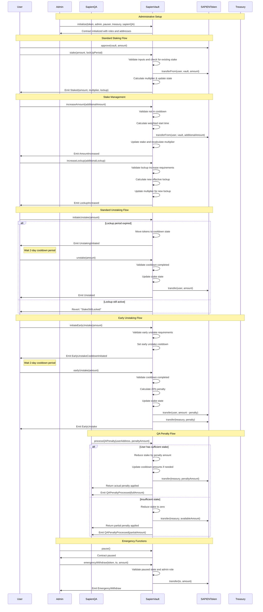

# SapienVault Contract Documentation

## Overview

**Contract:** SapienVault  
**Purpose:** Manages staking, lockup, cooldown, and reward multiplier logic for Sapien Protocol through a reputation-based collateral staking mechanism that forms the backbone of the Sapien AI ecosystem.

**Inheritance:**
- `ISapienVault`
- `AccessControlUpgradeable`
- `PausableUpgradeable`
- `ReentrancyGuardUpgradeable`

### Key Features

- **Single stake per user**: Simplified design with weighted averaging for stake combinations and upgrades
- **Dynamic multiplier system**: Reward multipliers based on both stake amount and commitment duration (1.0x to 1.5x)
- **Multi-phase unstaking**: Two-phase process (lockup expiration → 2-day cooldown → withdrawal)
- **Early unstaking with penalties**: 20% penalty for early withdrawal with mandatory cooldown protection
- **Quality Assurance integration**: Stake penalties for poor contribution quality through SapienQA integration
- **Weighted averaging protection**: Prevents lockup period gaming when combining stakes
- **Emergency controls**: Admin pause functionality and emergency withdrawal capabilities
- **Role-based security**: Granular access control for admin, pauser, and QA functions

---

## Developer Notes

### Architecture Decisions

1. **Single Stake Model**: One stake per user simplifies reputation calculations and user experience
2. **Weighted Start Time**: Prevents gaming by properly averaging lockup periods when stakes are combined
3. **Two-Phase Unstaking**: Lockup period followed by cooldown prevents immediate unstaking to avoid QA penalties
4. **Multiplier Scaling**: Linear scaling based on amount and lockup duration to incentivize long-term commitment
5. **QA Integration**: Direct integration with SapienQA for automated penalty enforcement
6. **Penalty Structure**: 20% early withdrawal penalty flows to treasury to discourage gaming

### Security Considerations

- **Reentrancy Protection**: All external functions protected against reentrancy attacks
- **Cooldown Protection**: Prevents users from avoiding QA penalties through immediate unstaking
- **Weighted Averaging**: Prevents lockup period manipulation through strategic stake timing
- **Role-Based Access**: Critical functions restricted to appropriate roles with clear separation of concerns
- **Input Validation**: Comprehensive validation prevents edge cases and malicious inputs
- **Economic Security**: Penalty mechanisms discourage behavior harmful to the ecosystem

### Business Logic

- **Reputation System**: Higher stakes and longer lockups result in higher reputation multipliers
- **Quality Incentives**: Poor work quality results in stake slashing, encouraging high-quality contributions
- **Liquidity Management**: Staking removes tokens from circulation, supporting token economics
- **Commitment Rewards**: Longer lockups earn higher multipliers, rewarding committed participants

---

## Workflow Diagram



---

## Initialization

```solidity
function initialize(
    address token,
    address admin,
    address pauser,
    address newTreasury,
    address sapienQA
) public initializer
```

**Parameters:**
- `token`: The SAPIEN ERC20 token contract address for staking operations
- `admin`: Address with DEFAULT_ADMIN_ROLE for contract administration and treasury management
- `pauser`: Address with PAUSER_ROLE for emergency pause/unpause operations
- `newTreasury`: Treasury address for penalty collection and protocol fees
- `sapienQA`: Address with SAPIEN_QA_ROLE for quality assurance penalty enforcement

**Developer Notes:**
- Uses OpenZeppelin's initializer pattern for upgradeable contracts
- Validates all addresses are non-zero to prevent misconfiguration
- Sets maximum stake amount to 2,500 SAPIEN tokens from constants
- Grants roles immediately for operational readiness

**Validation:**
- All input addresses must be non-zero
- Cannot be called more than once due to initializer protection
- Sets up role-based access control for secure operations

---

## Roles & Access Control

| Role | Identifier | Capabilities | Security Level |
|------|------------|--------------|----------------|
| `DEFAULT_ADMIN_ROLE` | 0x00 | Full admin rights, treasury management, role assignment | **Critical** |
| `PAUSER_ROLE` | keccak256("PAUSER_ROLE") | Emergency pause/unpause functionality | **High** |
| `SAPIEN_QA_ROLE` | keccak256("SAPIEN_QA_ROLE") | Process QA penalties on user stakes | **High** |

### Role Functions

```solidity
// Role identifier getters
function PAUSER_ROLE() external pure returns (bytes32);
function SAPIEN_QA_ROLE() external pure returns (bytes32);
```

### Role Security Model

- **DEFAULT_ADMIN_ROLE**: Ultimate administrative control with treasury and role management capabilities
- **PAUSER_ROLE**: Emergency response capability for security incidents
- **SAPIEN_QA_ROLE**: Quality enforcement through automated penalty application

---

## Core State Variables

```solidity
// Core contract configuration
IERC20 public sapienToken;                    // The SAPIEN token interface for staking
address public treasury;                      // Treasury address for penalty collection
uint256 public totalStaked;                   // Total amount of tokens staked in contract
uint256 public maximumStakeAmount;            // Maximum amount per user stake

// Per-user stake tracking
mapping(address => UserStake) public userStakes;    // Individual user stake data
```

### UserStake Structure

```solidity
struct UserStake {
    uint128 amount;                    // Total staked amount
    uint128 cooldownAmount;            // Amount in cooldown (slot 1)
    uint64 weightedStartTime;          // Weighted average start time
    uint64 effectiveLockUpPeriod;      // Effective lockup period
    uint64 cooldownStart;              // When cooldown was initiated (slot 2)
    uint64 lastUpdateTime;             // Last time stake was modified (slot 3)
    uint64 earlyUnstakeCooldownStart;  // When early unstake cooldown was initiated (slot 4)
    uint32 effectiveMultiplier;        // Calculated multiplier (slot 4)
    uint128 earlyUnstakeCooldownAmount; // Amount requested for early unstake (slot 5)
}
```

**Developer Notes:**
- Optimized storage layout to minimize gas costs with careful slot packing
- `weightedStartTime` enables fair averaging when combining stakes
- `cooldownAmount` tracks tokens in cooldown separately from main stake
- `effectiveMultiplier` stored in basis points (10000 = 1.0x)

---

## Staking States & Transitions

### State Definitions

1. **LOCKED**: Tokens in lockup period (cannot initiate unstaking)
2. **UNLOCKED**: Lockup completed, can initiate unstaking (moves to cooldown)
3. **COOLDOWN**: Unstaking initiated, waiting for 2-day cooldown completion
4. **READY**: Cooldown completed, can execute final withdrawal

### State Transition Functions

```solidity
// Internal helper functions for state checking
function _isUnlocked(UserStake storage userStake) private view returns (bool);
function _isReadyForUnstake(UserStake storage userStake) private view returns (bool);
```

**State Transition Rules:**
- LOCKED → UNLOCKED: Automatic when `block.timestamp >= weightedStartTime + effectiveLockUpPeriod`
- UNLOCKED → COOLDOWN: Via `initiateUnstake()` function call
- COOLDOWN → READY: Automatic when `block.timestamp >= cooldownStart + COOLDOWN_PERIOD`
- Any State → LOCKED: Via early unstaking (if available) or stake increases

---

## Staking API

### Core Staking Functions

#### `stake(uint256 amount, uint256 lockUpPeriod)`
**Purpose:** Stakes tokens with specified lockup period for new users

```solidity
function stake(uint256 amount, uint256 lockUpPeriod) public whenNotPaused nonReentrant
```

**Validation:**
- User must not have existing stake (single stake per user model)
- Amount must be ≥ minimum stake amount (1 SAPIEN token)
- Amount must be ≤ maximum stake amount (2,500 SAPIEN tokens)
- Lockup period must be valid (30-365 days)

**Process:**
1. Validates all inputs and checks for existing stake
2. Transfers tokens from user to contract via `safeTransferFrom`
3. Sets up new stake with current timestamp as weighted start time
4. Calculates initial multiplier based on amount and lockup
5. Updates total staked counter and emits events

#### `increaseAmount(uint256 additionalAmount)`
**Purpose:** Adds tokens to existing stake while maintaining current lockup period

```solidity
function increaseAmount(uint256 additionalAmount) public whenNotPaused nonReentrant
```

**Business Logic:**
- Maintains existing effective lockup period
- Uses weighted averaging for start time calculation
- Recalculates multiplier based on new total amount
- Cannot be called during cooldown periods

**Weighted Start Time Calculation:**
```solidity
newWeightedStartTime = (currentStartTime * currentAmount + block.timestamp * newAmount) / totalAmount
```

#### `increaseLockup(uint256 additionalLockup)`
**Purpose:** Extends lockup period for existing stake

```solidity
function increaseLockup(uint256 additionalLockup) public whenNotPaused nonReentrant
```

**Calculation Logic:**
- For active stakes: Adds to remaining lockup time
- For expired stakes: Sets new lockup starting from current timestamp
- Resets weighted start time to current timestamp
- Maximum total lockup capped at 365 days

#### `increaseStake(uint256 additionalAmount, uint256 additionalLockup)`
**Purpose:** Combines amount and lockup increases in single transaction for better UX

```solidity
function increaseStake(uint256 additionalAmount, uint256 additionalLockup) external
```

**Implementation:**
- Simply calls `increaseAmount()` followed by `increaseLockup()`
- Provides atomic execution of both operations
- Reduces transaction costs compared to separate calls

---

## Unstaking System

### Standard Unstaking Process

#### `initiateUnstake(uint256 amount)`
**Purpose:** Moves specified amount from locked to cooldown state

```solidity
function initiateUnstake(uint256 amount) public whenNotPaused nonReentrant
```

**Requirements:**
- Lockup period must be completed (`_isUnlocked()` returns true)
- Amount must not exceed available unlocked tokens
- Cannot be called if user is already in cooldown

**Process:**
1. Validates unstaking requirements
2. Adds amount to existing cooldown amount
3. Sets cooldown start time to current timestamp
4. Emits `UnstakingInitiated` event with cooldown details

#### `unstake(uint256 amount)`
**Purpose:** Completes withdrawal after cooldown period

```solidity
function unstake(uint256 amount) external whenNotPaused nonReentrant
```

**Requirements:**
- Cooldown period must be completed (2 days from initiation)
- Amount must not exceed cooldown amount
- User must be in ready state

**Process:**
1. Validates withdrawal requirements
2. Reduces stake amount and cooldown amount
3. Updates total staked counter
4. Transfers tokens to user
5. Resets stake if amount reaches zero

### Early Unstaking Process

#### `initiateEarlyUnstake(uint256 amount)`
**Purpose:** Initiates early unstake cooldown for locked tokens

```solidity
function initiateEarlyUnstake(uint256 amount) external whenNotPaused nonReentrant
```

**Requirements:**
- Stake must still be locked (lockup period not completed)
- Amount must be ≥ minimum unstake amount
- No existing early unstake cooldown active
- Amount must not exceed available stake

**Security Feature:**
- Requires cooldown period to prevent QA penalty avoidance
- Prevents users from immediately unstaking after poor quality work

#### `earlyUnstake(uint256 amount)`
**Purpose:** Completes early withdrawal with 20% penalty

```solidity
function earlyUnstake(uint256 amount) external whenNotPaused nonReentrant
```

**Penalty Calculation:**
```solidity
uint256 penalty = (amount * EARLY_WITHDRAWAL_PENALTY) / BASIS_POINTS;  // 20%
uint256 payout = amount - penalty;
```

**Process:**
1. Validates early unstake requirements including cooldown completion
2. Calculates 20% penalty and net payout
3. Updates stake state and total staked counter
4. Transfers net amount to user and penalty to treasury
5. Handles forced complete unstaking if remainder below minimum

---

## Multiplier System

### `calculateMultiplier(uint256 amount, uint256 effectiveLockup)`
**Purpose:** Calculates reward multiplier based on stake amount and lockup duration

```solidity
function calculateMultiplier(uint256 amount, uint256 effectiveLockup) public pure returns (uint256)
```

**Formula:**
```solidity
uint256 bonus = (effectiveLockup * amount * MAX_BONUS) / (LOCKUP_365_DAYS * MAXIMUM_STAKE_AMOUNT);
return BASE_MULTIPLIER + bonus;
```

**Multiplier Matrix:**

| Stake Amount | 30 Days | 90 Days | 180 Days | 365 Days |
|--------------|---------|---------|----------|----------|
| 1 SAPIEN     | 1.00x   | 1.00x   | 1.00x    | 1.0002x  |
| 250 SAPIEN   | 1.0041x | 1.0123x | 1.0246x  | 1.05x    |
| 500 SAPIEN   | 1.0082x | 1.0246x | 1.0493x  | 1.10x    |
| 1,000 SAPIEN | 1.0164x | 1.0493x | 1.0986x  | 1.20x    |
| 1,500 SAPIEN | 1.0246x | 1.0739x | 1.1479x  | 1.30x    |
| 2,000 SAPIEN | 1.0328x | 1.0986x | 1.1972x  | 1.40x    |
| 2,500 SAPIEN | 1.0410x | 1.1232x | 1.2465x  | 1.50x    |

**Design Principles:**
- Linear scaling within bounds to prevent exploitation
- Caps at maximum stake amount and lockup period
- Incentivizes both larger stakes and longer commitments
- Returns multiplier in basis points (10000 = 1.0x)

---

## View Functions

### Primary Summary Function

#### `getUserStakingSummary(address user)`
**Purpose:** Returns comprehensive staking information in single call

```solidity
function getUserStakingSummary(address user) public view returns (UserStakingSummary memory summary)
```

**Return Structure:**
```solidity
struct UserStakingSummary {
    uint256 userTotalStaked;         // Total tokens staked by user
    uint256 effectiveMultiplier;     // Current multiplier (basis points)
    uint256 effectiveLockUpPeriod;   // Lockup period (seconds)
    uint256 totalLocked;             // Amount still in lockup period
    uint256 totalUnlocked;           // Amount available for unstaking initiation
    uint256 timeUntilUnlock;         // Time remaining until unlock (seconds)
    uint256 totalReadyForUnstake;    // Amount ready for immediate withdrawal
    uint256 timeUntilUnstake;        // Time remaining until cooldown unstake
    uint256 totalInCooldown;         // Amount currently in unstaking cooldown
    uint256 timeUntilEarlyUnstake;   // Time remaining until early unstake
    uint256 totalInEarlyCooldown;    // Amount requested for early unstake
}
```

**Usage Examples:**
- Frontend dashboards displaying complete user staking status
- DeFi integrations checking available liquidity before transactions
- Rewards calculations using effective multiplier
- Unstaking flows guiding users through unlock → cooldown → withdrawal

### Individual Query Functions

#### Amount Queries
```solidity
function getTotalStaked(address user) public view returns (uint256);
function getTotalUnlocked(address user) public view returns (uint256);
function getTotalLocked(address user) public view returns (uint256);
function getTotalInCooldown(address user) public view returns (uint256);
function getTotalReadyForUnstake(address user) public view returns (uint256);
```

#### State Queries
```solidity
function hasActiveStake(address user) external view returns (bool);
function getUserMultiplier(address user) public view returns (uint256);
function getUserLockupPeriod(address user) public view returns (uint256);
function getTimeUntilUnlock(address user) public view returns (uint256);
function isEarlyUnstakeReady(address user) public view returns (bool);
```

#### Validation Functions
```solidity
function isValidLockUpPeriod(uint256 lockUpPeriod) public pure returns (bool);
```

---

## Quality Assurance Integration

### `processQAPenalty(address userAddress, uint256 penaltyAmount)`
**Access:** SAPIEN_QA_ROLE  
**Purpose:** Processes QA-imposed penalties by reducing user stakes

```solidity
function processQAPenalty(address userAddress, uint256 penaltyAmount)
    external nonReentrant whenNotPaused onlySapienQA
    returns (uint256 actualPenalty)
```

**Processing Logic:**
1. **Calculate Applicable Penalty**: Determines maximum penalty based on available stake
2. **Apply Penalty**: Reduces stake amounts while maintaining consistency
3. **Update State**: Recalculates multipliers and handles edge cases
4. **Transfer Penalty**: Sends penalty amount to treasury
5. **Return Actual**: Returns actual penalty applied (may be less than requested)

#### Penalty Application Strategy

```solidity
function _reducePrimaryStake(UserStake storage userStake, uint256 maxReduction)
    internal returns (uint256 actualReduction)
```

**Process:**
1. **Primary Stake Reduction**: Reduces main stake amount first
2. **Cooldown Adjustment**: Ensures cooldown amounts never exceed remaining stake
3. **Early Unstake Handling**: Adjusts or cancels early unstake cooldowns if needed
4. **Minimum Enforcement**: Cancels early unstakes below minimum amount

#### Graceful Degradation

- **Partial Penalties**: Handles cases where penalty exceeds available stake
- **State Consistency**: Maintains valid state even with zero stake remaining
- **Multiplier Recalculation**: Updates multipliers for remaining stake
- **Complete Reset**: Cleans up all state when stake reaches zero

---

## Administrative Functions

### Emergency Controls

#### `pause()` / `unpause()`
**Access:** PAUSER_ROLE  
**Purpose:** Emergency controls to halt/resume staking operations

```solidity
function pause() external onlyPauser;
function unpause() external onlyPauser;
```

**Impact When Paused:**
- All staking and unstaking operations halted
- Emergency withdrawal functions remain available
- View functions continue to work normally
- QA penalties can still be processed

#### `emergencyWithdraw(address token, address to, uint256 amount)`
**Access:** DEFAULT_ADMIN_ROLE  
**Purpose:** Emergency function for critical situations when contract is paused

```solidity
function emergencyWithdraw(address token, address to, uint256 amount) 
    external onlyAdmin whenPaused nonReentrant
```

**Security Features:**
- Only callable when contract is paused
- Requires admin role for authorization
- Supports both ERC20 tokens and ETH withdrawal
- Emits detailed events for transparency

### Configuration Management

#### `setTreasury(address newTreasury)`
**Access:** DEFAULT_ADMIN_ROLE  
**Purpose:** Updates treasury address for penalty collection

```solidity
function setTreasury(address newTreasury) external onlyAdmin
```

#### `setMaximumStakeAmount(uint256 newMaximumStakeAmount)`
**Access:** DEFAULT_ADMIN_ROLE  
**Purpose:** Updates maximum stake amount for individual staking operations

```solidity
function setMaximumStakeAmount(uint256 newMaximumStakeAmount) external onlyAdmin
```

**Use Cases:**
- Adjusting economic parameters based on token price
- Implementing gradual rollout of higher stake limits
- Emergency reduction of maximum stakes

---

## Events

| Event | Purpose | Parameters |
|-------|---------|------------|
| `Staked` | User successfully staked tokens | `user, amount, effectiveMultiplier, lockUpPeriod` |
| `AmountIncreased` | Additional tokens added to stake | `user, additionalAmount, newTotalAmount, newEffectiveMultiplier` |
| `LockupIncreased` | Lockup period extended | `user, additionalLockup, newEffectiveLockup, newEffectiveMultiplier` |
| `UnstakingInitiated` | Unstaking cooldown started | `user, cooldownStart, cooldownAmount` |
| `Unstaked` | Tokens successfully withdrawn | `user, amount` |
| `EarlyUnstake` | Early withdrawal completed with penalty | `user, amount, penalty` |
| `EarlyUnstakeCooldownInitiated` | Early unstake cooldown started | `user, cooldownStart, amount` |
| `UserStakeUpdated` | Generic stake update for complex operations | `user, userStake` |
| `UserStakeReset` | User stake completely reset to zero | `user, userStake` |
| `QAPenaltyProcessed` | QA penalty successfully applied | `userAddress, actualPenalty, qaContract` |
| `QACooldownAdjusted` | Cooldown amounts adjusted due to penalty | `userAddress, cooldownReduction` |
| `QAStakeReduced` | Detailed breakdown of penalty application | `userAddress, fromActiveStake, fromCooldownStake` |
| `QAUserStakeReset` | User stake reset due to QA penalty | `userAddress` |
| `SapienTreasuryUpdated` | Treasury address changed | `newTreasury` |
| `MaximumStakeAmountUpdated` | Maximum stake limit changed | `oldMaximum, newMaximum` |
| `EmergencyWithdraw` | Emergency withdrawal executed | `token, to, amount` |

### Event Usage Patterns

```solidity
// Core staking event
event Staked(
    address indexed user,
    uint256 amount,
    uint256 effectiveMultiplier,
    uint256 lockUpPeriod
);

// Comprehensive state update event
event UserStakeUpdated(
    address indexed user,
    UserStake userStake
);
```

---

## Error Conditions

### Validation Errors
- `ZeroAddress()`: Zero address provided for critical parameters
- `InvalidAmount()`: Zero or invalid amount specified
- `MinimumStakeAmountRequired()`: Amount below minimum threshold
- `StakeAmountTooLarge()`: Amount exceeds maximum allowed
- `InvalidLockupPeriod()`: Lockup outside valid range (30-365 days)

### State Errors
- `ExistingStakeFound()`: User already has stake (single stake model)
- `NoStakeFound()`: User has no active stake
- `StakeStillLocked()`: Attempting to unstake before lockup expiration
- `NotReadyForUnstake()`: Cooldown period not completed

### Operation Errors
- `AmountExceedsAvailableBalance()`: Insufficient unlocked tokens
- `AmountExceedsCooldownAmount()`: Unstake amount exceeds cooldown
- `AmountExceedsEarlyUnstakeRequest()`: Early unstake amount validation
- `CannotIncreaseStakeInCooldown()`: Stake modifications during cooldown
- `EarlyUnstakeCooldownActive()`: Existing early unstake in progress
- `EarlyUnstakeCooldownRequired()`: Early unstake cooldown not completed
- `LockPeriodCompleted()`: Cannot early unstake after lockup expiration

### QA Errors
- `InsufficientStakeForPenalty()`: Not enough stake for requested penalty
- `MinimumUnstakeAmountRequired()`: Amount below minimum unstake threshold
- `MinimumLockupIncreaseRequired()`: Lockup increase below minimum

---

## Security Features

### Reentrancy Protection
- All external functions use `nonReentrant` modifier
- State changes occur before external calls (CEI pattern)
- Protected against recursive calls during token transfers

### Access Control Security
- Role-based permissions for all administrative functions
- Clear separation between operational and emergency functions
- QA role limited to penalty processing only

### Economic Security
- **Cooldown Protection**: Prevents immediate unstaking to avoid QA penalties
- **Weighted Averaging**: Prevents lockup period gaming through strategic timing
- **Penalty Mechanisms**: 20% early withdrawal penalty and QA penalties discourage harmful behavior
- **Minimum Amounts**: Prevents dust attacks and precision issues

### Input Validation
- Comprehensive validation of all user inputs
- Range checking for amounts and time periods
- State consistency validation before operations

### Upgrade Security
- Uses OpenZeppelin's upgradeable proxy pattern
- State preservation across upgrades
- Version tracking for compatibility

---

## Integration Guide

### For Frontend Applications

#### Basic Staking Interface
```solidity
// Check if user can stake
bool canStake = !sapienVault.hasActiveStake(user);

// Get current stake summary
UserStakingSummary memory summary = sapienVault.getUserStakingSummary(user);

// Execute staking
await sapienToken.approve(vaultAddress, amount);
await sapienVault.stake(amount, lockupPeriod);
```

#### Advanced Stake Management
```solidity
// Increase stake amount
await sapienToken.approve(vaultAddress, additionalAmount);
await sapienVault.increaseAmount(additionalAmount);

// Increase lockup period
await sapienVault.increaseLockup(additionalLockup);

// Combined increase (better UX)
await sapienToken.approve(vaultAddress, additionalAmount);
await sapienVault.increaseStake(additionalAmount, additionalLockup);
```

#### Unstaking Workflows
```solidity
// Standard unstaking (after lockup)
if (summary.totalUnlocked > 0) {
    await sapienVault.initiateUnstake(amount);
    // Wait 2 days
    await sapienVault.unstake(amount);
}

// Early unstaking (during lockup)
if (summary.totalLocked > 0) {
    await sapienVault.initiateEarlyUnstake(amount);
    // Wait 2 days
    await sapienVault.earlyUnstake(amount);
}
```

### For Backend Systems

#### Monitoring Stake Changes
```solidity
// Monitor for stake events
contract.on("Staked", (user, amount, multiplier, lockup) => {
    updateUserReputation(user, multiplier);
});

contract.on("QAPenaltyProcessed", (user, penalty, qaContract) => {
    logQualityIssue(user, penalty);
});
```

#### Reputation Calculations
```solidity
// Get user's effective multiplier for rewards
uint256 multiplier = sapienVault.getUserMultiplier(user);
uint256 rewardAmount = baseReward * multiplier / 10000;
```

### For QA Systems

#### Penalty Processing
```solidity
// Process QA penalty through SapienQA contract
uint256 actualPenalty = await sapienVault.processQAPenalty(user, penaltyAmount);

// Handle partial penalties
if (actualPenalty < penaltyAmount) {
    logPartialPenalty(user, penaltyAmount, actualPenalty);
}
```

---

## Gas Optimization Notes

- **Storage Slot Packing**: UserStake struct optimized to minimize storage slots
- **Immutable Constants**: Frequently used constants stored as immutable
- **Efficient Mappings**: Single mapping for user stakes with computed values
- **Event-Based Architecture**: Heavy use of events for off-chain data access
- **Batch Operations**: `increaseStake()` combines operations for gas savings

---

## Testing Recommendations

### Unit Tests
- Multiplier calculation accuracy across all ranges
- Weighted averaging correctness for stake combinations
- State transition validation for all staking states
- Cooldown period enforcement and timing
- Penalty calculation and application accuracy

### Integration Tests
- End-to-end staking and unstaking workflows
- QA penalty integration with SapienQA contract
- Emergency pause and recovery procedures
- Role-based access control enforcement
- Economic attack vector resistance

### Security Tests
- Reentrancy attack prevention
- Integer overflow/underflow protection
- Access control bypass attempts
- Economic manipulation through timing attacks
- Cooldown gaming prevention

### Edge Case Tests
- Minimum and maximum stake amounts
- Boundary conditions for lockup periods
- Zero-stake scenarios after penalties
- Simultaneous operations by multiple users
- Contract pause/unpause during operations

---

## Upgradeability Considerations

- **Proxy Pattern**: Uses OpenZeppelin's upgradeable proxy pattern
- **State Layout**: Carefully designed storage layout to prevent conflicts
- **Version Compatibility**: Constants integration enables version tracking
- **Migration Strategy**: Supports gradual migration of stake data if needed
- **Backward Compatibility**: New versions maintain interface compatibility

---

## Constants Integration

The contract integrates with `Constants.sol` for:

```solidity
// Staking limits and periods
MINIMUM_STAKE_AMOUNT = 1 * TOKEN_DECIMALS;     // 1 SAPIEN token
MAXIMUM_STAKE_AMOUNT = 2500 * TOKEN_DECIMALS;  // 2,500 SAPIEN tokens
LOCKUP_30_DAYS = 30 days;                      // Minimum lockup period
LOCKUP_365_DAYS = 365 days;                    // Maximum lockup period

// Economic parameters
BASE_MULTIPLIER = 10000;                       // 1.00x in basis points
MAX_MULTIPLIER = 15000;                        // 1.50x maximum
EARLY_WITHDRAWAL_PENALTY = 2000;               // 20% penalty
COOLDOWN_PERIOD = 2 days;                      // Standard cooldown

// Role identifiers
PAUSER_ROLE = keccak256("PAUSER_ROLE");
SAPIEN_QA_ROLE = keccak256("SAPIEN_QA_ROLE");
```

---

## Performance Monitoring

### Key Metrics
- **Total Value Locked (TVL)**: Sum of all staked tokens
- **Average Multiplier**: Weighted average across all stakes
- **Unstaking Rate**: Frequency of unstaking operations
- **Penalty Rate**: Frequency and amount of QA penalties
- **Gas Usage**: Average gas costs for operations

### Health Indicators
- **Stake Distribution**: Spread across different lockup periods
- **Early Unstake Rate**: Percentage of early vs normal unstaking
- **QA Penalty Impact**: Effect on staker behavior
- **Contract Utilization**: Active stakers vs total users

---

## Conclusion

The SapienVault contract serves as the cornerstone of the Sapien AI reputation system, providing a robust and secure staking mechanism that incentivizes long-term participation and high-quality contributions. Its design balances user experience with economic security, creating a foundation for a thriving AI training ecosystem.

Key achievements:
- **Simplified User Experience**: Single stake per user with comprehensive management functions
- **Economic Alignment**: Multiplier system rewards commitment and quality
- **Security First**: Comprehensive protection against economic and technical attacks
- **Integration Ready**: Seamless integration with QA and rewards systems
- **Scalable Design**: Efficient implementation supporting ecosystem growth

The contract demonstrates how careful architectural decisions can create powerful economic incentives while maintaining the security and usability required for a production ecosystem.

