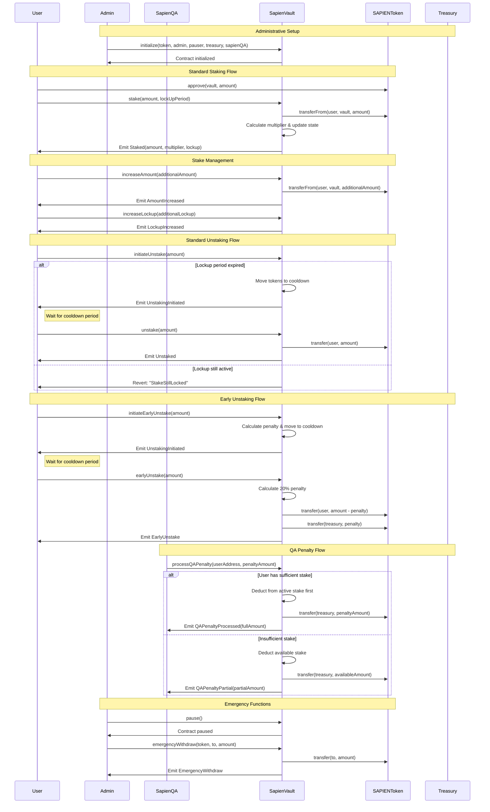

# SapienVault Contract Documentation

## Overview

**Contract:** SapienVault  
**Purpose:** Manages staking, lockup, cooldown, and reward multiplier logic for Sapien Protocol through a reputation-based collateral staking mechanism.

**Inheritance:**
- `ISapienVault`
- `AccessControlUpgradeable`
- `PausableUpgradeable`
- `ReentrancyGuardUpgradeable`

**Features:**
- Single stake per user with weighted averaging for stake combinations
- Dynamic reward multiplier calculation using internal Multiplier library
- Multi-phase unstaking: lockup → cooldown → withdrawal
- Early unstaking with penalties (20%) and cooldown protection
- Quality Assurance (QA) integration for stake penalties
- Role-based access control for admin, pauser, and QA functions
- Emergency withdrawal capabilities

---

## Workflow Diagram



---

## Workflow

1. **Token Staking**: Users approve and stake tokens with chosen lockup periods (30-365 days)
2. **Multiplier Calculation**: Contract calculates reward multipliers based on amount and lockup duration
3. **Stake Management**: Users can increase amounts or extend lockup periods for existing stakes
4. **Standard Unstaking**: After lockup expiration, users initiate unstaking → cooldown → withdrawal
5. **Early Unstaking**: Users can unstake before expiration with 20% penalty to treasury
6. **QA Penalties**: Quality Assurance can impose penalties that reduce user stakes
7. **Emergency Controls**: Administrators can pause operations and perform emergency withdrawals

---

## Initialization

```solidity
function initialize(
    address token,
    address admin,
    address pauser,
    address newTreasury,
    address sapienQA
) public initializer
```

Initializes the staking vault with:
- **token**: The SAPIEN ERC20 token contract
- **admin**: Address with DEFAULT_ADMIN_ROLE
- **pauser**: Address with PAUSER_ROLE  
- **newTreasury**: Treasury address for penalty collection
- **sapienQA**: Address with SAPIEN_QA_ROLE

---

## Roles

| Role | Description |
|------|-------------|
| `DEFAULT_ADMIN_ROLE` | Full administrative rights, treasury management |
| `PAUSER_ROLE` | Authorized to pause/unpause contract operations |
| `SAPIEN_QA_ROLE` | Allowed to impose penalties on users via processQAPenalty |

---

## Core State Variables

- `IERC20 public sapienToken` – The Sapien ERC20 token interface
- `address public treasury` – Treasury address for penalty collection
- `uint256 public totalStaked` – Total amount of tokens staked in contract
- `mapping(address => UserStake) public userStakes` – Individual user stake data

### UserStake Structure

```solidity
struct UserStake {
    uint128 amount;                    // Total staked amount
    uint64 weightedStartTime;          // Weighted average start time
    uint64 effectiveLockUpPeriod;      // Effective lockup duration
    uint64 lastUpdateTime;             // Last modification timestamp
    uint64 cooldownStart;              // Cooldown initiation time (0 if not in cooldown)
    uint32 effectiveMultiplier;        // Current reward multiplier (basis points)
}
```

---

## Staking API

### Core Staking Functions

#### `stake(uint256 amount, uint256 lockUpPeriod)`
Stakes tokens with specified lockup period (30-365 days). For existing stakes, uses weighted averaging to combine with current position.

#### `increaseAmount(uint256 additionalAmount)`
Adds tokens to existing stake maintaining current effective lockup period. Cannot be called during cooldown.

#### `increaseLockup(uint256 additionalLockup)`
Extends lockup period by specified duration. Must meet minimum increase requirements.

---

## Unstaking Flow

### Standard Unstaking Process

#### `initiateUnstake(uint256 amount)`
Moves specified amount from locked to cooldown state. Only callable after lockup expiration.

#### `unstake(uint256 amount)`
Completes withdrawal after cooldown period. Transfers tokens back to user.

### Early Unstaking

#### `initiateEarlyUnstake(uint256 amount)`
Initiates early withdrawal before lockup expiration. Applies penalty calculation.

#### `earlyUnstake(uint256 amount)`
Completes early withdrawal after cooldown. Deducts 20% penalty to treasury.

---

## Multiplier System

### `calculateMultiplier(uint256 amount, uint256 effectiveLockup)`
Calculates reward multiplier using internal Multiplier library based on:
- **Amount tiers**: 1K, 2.5K, 5K, 7.5K, 10K+ tokens
- **Lockup periods**: 30, 90, 180, 365 days
- **Returns**: Multiplier in basis points (10000 = 1.0x)

**Multiplier Matrix:**
| Time Period | ≤1K   | 1K-2.5K | 2.5K-5K | 5K-7.5K | 7.5K-10K | 10K+ |
|-------------|-------|---------|---------|---------|----------|------|
| 30 days     | 1.05x | 1.14x   | 1.23x   | 1.32x   | 1.41x    | 1.50x|
| 90 days     | 1.10x | 1.19x   | 1.28x   | 1.37x   | 1.46x    | 1.55x|
| 180 days    | 1.25x | 1.34x   | 1.43x   | 1.52x   | 1.61x    | 1.70x|
| 365 days    | 1.50x | 1.59x   | 1.68x   | 1.77x   | 1.86x    | 1.95x|

---

## Quality Assurance Integration

### `processQAPenalty(address userAddress, uint256 penaltyAmount)`
Processes QA-imposed penalties by transferring stake to treasury. Only callable by SAPIEN_QA_ROLE.

**Returns:** Actual penalty amount (may be less than requested if insufficient stake)

**Behavior:**
- Deducts from active stake first, then cooldown amounts
- Transfers penalized tokens to treasury
- Emits detailed events for audit trail
- Handles partial penalties when stake insufficient

---

## View Functions

### Primary Summary Function

#### `getUserStakingSummary(address user)`
Returns comprehensive UserStakingSummary struct containing:
- `userTotalStaked`: Total tokens staked by user
- `totalUnlocked`: Tokens past lockup, ready for unstaking
- `totalLocked`: Tokens still in lockup period
- `totalInCooldown`: Tokens queued for unstaking
- `totalReadyForUnstake`: Tokens ready for immediate withdrawal
- `effectiveMultiplier`: Current reward multiplier
- `effectiveLockUpPeriod`: Lockup duration
- `timeUntilUnlock`: Seconds until stake unlocks (0 if unlocked)

### Individual Query Functions

- `getTotalStaked(address user)`: Total staked amount
- `getTotalUnlocked(address user)`: Unlocked amount available for unstaking
- `getTotalLocked(address user)`: Amount still in lockup
- `getTotalInCooldown(address user)`: Amount in cooldown period
- `getTotalReadyForUnstake(address user)`: Amount ready for withdrawal
- `hasActiveStake(address user)`: Whether user has any stake
- `getTimeUntilUnlock(address user)`: Time remaining until unlock
- `isValidLockUpPeriod(uint256 period)`: Validates lockup duration

---

## Administrative Functions

### Access Control

#### `pause()` / `unpause()`
Emergency controls to halt/resume staking operations. Only callable by PAUSER_ROLE.

#### `setTreasury(address newTreasury)`
Updates treasury address for penalty collection. Only callable by DEFAULT_ADMIN_ROLE.

#### `emergencyWithdraw(address token, address to, uint256 amount)`
Emergency function to withdraw tokens in critical situations. Only callable by DEFAULT_ADMIN_ROLE when paused.

### Role Access Functions

- `PAUSER_ROLE()`: Returns pauser role identifier
- `SAPIEN_QA_ROLE()`: Returns QA role identifier

---

## Events

| Event | Description |
|-------|-------------|
| `Staked` | Tokens staked with amount, multiplier, and lockup |
| `AmountIncreased` | Additional tokens added to existing stake |
| `LockupIncreased` | Lockup period extended |
| `UnstakingInitiated` | Unstaking process started (cooldown begins) |
| `Unstaked` | Tokens successfully withdrawn |
| `EarlyUnstake` | Early withdrawal completed with penalty |
| `SapienTreasuryUpdated` | Treasury address changed |
| `EmergencyWithdraw` | Emergency withdrawal executed |
| `QAPenaltyProcessed` | QA penalty successfully applied |
| `QAPenaltyPartial` | Partial penalty due to insufficient stake |

---

## Error Conditions

- `ZeroAddress()`: Invalid zero address provided
- `InvalidLockupPeriod()`: Lockup outside 30-365 day range
- `MinimumStakeAmountRequired()`: Below minimum stake threshold
- `StakeAmountTooLarge()`: Exceeds maximum stake limit
- `NoActiveStake()`: User has no stake to modify
- `StakeStillLocked()`: Attempting to unstake before expiration
- `InsufficientUnlockedTokens()`: Not enough unlocked tokens
- `CannotIncreaseStakeInCooldown()`: Cannot add stake during cooldown
- `InvalidAmount()`: Zero or invalid amount specified

---

## Security Features

- **Reentrancy Protection**: All external functions protected against reentrancy
- **Role-Based Access Control**: Critical functions restricted to appropriate roles
- **Weighted Averaging**: Prevents lockup period gaming through stake combination
- **Cooldown Protection**: Prevents immediate unstaking to avoid QA penalty gaming
- **Input Validation**: Comprehensive validation of all user inputs
- **Emergency Controls**: Pause functionality and emergency withdrawal capabilities

---

## Technical Implementation Notes

- **Single Stake Model**: Simplified user experience with one stake per user
- **Weighted Calculations**: Fair combination of stakes with different parameters
- **Gas Optimization**: Efficient storage layout and minimal external calls
- **Upgradeable Pattern**: Uses OpenZeppelin's upgradeable proxy pattern
- **Library Integration**: Uses Multiplier library for gas-efficient calculations

---

## Constants Integration

The contract integrates with `Constants.sol` for:
- Minimum/maximum stake amounts
- Lockup period boundaries  
- Basis points precision
- Token decimals
- Penalty percentages
- Role identifiers

---

## TODO / Suggestions

- [ ] Add support for partial withdrawals while still locked
- [ ] Consider per-user staking cap or whitelist functionality
- [ ] Emit more granular events for frontend traceability (e.g., cooldown started, unlocks completed)

---
